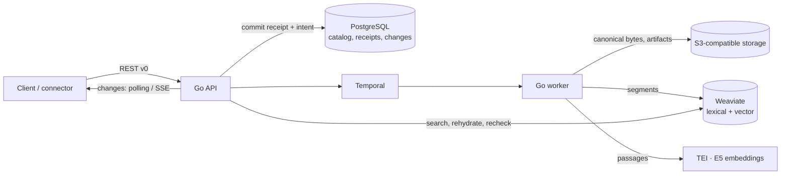

# Quivr V2

[](LICENSE)

**An open-source engine that turns continuous content streams into search and monitoring.**

Quivr V2 ingests content durably, makes it searchable within seconds, enriches it in
the background and lets you follow a topic over time. The core stays generic: formats,
AI models and business rules belong in plugins, so you can adapt Quivr to your domain
without forking the platform.

> **Status: evaluation stage.** The API is `v0` and may change without notice. Do not
> run it in production yet.

## Why Quivr V2

- **Durable before fast.** A write is acknowledged only once it is committed; outages
  delay processing, they never lose or silently fail content.
- **Idempotent everywhere.** Every write carries an idempotency key. Replays return the
  same result, changed replays are conflicts, and corrections create new immutable
  Versions instead of overwriting history.
- **Useful early, richer later.** Text is lexically searchable as soon as it is
  segmented; embeddings and other enrichments arrive afterwards without blocking it.
- **Rebuildable indexes.** PostgreSQL and S3 hold the canonical data; the search index
  is a projection that can be rebuilt from durable artifacts.
- **Honest search.** Every hit is rehydrated from canonical storage and re-authorized.
  A dependency outage returns an error, never an empty "success".
- **Generic core, extensible edges.** Connectors, normalizers, enrichers, retrievers and
  delivery channels are plugin capabilities, not core code.

## Architecture at a glance



A single `quivr` binary provides the `api`, `worker` and `migrate` commands.

| Concern | Choice |
| --- | --- |
| Core | Go modular monolith (`cmd/quivr`, `internal/…`) |
| Transactional catalog | PostgreSQL 17 |
| Canonical bytes and artifacts | S3-compatible storage (SeaweedFS locally) |
| Durable orchestration | Temporal |
| Lexical and vector search | Weaviate |
| Embeddings | Local TEI serving pinned `multilingual-e5-small` (384 dimensions) |
| Contract | OpenAPI 3.1 in [`contracts/http/v0`](contracts/http/v0/openapi.yaml) |
| Local runtime | Docker Compose |

## Quickstart

Requirements (Linux; the local harness targets Linux hosts): Go 1.27.1, Docker with Compose v2, Python 3 with `venv`,
Node.js 22+ and `jq`. The first run downloads pinned images and the E5 model (~1 GB).

```bash
make dev      # start dependencies, run migrations, launch API + worker
make verify   # contracts, unit tests and end-to-end journeys on an isolated stack
make down     # stop everything, keep data (make reset also deletes volumes)
```

`make dev` prints the API address and the path of a generated `config.json` holding
throwaway local keys. Export both, then create a Corpus, ingest a text and search it:

```bash
export QUIVR=http://127.0.0.1:<port>          # printed by make dev
export CONFIG=<path printed by make dev>/config.json
export KEY=$(jq -r '.keys | to_entries[]
  | select(.value.organization == "org_a" and .value.corpora == ["*"]
           and (.value.actions | index("corpora:write"))) | .key' "$CONFIG")

# 1. Create a Corpus
CORPUS=$(curl -s -X POST "$QUIVR/v0/corpora" \
  -H "Authorization: Bearer $KEY" -H 'Content-Type: application/json' \
  -d '{"name": "Newsroom", "idempotency_key": "corpus-newsroom-1"}' | jq -r .corpus_id)

# 2. Ingest a text (202 + Receipt; processing continues asynchronously)
curl -s -X POST "$QUIVR/v0/records" \
  -H "Authorization: Bearer $KEY" -H 'Content-Type: application/json' \
  -d '{
    "idempotency_key": "record-eclipse-1",
    "source": {"corpus_id": "'"$CORPUS"'", "namespace": "demo", "record_key": "eclipse"},
    "content": {"kind": "text", "text": "A total solar eclipse crossed northern Spain this afternoon."}
  }' | jq

# 3. Search (give processing a few seconds)
curl -s -X POST "$QUIVR/v0/search" \
  -H "Authorization: Bearer $KEY" -H 'Content-Type: application/json' \
  -d '{"query": "solar eclipse", "corpus_ids": ["'"$CORPUS"'"], "mode": "hybrid"}' \
  | jq '.items[] | {rank, record_id, text: .excerpt.text}'
```

Run the same ingest command again: you get the same Receipt back, not a duplicate.
For a browser UI over the same API, run `make demo` and open http://127.0.0.1:5183
(see [`quivr-search/`](quivr-search/README.md)).

## What works today

- **Corpora** with scoped API keys per Organization, action and Corpus.
- **Durable, idempotent ingestion**: inline text, bounded batches with per-entry
  outcomes, verified uploads (presigned PUT + checksum confirm), structured Manifests,
  extensions and relations.
- **Corrections and withdrawals** with immutable Versions and fenced withdrawn Records.
- **Search**: lexical, semantic and hybrid, with canonical rehydration and access
  rechecks on every hit.
- **Change feed** through polling and resumable SSE, plus **catalog resync** after
  cursor expiry.
- **Saved Queries and Subscriptions**, pinned and versioned; enabled Subscriptions turn
  newly searchable Versions into unique **Matches** (`/v0/matches`), each with a
  pending Delivery record. Matching uses a deterministic built-in evaluator for now.
- **Projection rebuilds** from durable artifacts as recoverable Operations, with cancel
  and rerun.
- **Typed retrieval mappings** per Corpus (`PUT /v0/corpora/{id}/retrieval`): logical
  fields pointing into source data take effect only when their rebuilt generation is
  validated and activated.
- **Connector Instances**: scheduled pull acquisition into a Corpus, with write-only
  deposited credentials and health, through the same ingestion path as pushed content.
- **Retrieval measurement** with a frozen workload (`make measure`).

## What comes next

- Signed webhook delivery with retried attempts, and plugin-owned match criteria.
- Filtering on typed field mappings (filter roles are validated and stored today).
- Concrete pull connector kinds: RSS, Microsoft 365, X.
- The plugin platform: out-of-process plugin workers, packaging and SDKs.

The contract already describes some of these routes; the ones not implemented yet are
listed here, not in "What works today".

## Documentation

| Read | For |
| --- | --- |
| [API walkthrough](docs/api-walkthrough.md) | Endpoint semantics, limits, processing and search details |
| [OpenAPI contract](contracts/http/v0/openapi.yaml) | Authoritative request and response shapes |
| [Domain language](CONTEXT.md) | Corpus, Record, Version, Manifest, Receipt… |
| [Architecture overview](docs/quivr-v2-architecture-overview.md) | Target architecture and plugin model |
| [Module boundaries](docs/quivr-v2-module-boundaries.md) | Who owns what in the Go core |
| [Canonical data model](docs/quivr-v2-canonical-data-model.md) | Lifecycles and invariants |
| [Ingestion](docs/quivr-v2-ingestion-contracts.md) · [Search](docs/quivr-v2-search-contracts.md) · [Monitoring](docs/quivr-v2-monitoring-tracer.md) | Contract rationale |
| [Connectors](docs/connectors/README.md) | Operating scheduled Connector Instances |
| [Local harness](docs/quivr-v2-local-harness.md) | How `make dev` and `make verify` work |
| [Railway deployment](deploy/railway/README.md) | Hosted single-node evaluation demo |
| [Research](research/) | Technology comparisons behind the stack |

## Repository layout

```text
cmd/quivr/          single binary: API, worker, migrations
internal/           domain modules (content, corpus, retrieval, changes, monitoring…)
contracts/http/v0/  OpenAPI contract, examples and checks
migrations/         ordered PostgreSQL migrations (UTC-stamped; legacy 0xx_ first)
scripts/            local stack, verification and measurement tooling
quivr-search/       demo web UI
deploy/             Docker Compose and Railway deployment
docs/               architecture, contracts and evidence
research/           technology comparisons behind the stack
multimodal-rag/     earlier exploration (submodule), not the target architecture
```

## Contributing

- Read [`AGENTS.md`](AGENTS.md) and [`CONTEXT.md`](CONTEXT.md) first; use the domain
  vocabulary in code and docs.
- Change the contract in `contracts/http/v0/openapi.yaml`, then run `make generate`.
- Keep `make verify` green; add tests with every behaviour change.
- Pull request titles follow Commitizen conventions, for example
  `feat(ingestion): accept record versions`.
- Keep customer-specific formats and rules out of the core; they belong in plugins.

## License

MIT — see [LICENSE](LICENSE).
