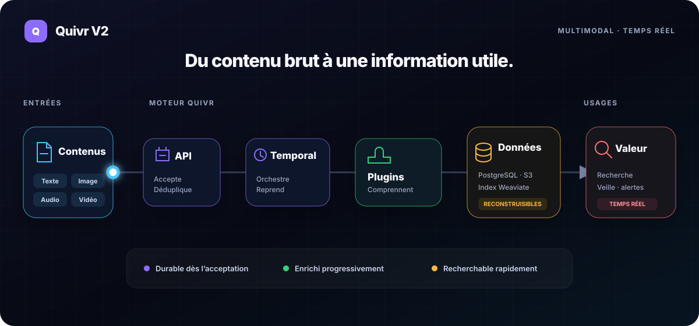
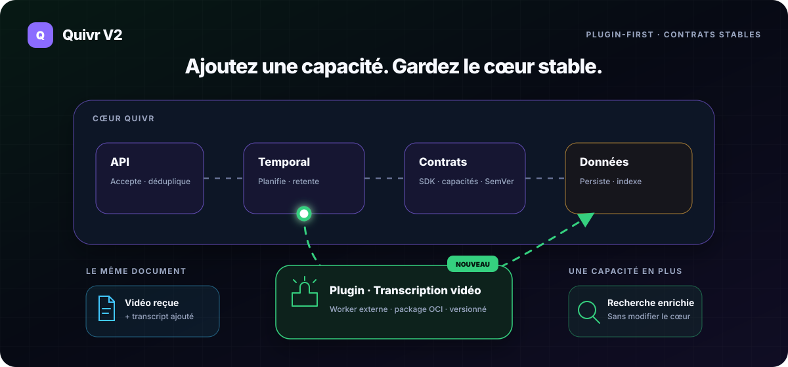

# Quivr V2

## Parcours implémentés : Corpora, ingestion et recherche texte

Le cœur Go permet de créer, lister et lire des Corpora avec contrôle d'accès,
rejeu idempotent et persistance PostgreSQL. Il accepte aussi du texte en ligne,
le matérialise via Temporal et S3, et expose des Versions immuables. La recherche
lexicale, sémantique et hybride est disponible ; la veille reste la cible produit.

Sur Linux, installer Go 1.27.1, Docker avec Compose v2, Python avec `venv`, et
Node/npm (22 ou ultérieur pour les vérifications de contrats), puis lancer :

```bash
make dev
make verify
make down
```

`dev` compile un seul binaire `quivr`, démarre PostgreSQL, Temporal, SeaweedFS, Weaviate et TEI via Compose, applique les
migrations et lance API/worker comme processus locaux. L'adresse de l'API et le
chemin de configuration s'affichent au démarrage. Les ports sont dynamiques et
liés à loopback. Les clés jetables, paramètres et logs restent dans le répertoire
privé `.scratch/quivr-dev-…` ; ne pas le publier. Le champ `keys` de `config.json`
associe chaque Bearer token à une Organization, des actions et des Corpora (`*`
autorise toute l'Organization). Créer un nouveau Corpus requiert `corpora:write`
et le scope `*` ; une clé bornée à des Corpora existants ne peut en créer d'autres.

Avec l'adresse et une clé locale, envoyer `POST /v0/corpora` avec un JSON contenant
`name` et `idempotency_key`, puis lire `GET /v0/corpora` et
`GET /v0/corpora/{corpus_id}`. Un rejeu équivalent conserve l'identité ; modifier
la demande sous la même clé produit un conflit. Les champs de mapping explicites
sont conservés et validés ; un `plugin_profile` non installé est refusé. Cette
configuration reste soumise aux limites de la tranche implémentée.

Pour ingérer, envoyer `POST /v0/records` avec `idempotency_key`, `source`
(`corpus_id`, `namespace`, `record_key`) et `content` (`kind: "text"`, `text`).
L'API renvoie 202 après commit du Receipt et du travail à déclencher, même si
Temporal ou S3 sont indisponibles. Lire ensuite l'URL `Location` du Receipt,
puis `/v0/records/{record_id}/versions/{version_id}` pour le Manifest et son texte.
Les permissions sont `content:write` et `content:read`, limitées aux Corpora autorisés.

Le Receipt résout `created`, `duplicate` ou `conflict` pour cette tranche ; il ne
passe jamais à un état « failed » pour une panne technique. Sans révision source,
le digest canonique fournit l'identité de Version. Réutiliser une révision avec
un contenu différent conserve l'historique et signale un conflit. `source_position`
accepte un entier décimal de 1 à 1000 chiffres ; les zéros initiaux sont normalisés.
Les commandes sont limitées à 1 MiB. Les Manifests explicites et extensions
non vides sont refusés jusqu'à leurs tickets dédiés, sans fausse acceptation.

Pour un import en lot, envoyer `POST /v0/records/batch` avec `{"items": [...]}` :
jusqu'à 100 commandes et 10 MiB, chacune au plus 1 MiB brut ; l'envoi et le
traitement partagent le délai de 5 s de la requête. La réponse 200 donne,
pour chaque entrée et dans l'ordre (`index`), soit son Receipt, soit une erreur
avec les mêmes codes qu'une soumission unitaire ; une entrée invalide ne bloque
pas les autres. Une enveloppe mal formée est refusée en bloc (400, 413 ou 422)
sans aucun Receipt. Chaque entrée garde sa propre clé : après une réponse perdue
ou interrompue, renvoyer les mêmes clés, par lot ou via `POST /v0/records`,
rend les mêmes Receipts sans doublon.

Pour un upload, envoyer `POST /v0/uploads` avec `size_bytes`, `sha256` et
`media_type` (1 GiB maximum). La réponse 201 fournit `upload_id`, une URL PUT
présignée, ses en-têtes signés obligatoires et `expires_at` (15 minutes). Le
client transfère les octets puis appelle `POST /v0/uploads/{upload_id}/confirm`,
qui vérifie taille et checksum en relisant l'objet et expose un `blob_id` stable
une fois `verified` (relire via `GET /v0/uploads/{upload_id}` et
`GET /v0/blobs/{blob_id}`). Un transfert absent, altéré ou hors Organization est
rejeté (`rejected`, ou 404 pour un autre tenant ; la possession d'un ID n'est pas
un accès). Soumettre ensuite `POST /v0/records` avec
`content: {"kind":"blob","blob_id":…,"media_type":"text/plain"}` : le texte
vérifié suit le même chemin Receipt/Version et conserve ses octets d'origine,
le Blob source restant tracé dans `provenance.source_blob_ids`. Seuls les médias
`text/*` sont acceptés dans cette tranche ; les références non vérifiées
renvoient 422 `unverified_blob`. Les permissions sont `blobs:write` (créer,
confirmer) et `blobs:read` (lire session et Blob). Les sessions expirées et
absentes sont lisibles dans leur état terminal ; aucun balayage d'orphelins,
rétention ou extraction média n'est ajouté ici.

Les Parts texte passent par `quivr.normalized-text.token-windows.v1` avec le
tokenizer E5 et Hugging Face Tokenizers 0.23.2 épinglés : fenêtres de 384 tokens,
recouvrement de 48 tokens (jusqu’à 56 pour reculer au début d’un mot), préférence
aux paragraphes, lignes, fins de phrase puis espaces. Les extraits sont des
tranches exactes de la Part ; aucune première ligne n’est transformée en titre.
Les offsets Unicode et UTF-8, coupures forcées et checksums sont persistés.
Le traitement commun prend en charge une Part titre explicite accompagnant les
Parts corps ; sa vue modèle est plafonnée à 64 tokens, son texte lexical reste
complet. L’ingestion de Manifests structurés reste dans THE-648.

La préparation installe le wheel vérifié et télécharge le snapshot E5 épinglé
(poids et export ONNX, environ 940 Mo plus tokenizer/configuration). Le traitement utilise un sous-processus Python local, hors réseau,
pour les offsets et comptes de tokens ; la recette et ses validations sont en Go.
[Provenance, licence et reproduction](third_party/tokenizer/NOTICE.md).

Limites techniques de cette tranche : 256 KiB UTF-8 par entrée de traitement,
64 Parts, 256 segments, 4 096 points de code par extrait et 512 tokens par entrée
modèle assemblée. Le lot assemblé est limité à 2 MiB de texte / 4 MiB de JSON. Un dépassement ou un NUL laisse le contenu accepté lisible,
mais bloque le traitement avec `segmentation_limit` et une disponibilité
`quarantined` ; aucun résultat partiel n’est publié comme réussi.

Après publication vérifiée dans Weaviate, Content commit atomiquement la couverture
lexicale, la promotion de la révision souhaitée et son événement. Une panne laisse
l’ancienne Version courante utilisable et la nouvelle en reprise. Une activité
séparée enrichit ensuite les segments avec E5 local. Les payloads float32 little-endian
(1 536 octets) et leurs manifests immuables sont vérifiés dans S3, puis référencés
dans PostgreSQL avant projection. Les retries réutilisent les artefacts ; une
sortie divergente sous la même dérivation bloque l’enrichissement avec
`derivation_conflict`, sans retirer la couverture lexicale. La publication de la
couverture vectorielle et de `record.enrichment_available` est atomique.

TEI 1.9.3 utilise mean pooling, normalisation L2, 384 dimensions et `float32`.
Les entrées sont celles de la segmentation (`passage: …`) et des requêtes
(`query: …`), sans troncature. L’image et les sept fichiers du snapshot sont
épinglés ; TEI monte le cache en lecture seule sur un réseau Docker interne sans
accès sortant. Le cœur Linux le joint par son adresse bridge. Aucun fournisseur
hébergé ni vecteur factice n’est utilisé. Une panne TEI laisse le lexical disponible
et fait renvoyer 503 aux recherches sémantique/hybride.
[Reproduction et provenance E5](third_party/e5/NOTICE.md).

```http
POST /v0/search
Authorization: Bearer <clé avec content:read et search:query>
Content-Type: application/json

{"query":"éclipse","corpus_ids":["<corpus_id>"],"mode":"lexical","profile":"balanced","limit":10}
```

Le profil résolu `balanced.e5-token-windows.v1` accepte des requêtes non
vides de 256 tokens maximum (8 192 points de code au transport), sans troncature.
La requête remplace CRLF/CR par LF et retire les espaces de bord, tout en conservant
casse, accents et langue. `hybrid`, `balanced` et 10 résultats sont les valeurs
par défaut, 50 le maximum. Les trois modes sont `lexical`, `semantic` et `hybrid`.
L’hybride conserve alpha 0,5, fusion relative des scores et poids titre 2/corps 1. Les autres
profils renvoient 422. Toute la liste de Corpora doit être autorisée. PostgreSQL
sélectionne la génération logique et le routage physique ; la réhydratation relit
les octets S3, valide les extraits et revérifie accès, version courante, quarantaine
et Tombstone. Les coordonnées sont en points de code Unicode ; aucun score brut,
nom de collection physique ou faux vecteur n’est exposé. Une panne renvoie 503.

La migration 005 nécessite de redémarrer API/workers. Elle désactive l’ancienne
génération, remet les Versions éligibles en traitement et redéclenche les Receipts sous une identité de workflow
versionnée. L’initialiseur crée une nouvelle collection et son routage canonique ;
la recherche est temporairement incomplète jusqu’à la réindexation et l’enrichissement. Les anciens
workers doivent être arrêtés ; il s’agit du cutover potentiellement cassant accepté
pour l’évaluation, sans contrôleur de migration à chaud ni certification de plateforme.

PostgreSQL conserve les faits et références ;
les lectures vérifient le checksum des objets S3. L'initialiseur crée le bucket,
et lui seul applique les migrations. Le journal interne sérialise les commits
par Organization ; `record.accepted` invalide le catalogue dès l'acceptation,
puis `record.materialized` à la publication. L'exposition polling/SSE arrive dans
son propre ticket.

`make verify` régénère/compare les transports, contrôle les exemples dans les
trois langages et exécute le parcours HTTP contre un PostgreSQL isolé, incluant
redémarrage, isolation, pagination et concurrence, puis ingestion, doublons,
conflits de révision et reprise après arrêt de Temporal/S3 et interruption du
worker, puis les trois modes de recherche, textes longs, extraits Unicode, droits,
limites et panne Weaviate. Le scénario de panne modèle vérifie six nouvelles
Versions lexicales sans vecteurs, les erreurs 503 et la reprise après redémarrage. Les tests de Processing utilisent le tokenizer réel pour les fenêtres 384/385, titres, paragraphes et coupures forcées. Les tests d’adaptateurs vérifient aussi perte de réponse S3 et atomicité
de publication et de promotion PostgreSQL, ainsi que les barrières de réhydratation. Les rapports restent dans
`.scratch/quivr-verify-…` (dont `embedding-outage.json`, `embedding-provenance.json`
et `relevance-report.json`) après suppression des processus, conteneurs et volumes
du test. La première préparation télécharge les dépendances et images épinglées.
Les requêtes/réponses synthétiques peuvent être exportées ; jamais les fichiers
`state.json`, `config.json`, `worker.json` ou `s3.json`, qui contiennent les clés.

Le fixture original CC0 de 24 requêtes FR/EN est mesuré séparément avec des
Parts titre/corps explicites aux adaptateurs réels, dans une collection réservée
au fixture pour isoler les statistiques BM25 ; les parcours HTTP vérifient
indépendamment l’ingestion inline et la réhydratation canonique. Résultat observé :

| Mode | MRR@10 | Recall@3 |
| --- | ---: | ---: |
| Lexical | 0,6993 | 0,8333 |
| Sémantique | 0,9583 | 1,0000 |
| Hybride | 0,7969 | 0,9583 |

Le déficit hybride connu reste suivi dans THE-641. Ces petits jugements synthétiques
ne mesurent pas la pertinence Agency ni un objectif de latence en production.

`make down` conserve les volumes de développement ; `make reset` les supprime
explicitement. `make migrate` applique les migrations versionnées à cette pile.
Les migrations à chaud peuvent casser des processus pendant l'évaluation ; noter
les redémarrages requis. `GO=/chemin/vers/go` sélectionne un outil Go local.
`make generate` met à jour les bindings après une modification du contrat.
Les logs locaux sont bornés à quatre fichiers de 1 MiB par processus ; PostgreSQL
et les autres services Compose conservent trois fichiers de 1 MiB chacun. Les probes privées `/healthz` et `/readyz` utilisent un port séparé ; elles ne
font pas partie de l'API publique. Aucun service de modèle ni clé externe n'est
nécessaire pour cette tranche.

**Transformez n’importe quel flux de contenu en recherche et veille multimodales.**

Quivr V2 est un backend open source qui ingère du texte, des images, de l’audio et de la vidéo, les rend rapidement recherchables, puis les enrichit au fil du traitement. Vous pouvez ensuite rechercher l’information, suivre un sujet en continu ou déclencher une alerte lorsqu’un contenu pertinent arrive.

Le cœur reste volontairement générique. Les formats, modèles d’IA et règles métier sont ajoutés sous forme de plugins : chacun peut adapter Quivr à son contexte sans forker toute la plateforme.

[Lire le scope du MVP](./docs/quivr-v2-backend-mvp-scope.md) · [Comprendre l’architecture en détail](./docs/quivr-v2-architecture-overview.md)



_SVG animé généré avec le renderer PR Lens, versionné avec le projet et sans lien externe._

## Comment un contenu traverse Quivr

1. **Accepter** — l’API reçoit le contenu avec une clé d’idempotence et confirme sa prise en charge durable.
2. **Orchestrer** — Temporal enchaîne les étapes, retente les erreurs et reprend après une panne.
3. **Comprendre** — les plugins normalisent ou enrichissent le contenu : OCR, transcription, embeddings, règles métier.
4. **Conserver** — PostgreSQL et S3 portent les versions canoniques, les blobs et leur provenance.
5. **Rendre utile** — Weaviate sert la recherche hybride ; les Saved Queries transforment ensuite le retrieval en veille continue.

Un contenu n’attend pas la fin de tous les traitements pour devenir utile. Une vidéo peut être visible avec ses métadonnées, puis gagner une transcription, des timecodes et des embeddings au fur et à mesure.

## Les plugins sont le produit d’extension



Un plugin peut apporter une ou plusieurs capacités :

- `Connector` — récupérer une source ou comprendre son protocole ;
- `Normalizer` — convertir un format vers le modèle canonique ;
- `Enricher` — produire OCR, transcript, captions, embeddings ou relations ;
- `Retriever` — ajouter une stratégie de recherche ou de reranking ;
- `Delivery` — envoyer un match vers un webhook ou un canal métier.

Chaque plugin est un worker externe distribué comme package OCI. Il utilise le SDK Quivr, déclare sa compatibilité avec le moteur en SemVer et ne dépend pas des détails internes de Temporal ou Weaviate.

Lors d’une mise à jour, une nouvelle génération reçoit les nouveaux travaux pendant que l’ancienne termine les siens. Pas besoin d’arrêter toute la plateforme pour ajouter une capacité ou revenir à la version précédente.

## Pourquoi cette architecture

- **Utile rapidement** — le contenu devient recherchable avant la fin des enrichissements coûteux.
- **Données récupérables** — PostgreSQL et S3 permettent de reconstruire index et embeddings.
- **Extensible sans fork** — intégrations, modèles et règles métier évoluent hors du cœur.
- **Pensé pour les développeurs** — REST/OpenAPI, SDK Python et TypeScript, Docker Compose local et licence permissive.

## Stack de référence

| Besoin | Choix actuel |
| --- | --- |
| Cœur du moteur | Go, en monolithe modulaire |
| Orchestration durable | Temporal |
| Catalogue transactionnel | PostgreSQL |
| Médias et artefacts lourds | Stockage S3-compatible |
| Recherche lexicale et vectorielle | Weaviate |
| Distribution des plugins | OCI |
| Local → distribué | Docker Compose → Kubernetes |

Le cœur Go possède l'API, le domaine, les transactions et les workers Temporal. Python et TypeScript restent les langages prioritaires des SDK et plugins externes. Ces choix forment la stack de départ, pas des dépendances exposées aux produits clients : les briques internes pourront évoluer sans casser leurs intégrations.

## Premier terrain : Agency Customer

Agency Customer est le premier cas d’usage. Il confronte Quivr à l’ingestion continue de millions d’articles, à la multimodalité, aux corrections et à la rétention, tandis que les formats et règles propres à l’Agency restent dans des plugins privés.

## Où en est le projet ?

Quivr V2 est en phase de conception active. Le MVP vise d’abord une chaîne complète :

```text
ingérer → normaliser → rendre searchable → enrichir → rechercher → matcher → notifier
```

L’optimisation extrême du scale viendra ensuite, guidée par la mesure plutôt que par l’anticipation.

## Aller plus loin

- [Vue d’ensemble de l’architecture](./docs/quivr-v2-architecture-overview.md)
- [Scope détaillé du backend MVP](./docs/quivr-v2-backend-mvp-scope.md)
- [Modèle de données canonique et cycles de vie](./docs/quivr-v2-canonical-data-model.md)
- [Vocabulaire et modèle de domaine](./CONTEXT.md)
- [Historique de la réflexion d’architecture](./docs/conversations/2026-09-03-quivr-v2-architecture-discovery.md)
- [Recherches et comparatifs techniques](./research/)

Les dossiers [`Agency-doc/`](./Agency-doc/) et [`multimodal-rag/`](./multimodal-rag/) restent des références de cadrage et d’exploration, pas l’architecture cible.

## Web demo

`make demo` opens the real text ingestion/search demo at http://127.0.0.1:5183.
It keeps its own local data across restarts; `make demo-reset` deletes that demo's data.
See [Quivr Search](quivr-search/README.md) for prerequisites, frontend development,
shared password configuration and `make verify-demo` browser checks.

## Retrieval baseline

`make measure` (Linux x86_64) runs the frozen [THE-661 workload](tests/measurement/workload-v1.json)
against an isolated real stack and writes `measurement.json`/`measurement.md` under
`.scratch/quivr-measure-*`: lexical, semantic and hybrid MRR/Recall, p50/p95 per load
condition against the p95 < 1 s target, cold/warm phase timings, resource peaks and pins.
It is not part of `make verify`; the non-required `Retrieval baseline` workflow runs it in CI
on manual dispatch only (`gh workflow run measure.yml --ref <branch>`).
The baseline is in [docs/evidence](docs/evidence/the-661-retrieval-baseline.md); the latest
recorded result, after removing the per-query tokenizer start, is in [THE-675](docs/evidence/the-675-query-floor.md).
