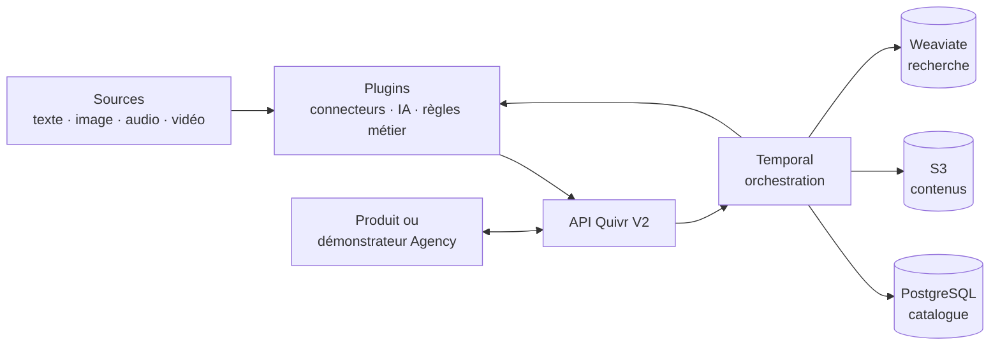

# Quivr V2

Quivr V2 est un backend open source pour l’ingestion, le retrieval et la veille multimodale. Il accepte du texte, des images, de l’audio et de la vidéo, rend rapidement les contenus recherchables, puis les enrichit progressivement grâce à des plugins externes.

Son premier cas d’usage est **Agency Customer**, projet dans lequel l’Agency construit son démonstrateur sur les APIs Quivr V2 et apporte ses formats ou règles métier via des plugins privés. Quivr V2 reste générique et utilisable dans d’autres contextes.

> Le projet est actuellement en phase de conception. Ce repository rassemble le scope, le modèle de domaine, les décisions d’architecture et les recherches préparatoires.

## Architecture en bref



Les données canoniques vivent dans PostgreSQL et S3. Weaviate est une projection de recherche reconstruisible. Temporal exécute les traitements durables. Les intégrations et modèles s’exécutent comme plugins externes versionnés.

## Principes

- **Disponibilité progressive** : searchable d’abord, enrichi ensuite.
- **Cœur générique** : les concepts Agency restent dans des plugins.
- **Vérité durable** : les index et embeddings peuvent être reconstruits.
- **Plugins sans arrêt global** : activation par génération et drainage de l’ancienne.
- **DevX d’abord** : REST/OpenAPI, SDK Python et TypeScript, Docker Compose local.
- **Scale par mesure** : aucune brique distribuée supplémentaire sans besoin observé.
- **Open source permissif** : aucune dépendance obligatoire copyleft ou source-available.

## Documentation

- **[Comprendre le projet et son architecture](./docs/quivr-v2-architecture-overview.md)** — point d’entrée haut niveau avec les flux et diagrammes.
- **[Scope détaillé du MVP](./docs/quivr-v2-backend-mvp-scope.md)** — comportement, APIs, données, critères d’acceptation, tests et rollout.
- **[Vocabulaire et modèle de domaine](./CONTEXT.md)** — langage commun du produit et invariants.
- **[Recherches techniques](./research/)** — Temporal, NATS, Weaviate, Qdrant, Meilisearch, Windmill et architectures de plugins.

## Périmètre du MVP

Le MVP fournit une chaîne complète plutôt qu’un assemblage de briques inachevées :

```text
ingérer → normaliser → rendre searchable → enrichir → rechercher → matcher → notifier
```

Il comprend notamment :

- ingestion idempotente unitaire, upload média et batch manifest ;
- versions immuables, corrections, retraits et provenance ;
- traitement progressif du texte, des images, de l’audio et de la vidéo ;
- recherche lexicale, sémantique, hybride et cross-modale ;
- Saved Queries, Subscriptions, Matches et deliveries ;
- plugins OCI avec SDK, SemVer, activation, rollback et backfill ;
- politiques de rétention, stockage froid et garbage collection sûr ;
- reconstruction des projections depuis les données canoniques.

Le démonstrateur Agency, la marketplace, le billing, l’exécution de plugins hostiles et le scale maximal anticipé sont hors du MVP.

## Stack de référence

| Besoin | Technologie |
| --- | --- |
| Orchestration durable | Temporal |
| Catalogue transactionnel | PostgreSQL |
| Contenus et artefacts lourds | Stockage S3-compatible |
| Recherche lexicale et vectorielle | Weaviate |
| Distribution des plugins | OCI |
| Développement local | Docker Compose |
| Déploiement distribué lorsque nécessaire | Kubernetes |

## Repositories de référence

- [`Agency-doc/`](./Agency-doc/) contient la documentation de cadrage Agency utilisée comme source de contexte. Elle reste indépendante de cette conception.
- [`multimodal-rag/`](./multimodal-rag/) est un prototype historique exploratoire, pas l’architecture cible.

Les décisions consolidées et leurs questions ouvertes sont documentées dans le [scope MVP](./docs/quivr-v2-backend-mvp-scope.md).
