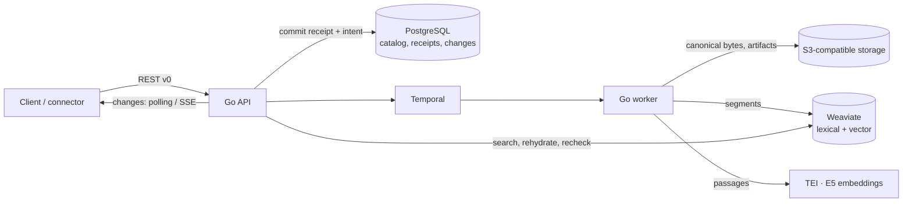

# Quivr V2

[](LICENSE)

**An open-source engine that turns continuous content streams into search and monitoring.**

Quivr V2 ingests content durably, makes it searchable within seconds, enriches it in
the background and lets you follow a topic over time. The core stays generic: formats,
AI models and business rules belong in plugins, so you can adapt Quivr to your domain
without forking the platform.

> **Status: evaluation stage.** The API is `v0` and may change without notice. Do not
> run it in production yet.

## Why Quivr V2

- **Durable before fast.** A write is acknowledged only once it is committed; outages
  delay processing, they never lose or silently fail content.
- **Idempotent everywhere.** Every write carries an idempotency key. Replays return the
  same result, changed replays are conflicts, and corrections create new immutable
  Versions instead of overwriting history.
- **Useful early, richer later.** Text is lexically searchable as soon as it is
  segmented; embeddings and other enrichments arrive afterwards without blocking it.
- **Rebuildable indexes.** PostgreSQL and S3 hold the canonical data; the search index
  is a projection that can be rebuilt from durable artifacts.
- **Honest search.** Every hit is rehydrated from canonical storage and re-authorized.
  A dependency outage returns an error, never an empty "success".
- **Generic core, extensible edges.** Connectors, normalizers, enrichers, retrievers and
  delivery channels are plugin capabilities, not core code.

## Architecture at a glance



A single `quivr` binary provides the `api`, `worker` and `migrate` commands.

| Concern | Choice |
| --- | --- |
| Core | Go modular monolith (`cmd/quivr`, `internal/…`) |
| Transactional catalog | PostgreSQL 17 |
| Canonical bytes and artifacts | S3-compatible storage (SeaweedFS locally) |
| Durable orchestration | Temporal |
| Lexical and vector search | Weaviate |
| Embeddings | Local TEI serving pinned `multilingual-e5-small` (384 dimensions) |
| Contract | OpenAPI 3.1 in [`contracts/http/v0`](contracts/http/v0/openapi.yaml) |
| Local runtime | Docker Compose |

## Quickstart

Requirements (Linux; the local harness targets Linux hosts): Go 1.27.1, Docker with Compose v2, Python 3 with `venv`,
Node.js 22+ and `jq`. The first run downloads pinned images and the E5 model (~1 GB).

```bash
make dev      # start dependencies, run migrations, launch API + worker
make check    # docs, contracts, vet and unit tests without Docker (about 2 min); run before pushing
make verify   # make check, then end-to-end journeys on an isolated stack
make down     # stop everything, keep data (make reset also deletes volumes)
```

`make verify` runs every feature's acceptance suite and one assembled monitoring
journey on an isolated stack. It removes only its own project, even after a
failure or Ctrl+C. It then prints the path of a `report.md` that names any failed
step, the pinned versions and the dependency inventory. Linux x86_64 is the only
supported platform; see the [remaining limits](docs/quivr-v2-remaining-limits.md).

`make dev` prints the API address and the path of a generated `config.json` holding
throwaway local keys. Then follow [Your first search](docs/first-search.md): create a
Corpus, add a text Record and search it, with commands that `make verify` replays
against a real stack.

For a browser UI over the same API, run `make demo` and open http://127.0.0.1:5183
(see [`quivr-search/`](quivr-search/README.md)).

## What works today

- **Corpora** with scoped API keys per Organization, action and Corpus.
- **Durable, idempotent ingestion**: inline text, bounded batches with per-entry
  outcomes, verified uploads (presigned PUT + checksum confirm), structured Manifests,
  extensions and relations.
- **Corrections and withdrawals** with immutable Versions and fenced withdrawn Records.
- **Search**: lexical, semantic and hybrid, with canonical rehydration and access
  rechecks on every hit.
- **Change feed** through polling and resumable SSE, plus **catalog resync** after
  cursor expiry.
- **Saved Queries and Subscriptions**, pinned and versioned; enabled Subscriptions turn
  newly searchable Versions into unique **Matches** (`/v0/matches`), each with a
  Delivery. Matching is decided by a pinned alert-rule plugin (the
  `subscription` Contribution), batched per article.
- **Keyword alerts** through the first-party plugin [`plugins/alerts`](plugins/alerts/README.md),
  pinned by default in the local stack:
  - queries such as `"Airbus" AND (grève OR strike) NOT sport`, with exact phrases,
    "any of", "none of" and grouping;
  - case, accents and punctuation are ignored, and words match whole;
  - metadata filters such as `source:wire` or `author:"Jane Doe"` (names mapped in the
    plugin configuration), and a filter alone is a valid alert;
  - each Match's evidence names the matched terms and the Parts where they matched
    ([guide](docs/keyword-alerts.md)).
  - the browser demo's **Alertes** tab writes these alerts and shows what each one
    caught, live ([`quivr-search/`](quivr-search/README.md#alertes)).
- **Described alerts** through the same plugin: a plain-language description such as
  "Labour strikes at ports and harbours", judged by TypeSafe's Jev classifier, so
  rephrased and translated articles alert too:
  - one classifier call per article covers all described alerts;
  - the Match evidence carries the classifier's score;
  - they are off without a TypeSafe key, because article text is sent to TypeSafe
    ([guide](docs/described-alerts.md)).
- **Subscription owners**: an application can create a Subscription for one of its
  end users (an opaque `owner` such as `user-123`) or a global one, see the owner on
  the Subscription, its Matches, webhooks and change feed to route each alert, and list
  a user's active Subscriptions with `GET /v0/subscriptions?owner=…`.
- **Correction and withdrawal notices** for alerted Records: a correction that still
  matches gets a linked successor Match (`match.corrected`), one that no longer matches
  gets `match.no_longer_matches` without a new Match, and a withdrawal gets
  `match.withdrawn`. Earlier Matches stay readable.
- **Signed webhook delivery** (Standard Webhooks) to deployment-configured destinations,
  with append-only attempt history, jittered exponential retries within a bounded
  delivery window, exhaustion, and no new attempt once a Subscription is disabled.
  The worker exposes delivery metrics on its probe listener (`/metrics`).
- **Projection rebuilds** from durable artifacts as recoverable Operations, with cancel
  and rerun.
- **Typed retrieval mappings** per Corpus (`PUT /v0/corpora/{id}/retrieval`): logical
  fields pointing into source data take effect only when their rebuilt generation is
  validated and activated.
- **Connector Instances**: scheduled pull acquisition into a Corpus, with write-only
  deposited credentials and health, through the same ingestion path as pushed content.
  Delivered kinds: `rss` (RSS and Atom feeds), `m365_mail` (Microsoft 365 mailboxes)
  and `x_list`, which polls an X list: edits become corrections, deleted or protected
  posts are withdrawn, and health shows daily reads ([guide](docs/connectors/x.md)).
  The deployment `credential_key` is optional. Without it, credential deposits are
  refused with `503 credentials_unavailable`, and everything else works.
  `GET /v0/connector-kinds` publishes each enabled kind's config and credential JSON
  Schemas, `PUT /v0/connectors/{id}/schedule` changes the polling interval, and
  validation errors name the offending field as a JSON Pointer.
- **Sources page in the web app** (`quivr-search`, **Sources** tab): paste a site
  or feed address and the web app finds its RSS or Atom feed (refusing private
  addresses), or add a suggested feed in one click from `DEMO_FEED_SUGGESTIONS`.
  Each source shows its health and last article, and can be paused, resumed or
  removed. Other kinds keep forms generated from their schemas, so new kinds need
  no UI change ([guide](docs/connectors/README.md#from-the-web-interface)).
- **Live feed page in the web app** (**Veille** tab): everything entering the demo
  Corpus, newest first, with source, time, title and excerpt. New items arrive over
  SSE, which the app's server relays from the change feed, and can be filtered by
  source ([guide](quivr-search/README.md#veille)).
- **Operational metrics and correlated logs** on each process's private probe
  listener (`/metrics`, Prometheus text, bounded labels):
  - API: accepted commands and the pending-ingestion backlog;
  - worker: processing outcomes, time from acceptance to searchable, and delivery
    attempts and durations.

  JSON logs link request, Receipt, Record and Version IDs
  ([harness](docs/quivr-v2-local-harness.md)).
- **Retrieval measurement** with a frozen workload (`make measure`).
- **Plugin Protocol v0 contract** (`contracts/plugins/v0/`) and `quivr plugin inspect`,
  which validates a `quivr-plugin.yaml` and reports its compatibility, Contributions,
  schemas, secrets and limits.
- **External normalizer**: the startup configuration pins one plugin and routes Blob
  media types to its normalizer. A Blob of a routed type, ingested by reference,
  becomes searchable through the plugin's Parts, and its Version shows
  `provenance.normalization`. An unavailable plugin is retried and never blocks the
  API or other ingestion. A plugin error, invalid output or exhausted retries quarantine
  the Version with a structured diagnostic, and an `optional` text route falls back to
  the built-in text path ([walkthrough](docs/api-walkthrough.md#external-normalizers)).
- **Plugin-owned extension namespaces**: the pinned plugin's declared namespaces are
  registered at startup beside the built-in ones. Its normalizer's extensions are
  validated against their schemas and published on the Version, clients cannot write
  them (`422 extension_namespace_owned`), and retrieval mappings can map them into search.
- **Python Plugin SDK** (`sdks/python/`) with `quivr plugin init`, which scaffolds a
  Markdown normalizer, and `quivr plugin dev`, which runs it locally, checks its
  discovery digest and replays a fixture through the engine's Manifest validation,
  without a Quivr stack ([SDK guide](sdks/python/README.md)).
- **Plugin Contract Runner** (`quivr plugin test`), which certifies a normalizer over
  the public protocol, launched from its manifest or at `--endpoint <url>`. It runs
  health, discovery, normative and plugin fixtures, deterministic replay, the declared
  deadline, terminal errors for invalid requests, and compatibility ranges. It judges
  output with the engine's own validation: Manifest rules, response size, input-Blob-only
  Blob Parts and declared namespaces. It writes a JSON report with `--report`, and CI
  publishes one for the `quivr plugin init` template.
- **Searchable PDFs** through the reference plugin [`plugins/pdf-text`](plugins/pdf-text/README.md)
  (pypdf, BSD-3-Clause). An `application/pdf` Blob becomes one `body` Part per page with
  text, and a phrase is found on its page's Part. Blank or scanned pages give warnings;
  encrypted or damaged PDFs are quarantined with a diagnostic naming the plugin.
  `make dev` pins it by default; there is no OCR
  ([walkthrough](docs/api-walkthrough.md#pdf-documents)).
- **`quivr search` from the command line**: set `QUIVR_API_URL` and `QUIVR_API_KEY`,
  then `quivr search --corpus <corpus_id> "query"` prints ranked hits with their
  excerpt and Record / Version / Part provenance, or the unchanged API response with
  `--json`. Failures exit with one code per class (rejected key or scope, invalid
  request, unreachable server). It uses a Go client generated from the contract
  (package [`client`](client/)) and never touches the stack's storage
  ([walkthrough](docs/api-walkthrough.md#from-the-command-line)).
- **AI agents search and cite Quivr over MCP**: `quivr mcp --profile read` serves an
  agent on stdio with three read-only tools. The agent can list the Corpora its key
  reaches, search them, and read a hit's Record Version and Manifest, keeping Record,
  Version, Part and exact excerpt offsets to cite. The API key alone decides access
  ([Connect an AI agent](docs/connect-an-ai-agent.md)).
- **A guide to writing a normalizer**: scaffold, run, certify, pin, ingest and observe
  your own plugin ([Write a normalizer](docs/plugins/write-a-normalizer.md)).

## What comes next

- Alerts that catch rephrased or translated articles with Quivr's own vectors, without an external classifier.
- Filtering on typed field mappings (filter roles are validated and stored today).
- X Filtered Stream webhooks as a lower-latency alternative to list polling.
- Reprocessing quarantined Versions.

The contract already describes some of these routes; the ones not implemented yet are
listed here, not in "What works today".

## Documentation

New to Quivr? [What Quivr can do](docs/what-quivr-can-do.md) explains it in plain words.
Then start from the page for what you want to do:

- [Using Quivr](docs/start/functional.md): run Quivr, send it content, search it and set
  up alerts.
- [Writing plugins](docs/start/plugin-author.md): extend Quivr with your own plugins.
- [Contributing to Quivr](docs/start/contributor.md): change this repository, as a person
  or a coding agent.

These start pages are generated from [`docs/inventory.toml`](docs/inventory.toml), so
every living page appears on the one for its reader. The authoritative request and
response shapes are in the [OpenAPI contract](contracts/http/v0/openapi.yaml).

## Repository layout

```text
cmd/quivr/          single binary: API, worker, migrations
internal/           domain modules (content, corpus, retrieval, changes, monitoring…)
contracts/http/v0/  OpenAPI contract, examples and checks
contracts/plugins/v0/ Plugin Protocol v0 schemas and normative fixtures
sdks/python/        Python Plugin SDK
plugins/pdf-text/   reference normalizer: PDF text, one Part per page
migrations/         ordered PostgreSQL migrations (UTC-stamped; legacy 0xx_ first)
scripts/            local stack, verification and measurement tooling
quivr-search/       demo web UI
deploy/             Docker Compose and Railway deployment
docs/               living documentation, ADRs (docs/adr/) and dated documents (docs/dated/)
multimodal-rag/     earlier exploration (submodule), not the target architecture
```

## Contributing

- Read [`AGENTS.md`](AGENTS.md) and [`CONTEXT.md`](CONTEXT.md) first; use the domain
  vocabulary in code and docs.
- Change the contract in `contracts/http/v0/openapi.yaml`, then run `make generate`.
- Run `make check` before pushing and keep `make verify` green; add tests with
  every behaviour change.
- Declare every new living doc page in [`docs/inventory.toml`](docs/inventory.toml)
  with one line giving its audience and kind (the file's header explains both),
  then run `make start-pages`; `make docs` fails on an undeclared page, a stale start
  page, a broken relative link or a missing repository path, and names the fix.
- Show API requests in guides as [runnable blocks](docs/runnable-guides.md), which
  `make verify` replays.
- Never edit an accepted ADR or a dated document under `docs/dated/`: supersede it
  with a new one ([ADR 0004](docs/adr/0004-documentation-rules-are-enforced-by-ci-only.md));
  `make docs` compares them with where your branch forked from `origin/main`.
- Pull request titles follow Commitizen conventions, for example
  `feat(ingestion): accept record versions`.
- Keep customer-specific formats and rules out of the core; they belong in plugins.

## License

MIT — see [LICENSE](LICENSE).
