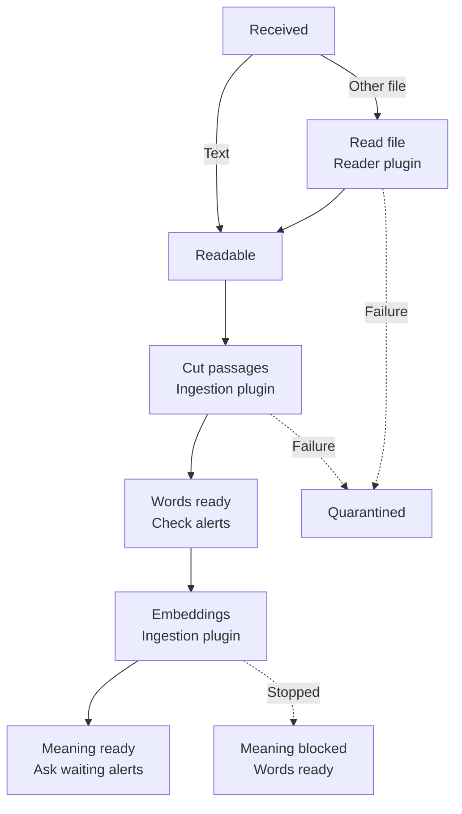
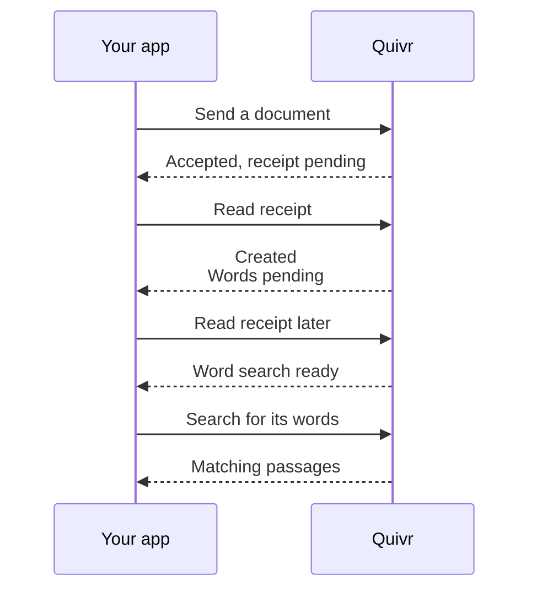
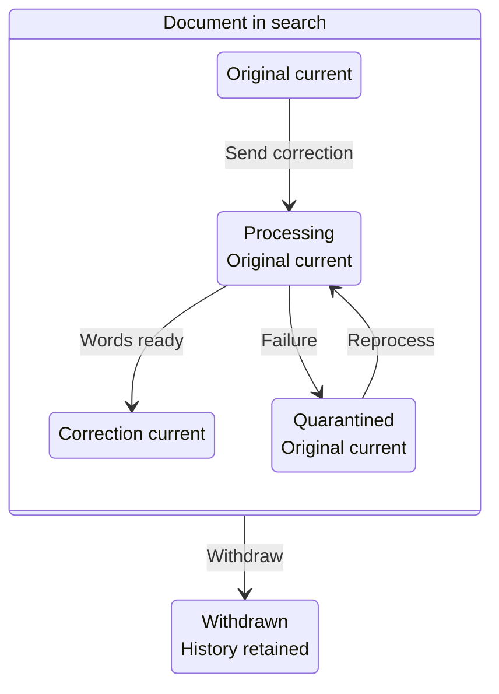

Quivr stores your documents and asks plugins to prepare them for search. A document can be accepted while it is still being prepared for word search, then meaning search.

## Documents and collections

You put documents into a collection (a Corpus, in the API) that you search together. A collection also limits what an API key can reach. A document (a Record) can be an article, an email or a post. Its identity combines the collection, where it comes from (the Source Namespace, such as `news`), and its ID there (the Record Key, such as the article's URL).

Quivr keeps each accepted text you send as a version (a Version), which never changes. Its content has named pieces (Parts), such as a title, body or PDF page. Search results point to these pieces so you can find the quoted passage.

## The life of a document

A plugin is a separate service that Quivr calls for a job. Text sent in the request body (inline text) skips the file reader. Quivr can also read valid text files with a `text/*` media type, up to 2 MiB, directly. Other file types need a configured reader (a normalizer plugin), which extracts their content after acceptance.

You still need an ingestion plugin, such as `core.ingest`, for plain text. It cuts the text into passages; Quivr indexes their words. Later, the ingestion plugin makes numerical representations of meaning (embeddings). This extra work (enrichment) has no guaranteed completion time.

Your alerts are saved checks for content you want to hear about. Quivr checks them when word search becomes ready. If a rule is waiting for embeddings, enrichment can prompt another check. Only alerts that have not decided yet are asked again; a rule that already matched or did not match this version keeps its decision.

Plugins read files and prepare passages and embeddings; a failure before word search is ready can put the version on hold (quarantine).

In words: inline text and supported text files skip extraction. Other files use the reader plugin. The ingestion plugin cuts passages, then Quivr makes word search available and checks alerts. The plugin adds embeddings for meaning search; only alerts still waiting for a decision are asked again. A reader or passage-processing failure can quarantine the version. Enrichment failure blocks meaning search while word search stays available.

An unavailable dependency can leave work retrying. File-reader timeouts and repeated retryable errors have a retry budget; exhausting it can quarantine the version. Quivr keeps quarantined content but withholds that version from search until an operator fixes the cause and [reprocesses it](/run-quivr/reprocess-quarantined-versions). Enrichment never quarantines a version.

## Acceptance and search readiness

Single-document ingestion returns `202 Accepted` with a tracking acknowledgement (an Ingestion Receipt). A batch returns `200` with one result per entry. A new ingestion receipt starts with `state: pending` and no outcome; for a file needing a reader, it stays pending during extraction, with `processing.phase: materialization`.

The receipt resolves once as `created`, `duplicate`, `withdrawal_applied` or `conflict`. A resolved `conflict` means the document was withdrawn before publication, or the source's revision label (`source_revision`) was reused for different content. It differs from an HTTP error that refuses a request before accepting it.

`state: resolved` and `outcome: created` can appear while word indexing is still running. The associated version's readiness is separate: `availability.searchable: true` means word search is ready and the version is current. Meaning search may still be pending. Reading the receipt later updates readiness without changing its outcome.

Creation and word-search readiness are separate moments; fast processing may skip the intermediate states you observe.

In words: the application sends content, gets a pending receipt, then reads it to follow creation and word-search readiness. A matching search can return passages after readiness. These are separate moments, even if the first receipt check already shows the last one.

Every content submission has a retry identifier (`idempotency_key`). After a timeout, retry the same request with the same key to get the same receipt. A different request under that key gets `409 idempotency_conflict`; a new submission for a withdrawn document gets the same error, even with a fresh key. The retry key identifies a request; the record key identifies the document. A correction keeps the document identity and uses a new retry key; see [Add content](/guides/add-content).

## Corrections and withdrawals

Search uses the document's current version. Corrected text with the same collection, namespace and record key creates a replacement. The old version stays current until the correction is searchable. If the correction is quarantined, the old text stays in search until the correction is successfully reprocessed or another replacement becomes ready.

For example, a ferry article says “The ferry leaves at nine.” You correct it to “The ferry leaves at ten.” Search still finds “nine” while the correction is processing or quarantined; it switches to “ten” only when the correction is ready.

A correction replaces the current version only when word search is ready; withdrawal ends search permanently.

In words: the original stays current while a correction is processing or quarantined. A searchable correction replaces it. Withdrawal can happen at any point; it removes the document from search and monitoring, and an alert that already matched it can still receive a withdrawal notice.

Withdrawal is permanent. A new submission under that document identity is refused with `409 idempotency_conflict`; replaying an old request only returns its receipt and cannot restore search. Stored versions remain readable by identifier, subject to access. Withdrawal does not physically delete them.

Resending the latest submitted content without a source revision label, using a new retry key, resolves as `duplicate`. Returning to earlier content after a correction can create a new version; it does not rewrite the old one.

## If you can't find it

Read the receipt's `processing` progress, `availability` readiness and `diagnostics` explaining failures. Check that your search covers the right collection and your API key can access it, then compare what you see:

| What you see | What it means |
| --- | --- |
| `state: pending` | Content is queued or being read. A file's extraction can still be running. |
| In `availability`: `searchable: false` | Word search is not ready for this version, or it is no longer current. Check processing and diagnostics. |
| In `processing`: `state: retrying` | A stage is retrying. Diagnostics distinguish an outage from bounded file-reader retries. |
| In `processing`: `phase: enrichment`; `state` is `queued`, `running`, `retrying` or `blocked` | Meaning search is pending or stopped. Word search stays available. |
| In `availability`: `state: quarantined`, with a diagnostic | On hold. An operator must fix the cause and reprocess this version. |
| Search returns old text | The correction may be pending or quarantined. Check its receipt; the original stays current. |
| HTTP `409` on a write | A key was reused for a different request, or the document was withdrawn. |

Resending a quarantined submission with the same key returns its receipt; it does not restart processing. See [quarantine recovery](/run-quivr/reprocess-quarantined-versions) for the operator's next step.

## Search and alerts

A search covers up to 16 collections. It offers word matching (`lexical`), meaning matching (`semantic`) and a combined ranking (`hybrid`, the default). Meaning search needs embeddings; hybrid can return word matches while embeddings are pending. Quivr checks each hit against stored content and your access; a required dependency outage returns an error.

A retrieval plugin finds and ranks results using a search profile. `core.retrieve` provides `default` and `deep`; both use the same ranking today, with different work budgets. See [Search](/guides/search#choose-a-profile) for configured profiles and other retrieval plugins.

An alert pairs a search definition (a Saved Query) with activation and notification settings (a Subscription). The saved query says what to look for and in which collections. The subscription chooses the rule and the notification destination. A positive decision is stored as a Match with evidence; that match never changes. Enrichment asks only undecided alerts again.

A subscription can carry `owner`, a reference from your application that Quivr echoes so you can route notifications to the right person. Notifications are signed webhooks: HTTP requests to your receiver. Attempts can repeat, so receivers deduplicate; retries end on a permanent failure or when the retry window ends. Delivery is not guaranteed. Corrections and withdrawals of matched content can produce follow-up notices. [How alerts work](/guides/alerts) follows one alert from saved search to webhook.

## Access, sources and plugins

An Organization owns its collections, documents and alerts. Normal API calls carry a key that determines the organization, allowed actions and reachable collections. The operator creates these keys.

A configured collector (a Connector Instance) adds content to one collection and namespace. It can fetch on a schedule or receive updates from a push source. Collected documents follow the same path as documents you send. Your application follows changes by [polling `GET /v0/changes`](https://docs.quivr.thevibecompany.co/api-reference/changes/poll-changes) or using the [live stream at `GET /v0/changes/stream`](https://docs.quivr.thevibecompany.co/api-reference/changes/stream-changes), resuming from a cursor that marks its position.

Source push routes declare their own authentication: a Quivr API key, a token for one collector or a provider signature. Quivr or the connector plugin verifies the request for the chosen mode. Webhooks authenticated by a provider signature need no Quivr API key. See [Collect from sources](/guides/connectors) for the choices.

Quivr's core stays generic; plugins make the decisions that depend on your content. Plugins read files, cut passages and make embeddings, rank results and decide alerts. They run as separate HTTP services; the operator runs and configures them. [How plugins work](/plugins/overview) explains their roles.

## Next

<CardGroup cols={2}>
<Card title="Add content" icon="file-plus" href="/guides/add-content">
Send documents, check receipts, make corrections and withdraw content.
</Card>
<Card title="Search" icon="search" href="/guides/search">
Find passages by words or meaning.
</Card>
</CardGroup>
