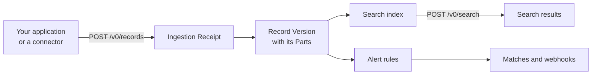

An article enters Quivr as a Record in a Corpus. Each accepted content of the Record is an immutable Version, which Quivr cuts into passages, indexes for search and checks against every active alert.

## Organizations and API keys

An Organization owns everything: its Corpora, their content and its alerts. Nothing crosses from one Organization to another. Every request carries an API key, and the key decides three things on the server: its Organization, the actions it may perform (such as `content:write` or `search:query`) and the Corpora it may reach. The operator who runs Quivr creates the keys in its configuration.

## Corpora

A Corpus is a collection of Records you search together, such as "News" or "Support tickets". It is also an access boundary: a key scoped to one Corpus cannot see the others. A search names the Corpora it covers, up to 16.

## Records, Versions and Parts

A Record is one item from a source: an article, a mail, a post. Two values identify it inside its Corpus. The Source Namespace says where it comes from, such as `news` or `wire-feed`. The Record Key is its identity there, such as the article's URL or the feed's item id.

Each content you submit for a Record becomes a Record Version, and Versions are never modified. Sending corrected text for the same Record Key creates a new Version, which becomes the current one once it is searchable. Search returns only current Versions, but every earlier Version stays readable, so you can always show what was published and when. Sending the same content again creates nothing new.

A Version is made of Parts: a `title`, a `body`, a page of a PDF, an attachment. Its Manifest lists the Parts, their text and where they came from. Search results point at a Part, so a hit on page 2 of a PDF says `page-2`.

To remove a Record from search, you withdraw it. The withdrawal is permanent and keeps the Record's history.

## Receipts: accepted, then processed

Writing is asynchronous. When you submit content, Quivr stores it durably, then answers `202 Accepted` with an Ingestion Receipt. Processing continues in the background: extracting text, cutting it into passages, indexing them. The Receipt resolves once, as `created`, `duplicate`, `withdrawal_applied` or `conflict`, and says whether the Version is searchable yet.

A dependency outage never fails a Receipt: the work waits and resumes. That is why every write carries an `idempotency_key`. After a timeout, send the same request again under the same key and you get the same Receipt back, never a duplicate.

## Search

A search runs in one of three modes:

| Mode | Finds | Available |
| --- | --- | --- |
| `lexical` | the words of the query | as soon as the Version is indexed |
| `semantic` | passages close in meaning, in any language the model knows | once the passages have vectors, seconds later |
| `hybrid` | both, fused into one ranking (the default) | as for `semantic`, with keyword results in the meantime |

Every hit is re-read from storage and re-checked against the caller's access before it is returned, so a withdrawn Record or an out-of-scope Corpus never leaks into results. If a dependency is down, the search fails with an error rather than returning an empty list.

A search profile names how results are found and ranked, with a latency and cost budget. The built-in profile is `default`. A retrieval plugin can declare others, such as a slower `deep` profile that re-ranks with a model.

## Alerts

An alert is two objects. A Saved Query holds what to look for and in which Corpora: for example the keyword query `library OR museum`. A Subscription turns it on: it names the plugin rule that decides each article (the evaluator), and the webhook destination that receives notifications.

When a new Version becomes searchable, Quivr asks the rule about every active Subscription. Each positive answer is a Match, stored with its evidence: which words matched, and where. Each Match is sent as a signed webhook, retried until the receiver accepts it or its delivery window ends. When a matched article is later corrected or withdrawn, the Subscription gets a follow-up notice.

A Subscription can carry an `owner`, an opaque reference to one of your application's users, so you can route each alert to the right person.

## Changes

Quivr publishes every committed change, such as a new Version, a Match or a connector's health, on a change feed. Your application reads it by polling `GET /v0/changes` or over Server-Sent Events, and resumes from a cursor after a disconnect.

## Connectors

A Connector Instance pulls content from an external source into one Corpus and Source Namespace on a schedule: an RSS feed, a Microsoft 365 mailbox, an X list. Collected items take the same path as articles you submit, so corrections, Receipts and alerts work the same way. Quivr keeps the schedule, the position in the source, the encrypted credential and the health of each instance.

## Plugins

Quivr's core stays generic. Everything that depends on your content is a plugin: reading a file format, collecting from a source, cutting and embedding text, ranking results, deciding alerts. A plugin is a separate HTTP service that Quivr calls with JSON. The operator runs it and pins it in Quivr's configuration.

## Next

<CardGroup cols={2}>
<Card title="How plugins work" icon="puzzle" href="/plugins/overview">
What a plugin is, how Quivr calls it, and how it is certified.
</Card>
<Card title="Add content" icon="file-plus" href="/guides/add-content">
Put these ideas to work: batches, files, corrections and withdrawals.
</Card>
</CardGroup>
