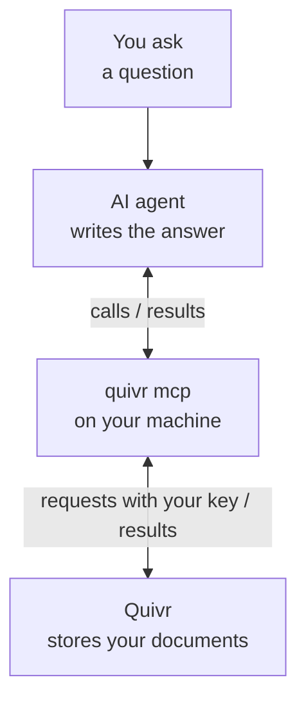

Connect an AI agent, such as Claude or Cursor, and it can search the documents you keep in Quivr and cite the exact passage behind each answer. Your API key decides which documents the agent may reach.

The agent talks to Quivr through MCP (Model Context Protocol), the standard way AI agents call outside tools. You add one entry to the agent's settings. The agent's MCP client, the part of the agent that runs outside tools, then starts `quivr mcp` on your machine to pass its tool calls to Quivr. Quivr finds the passages; the agent's model writes the answer.



1. You ask the agent a question.
2. The agent calls a Quivr tool, such as `search`. Its MCP client hands the call to `quivr mcp`, a program it started on your machine.
3. `quivr mcp` sends the request to Quivr's HTTP API with your API key. Quivr checks the key and returns the matching passages with their sources.
4. The agent's model reads the passages and writes the answer, citing them.

Quivr keeps documents in Corpora. A Corpus is a collection of documents searched together, such as "News", and an API key can be limited to some Corpora.

## Prerequisites

- **An AI agent that supports MCP**, such as Claude Desktop, Claude Code or Cursor, with its own account.
- **The `quivr` command**, built from your Quivr checkout with Go 1.27.2. Run this in the checkout, then check it with `command -v quivr`:

  ```bash
  go install ./cmd/quivr
  export PATH="$(go env GOPATH)/bin:$PATH"
  ```

- **`jq`**, for the checks below.
- **A Quivr address and an API key.** Quivr's MCP tools come in two profiles: `read` to search and read, `ingest` to also add text. Each needs these key permissions:

  | Profile | Key permissions |
  | --- | --- |
  | `read` | `corpora:read`, `content:read`, `search:query` |
  | `ingest` | the three above, plus `content:write` |

  - **To try it on your machine**, follow the [Quickstart](/quickstart). `make dev` starts Quivr and prints its address. `eval "$(make -s env)"` sets `QUIVR_API_URL` and `QUIVR_API_KEY` in your shell, with a local key that has every permission this guide uses.
  - **For an existing installation**, ask its operator for its address and a key with the permissions of the profile you will use.

## Add Quivr to your agent

<Steps>
<Step title="Pick a profile">

The profile picks the tools the agent sees:

| Profile | Tools |
| --- | --- |
| `read` | `list_corpora`, `search`, `read_record`. No tool changes data. |
| `ingest` | the `read` tools, plus `ingest_text` and `read_receipt` to add text and follow it until it is searchable |

No profile can withdraw or delete a document, or rebuild a Corpus's search index. Start with `read`.

</Step>
<Step title="Add the server to your agent's settings">

MCP clients read an `mcpServers` entry like this one:

```json
{
  "mcpServers": {
    "quivr": {
      "command": "quivr",
      "args": ["mcp", "--profile", "read"],
      "env": {
        "QUIVR_API_URL": "<your Quivr address>",
        "QUIVR_API_KEY": "<your API key>"
      }
    }
  }
}
```

`--profile` is required. Replace the two values with your own; on your machine, `make -s env` prints both. If the client cannot find `quivr`, put the full path that `command -v quivr` prints in `command`.

Where the entry goes depends on the client:

| Client | Where the entry goes |
| --- | --- |
| Claude Desktop | its `claude_desktop_config.json` file: [connect to local MCP servers](https://modelcontextprotocol.io/docs/develop/connect-local-servers) |
| Cursor | an `mcp.json` file: [Cursor's MCP guide](https://cursor.com/docs/mcp) |
| Claude Code | the command below |

In Claude Code, run this command from the project where you will use Quivr. It adds Quivr to that project only; add `--scope user` to use it in every project ([installation scopes](https://code.claude.com/docs/en/mcp#mcp-installation-scopes)).

```bash
claude mcp add quivr -e QUIVR_API_URL="$QUIVR_API_URL" -e QUIVR_API_KEY="$QUIVR_API_KEY" \
  -- quivr mcp --profile read
```

</Step>
<Step title="Restart the agent">

Most clients start their MCP servers when they start, so restart the agent or reload its MCP servers.

</Step>
</Steps>

## Check the local command

This lists the tools `quivr mcp` offers, without an agent and without contacting Quivr. Run it in the shell where `QUIVR_API_URL` and `QUIVR_API_KEY` are set:

```bash
{
  jq -nc '{jsonrpc: "2.0", id: 1, method: "initialize", params: {protocolVersion: "2025-06-18",
    capabilities: {}, clientInfo: {name: "check", version: "0"}}}'
  jq -nc '{jsonrpc: "2.0", method: "notifications/initialized"}'
  jq -nc '{jsonrpc: "2.0", id: 2, method: "tools/list"}'
} | quivr mcp --profile read | jq -r 'select(.id == 2) | .result.tools[].name'
```

```text
list_corpora
read_record
search
```

With `--profile ingest`, the list also has `ingest_text` and `read_receipt`.

## Check the connection

Ask the agent a question that reaches Quivr, using a word that appears in your documents:

```text
List the Quivr Corpora you can search.
Then search them for "ferry" and quote one passage
with its record_id, version_id, part_key and offsets.
```

The agent should call `list_corpora`, then `search`, and quote a passage with its source. What it writes depends on its model; this prompt was not run against a model for this page. If a call fails, the agent receives a tool error:

| The agent reports | Cause and fix |
| --- | --- |
| no Quivr tools | The client did not start `quivr mcp`. Check the entry, use the full path to `quivr`, and restart the agent. |
| `unreachable` | No Quivr answers at `QUIVR_API_URL`. Start Quivr, or correct the address. |
| `invalid_api_key` | Quivr rejected the key. Correct `QUIVR_API_KEY`. |
| `forbidden` | The key lacks a permission or a Corpus. Ask the operator for the permissions above. |

## Cite a source

Quivr stores each document as a Record. Each text a Record has had is a Version: a correction adds a new Version, and older ones stay readable. A Version's text is split into Parts, such as its title and its body.

Each `search` hit carries what a citation needs:

| Field | Meaning |
| --- | --- |
| `record_id`, `version_id` | the Record and the Version the passage comes from |
| `part_key` | the Part of that Version, such as `body` |
| `excerpt.text` | the passage, copied exactly from the Part |
| `excerpt.start`, `excerpt.end` | the passage's position in the Part: counted from zero in Unicode code points, `start` included and `end` excluded |

A hit from a local Quivr, trimmed to the fields a citation needs, with its identifiers shortened:

```json
{
  "record_id": "record_7b83…",
  "version_id": "version_8f91…",
  "part_key": "body",
  "excerpt": {
    "coordinate_system": "unicode_codepoint",
    "start": 0,
    "end": 39,
    "text": "The ferry to the island leaves at nine."
  }
}
```

The passage is code points 0 to 38 of the `body` Part, its whole text here.

`read_record` with the hit's `record_id` and `version_id` returns the Record and that whole Version, so the agent can read the passage in context. If the returned `record.current_version_id` differs from the hit's `version_id`, the Record has changed since: a newer Version replaced it, or it was withdrawn.

To check a quote from a text Record, such as one added with `ingest_text`, find the Part in that result: the item of `version.manifest.parts` whose `key` is the hit's `part_key`. The slice of its `content.text` from `start` to `end` equals `excerpt.text`. `jq` slices strings by code point, so `.content.text[0:39]` gives the passage above.

## Add text

With the `ingest` profile, `ingest_text` adds a text to a Corpus. It takes:

- `corpus_id`, from `list_corpora`;
- `record_key`, the agent's stable name for the Record;
- `text`;
- optionally a `namespace`, which groups record keys and defaults to `mcp`, and an `idempotency_key` (see retries below).

Quivr names a Record by its Corpus, namespace and `record_key` together. To correct a Record, send the new text with all three unchanged; changing any of them creates another Record.

### Follow the Receipt

`ingest_text` answers with a Receipt, Quivr's note that it accepted the text, before the text is searchable. Call `read_receipt` with its `receipt_id` until one of these holds:

| The Receipt shows | Meaning, and what the agent does |
| --- | --- |
| `availability.searchable` is `true` | Search finds the text. Stop. |
| `outcome` is `conflict` | Quivr refused the text. Stop and report the `diagnostics`. |
| `availability.state` is `quarantined` | Quivr could not process the text. Stop and report the `diagnostics`. |
| `processing.state` is `blocked` | Processing needs attention. Stop and report the `diagnostics`. |
| `availability.state` is `retrieval_ready` and `is_current` is `false` | A newer text replaced this Version, or the Record was withdrawn. Stop. |

Anything else, such as `state` `pending` or a Version still building, means Quivr is still working: call again, for example once a second. On a local Quivr, a short text became searchable in about a second.

### Retry a call

Without an `idempotency_key`, the tool derives one from `corpus_id`, `namespace`, `record_key` and `text`. Repeating the same call returns the same Receipt instead of adding a duplicate.

With your own `idempotency_key`, repeating the key with the same arguments returns the same Receipt. The same key with different arguments fails with `idempotency_conflict`.

Sending, under a new key, the text the Record last received returns `duplicate` and changes nothing.

### Go back to an earlier text

Sending an earlier text again creates a new Version containing that text, which becomes current once it is searchable. The earlier Version keeps its own `version_id`.

- **After the correction is searchable**, send the earlier text without an `idempotency_key`. The tool sees that its earlier Receipt was replaced and submits the text again. Going back to the same text works 16 times; the next attempt stops with `conflict`, and you pass your own key then.
- **Before the correction is searchable**, pass a new `idempotency_key`, any string you have not used before, and reuse it only to retry this same call. Without one, the call replays the earlier Receipt and the correction still becomes current.

## Who sees what

The API key decides everything, on the server. The profile only narrows which tools the agent sees; it never widens access.

| The agent tries to | It gets |
| --- | --- |
| list Corpora | only the Corpora the key may read |
| search a Corpus the key may not read | a `forbidden` tool error for the whole search, never an empty result |
| add text with a key that lacks `content:write` | a `forbidden` tool error |

A failed call reaches the agent as a tool error, usually with an error code and, for common codes, a hint, so the agent can correct the call.

## Clean up

To disconnect the agent, delete the `quivr` entry from its settings; in Claude Code, run `claude mcp remove quivr` from the same project. Disconnecting leaves in Quivr the Records an agent added. To remove one from search, [withdraw it](/guides/add-content#withdraw-an-article).

## Next

- [Search](/guides/search): the search modes and filters the agent's `search` tool uses.
- [MCP reference](/reference/mcp): every tool with its arguments.
