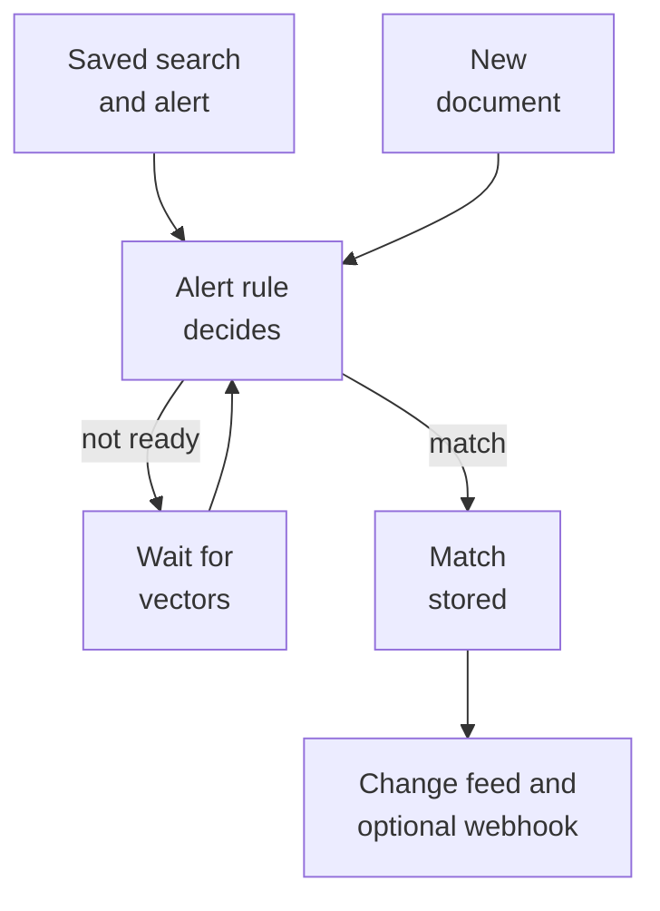
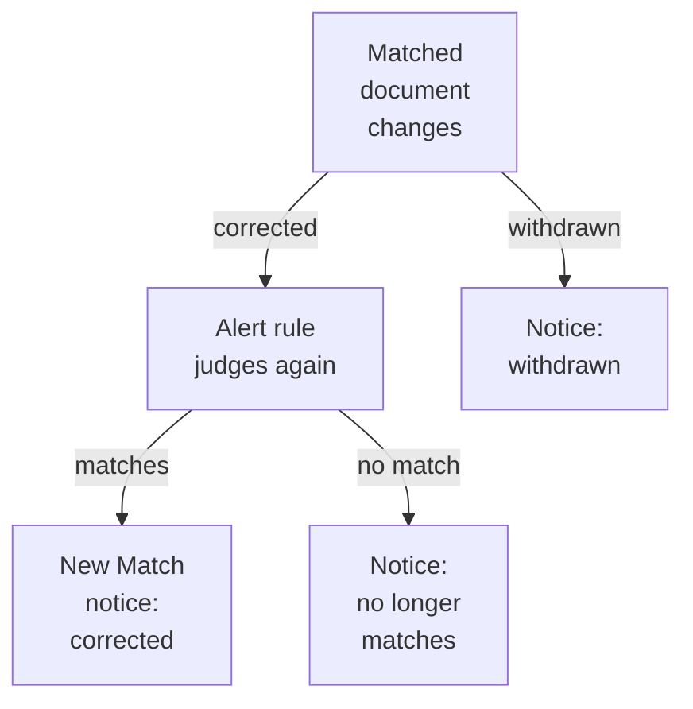

An alert watches your collections for new documents that fit a search you saved. For each new document, a plugin decides whether it fits; Quivr stores each fit as a match with its reason. Your application reads matches through the API and can also receive signed webhooks when you configure a destination.

Two terms in the picture: meaning vectors are what Quivr computes for meaning search after a document becomes searchable, and the change feed is the API's ordered list of events, which your application can follow.

An alert is two objects and one decision per new document, with the reason attached:

In words:

1. A saved search says what to look for and in which collections. An alert switches it on and names the rule that judges, an optional destination for webhooks and, optionally, which of your users it belongs to.
2. Each document that becomes searchable in a watched collection goes to the alert rule, a plugin. It answers match, no match or not ready.
3. Not ready means the rule needs the document's meaning vectors. Quivr waits and asks it again once they arrive.
4. A match is stored with its reason and an event in the change feed. With a destination, Quivr also sends a webhook to your receiver, which can arrive more than once.
5. A first no-match decision sends nothing. What happens when a matched document later changes is [below](#corrections-and-withdrawals).

## The parts of an alert

The API keeps the parts of an alert as separate objects, so you can change one without the others. Each name below is the one the API reference uses; the Subscription names its alert rule in its `evaluator` field:

| Object | What it is, and who sets it |
| --- | --- |
| Saved Query | The search to repeat: an expression and the collections (Corpora) it watches. Your application creates it. |
| Expression | The condition, as JSON, inside the Saved Query. Its `kind` picks the check, such as `keywords` or `meaning`. |
| Subscription | The alert. It switches a Saved Query on and names its rule, optional destination and `owner`. Your application creates it. |
| Alert rule | The plugin version that judges each document, such as `alerts` `0.4.0`. The operator installs it. |
| Destination | A webhook receiver's URL and signing secret. The operator sets it in Quivr's configuration. |
| Match | A stored decision that a document version fits a Subscription, with its evidence. Quivr creates it. |
| Delivery | One notice about one Match, sent to the destination. Its attempts are the HTTP requests. |

Changing a Saved Query's expression or a Subscription's settings creates a new Version instead of editing the old one. A Subscription keeps the Saved Query Version it names until you point it at a new one, and documents that arrive afterwards are judged by its new Version. Earlier Matches keep the Version that decided them. Several Subscriptions can share one Saved Query, for example one per user, each with its own `owner`.

An alert judges only documents that become searchable after it is switched on. To see what a query would have caught in the past, preview it with `POST /v0/subscription-previews` before saving it.

## Choose a check

The first-party `alerts` plugin offers three checks. Pick the one that fits how your users describe a topic:

| Check | What it catches, and at what cost |
| --- | --- |
| Keywords (`keywords`) | The words you list, with `AND`, `OR`, `NOT` and metadata filters. Decides at once, but misses other wordings and languages. |
| Local meaning (`meaning`) | A subject you describe, which can be found in other wording or languages. Never calls Jev; waits for vectors. |
| External meaning (`described`) | A subject you describe, judged by TypeSafe's Jev classifier. Sends text to TypeSafe and needs the operator's key. |

`keywords_or_meaning` and `keywords_and_meaning` combine a keyword tree with one meaning check.

Local checks require a threshold calibrated for their vector space. The operator sets `vectors.thresholds[<vector-space-id>]` on the plugin, or you set `threshold` in the Subscription's evaluator configuration. The Subscription setting takes precedence. There is no implicit default. Scores measure closeness, not a probability; tune the threshold on your own examples ([Meaning alerts](/guides/described-alerts#use-the-local-meaning-check)).

The local check never calls Jev, but it is not private by itself: document and description text go to whatever embedding provider the operator configured. To keep that text inside your installation, the operator must use a local embedding provider, such as the default `core-ingest` plugin, which calls an embedding server the operator runs (the local stack starts one). [Meaning alerts](/guides/described-alerts#use-the-local-meaning-check) has the details.

## Not ready

A rule answers not ready when it needs information Quivr is still computing, usually the document's meaning vectors (enrichment). Meaning checks wait for them by default; keyword checks do not. A Subscription can change this with `wait_for_enrichment` in its `evaluator.configuration`.

When the vectors arrive, Quivr asks again only the alerts that have not decided yet. An alert that already matched or did not match that version keeps its decision, so the second question never creates a duplicate Match. If the vectors never arrive, or the rule still answers not ready, the alert does not judge that version.

## Corrections and withdrawals

A correction is a new version of a document. When the earlier version matched an alert, the correction goes back to the alert rule, and the alert sends a follow-up notice once the rule decides. A withdrawal sends one without asking the rule:

In words: a correction that still matches stores a new Match and sends `match.corrected`. A correction that no longer matches sends `match.no_longer_matches`, and a withdrawal sends `match.withdrawn`; neither stores a Match. Each notice is a change feed event, with a webhook when its Subscription Version has a destination:

- `match.created`: a new document fits. Quivr stores a Match.
- `match.corrected`: a correction still fits. Quivr stores a new Match, linked to the earlier one by `previous_match_id`.
- `match.no_longer_matches`: a correction no longer fits. The notice points to the earlier Match; no Match is stored.
- `match.withdrawn`: the matched document is withdrawn. The notice points to the earlier Match; no Match is stored.

A Match never changes after it is stored, so the history of what your users were told stays readable.

## Delivery

Omit `destination_id` when creating a Subscription to read alerts through the API alone. Quivr stores Matches and follow-up events without creating Deliveries or sending webhooks. List the Matches with `GET /v0/matches?subscription_id=…`; follow the change feed for negative corrections and withdrawals, which store no new Match. These events omit `delivery_id`.

A new Subscription Version can add or remove a destination. Omitting `destination_id` on the new Version removes delivery for future Matches; it does not inherit the old destination. Earlier Matches keep their pinned Version, including its destination for negative corrections and withdrawals.

With a destination, each notice creates a delivery and an entry in the change feed. Quivr holds a delivery while its Subscription is paused, but its retry window keeps running: a delivery whose window ends during the pause is never sent. It never sends the webhook of a notice that became obsolete: the Subscription was deleted, the document was withdrawn, or a later correction replaced it. The change feed still has the event. Delivery is at least once:

- Quivr retries a timeout, a connection failure or a `408`, `429` or `5xx` answer, with growing delays, for up to 24 hours by default. The window normally starts when Quivr creates the delivery; a withdrawal recorded while the Subscription was paused starts its window when you resume it. The operator can change the window's length.
- Every retry sends the same event id (`webhook-id`) and the same body, so your receiver deduplicates on it.
- Retries stop at the end of the window or on any other answer. A receiver that stays down misses those webhooks. Your application can still list Matches with `GET /v0/matches`, which covers first matches and corrections that still match. The other follow-ups store no Match: an application that already follows the [change feed](https://docs.quivr.thevibecompany.co/api-reference/changes/poll-changes) from a saved position finds them there, for as long as the operator keeps events, 7 days by default.

Each webhook is signed with the destination's secret, so your receiver can prove it comes from Quivr. [Keyword alerts](/guides/keyword-alerts#receive-the-webhook) shows the body, which names the event type and the Match, and how to check the signature.

## Who does what

Your application, through the API:

1. Creates a Saved Query and a Subscription.
2. Reads Matches and follows the change feed, or receives each webhook and verifies its signature.
3. Deduplicates webhook notices on `webhook-id` and reads the Match's evidence.
4. Changes, pauses or deletes alerts.

The operator who runs Quivr:

1. Installs the `alerts` plugin and chooses the checks it offers ([First-party plugins](/run-quivr/catalog#alerts)).
2. Configures destinations when applications need webhooks ([Configuration](/reference/configuration#webhook-destinations)).
3. Maps your metadata fields for keyword filters ([Configure alert fields](/run-quivr/configure-alert-fields)).
4. Moves existing alerts to a new rule version ([Upgrade an alert rule](/run-quivr/upgrade-an-alert-rule)), or abandons evaluations whose old rule is gone ([Retire alert evaluations](/run-quivr/retire-alert-evaluations)).

## Next

<CardGroup cols={2}>
<Card title="Keyword alerts" icon="bell" href="/guides/keyword-alerts">
Save a keyword alert, receive its webhook and verify it.
</Card>
<Card title="Meaning alerts" icon="sparkles" href="/guides/described-alerts">
Alert on a subject described in plain words, with stored vectors or with Jev.
</Card>
</CardGroup>
