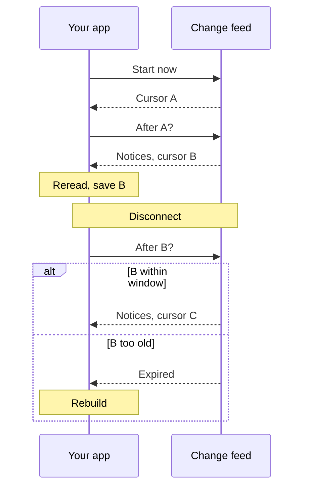

Read a collection's change feed to learn which documents or alerts changed. Handle each notice by reading the changed document again, then save your place so you can resume after a disconnect.

## How it works

You keep documents (Records, in the API) in a collection (a Corpus). Each accepted text of a document is a Version, which never changes; the document points to its current one. The change feed lists, in order, a short notice (a change event) for each change: what happened and to which resource, but not the new content.

Each read of the feed returns a cursor, a string marking your place in one collection. You send it on the next read. Quivr keeps notices for a retention window, 7 days by default. If the changes after your cursor are older than that, Quivr refuses the cursor, and you rebuild your copy from the list of all documents in the collection, the catalog.

Your application reads changes after its cursor, updates its copy, then saves the new cursor:



In words:

1. Your app asks to start now and gets cursor A, with no past notices.
2. It reads the changes after A, gets notices and cursor B, reads the changed documents again, then saves B.
3. After a disconnect, it reads the changes after B. If B is within the retention window, it gets notices, some possibly seen before, and cursor C.
4. If B is too old, Quivr answers that it expired, and the app rebuilds its copy from the catalog.

## Prerequisites

- A running Quivr, and `QUIVR_API_URL` and `QUIVR_API_KEY` in your shell. With the local stack, `eval "$(make -s env)"` sets them ([Quickstart](/quickstart)).
- To follow an existing collection, a key with `changes:read`, `content:read` and access to that collection. Running this page also needs `corpora:write`, `content:write` and access to all collections, to create a collection and an article.
- `curl`, `jq` and `sed`: `command -v curl jq sed` prints a path for each.

The requests below use idempotency keys: a request sent again with the same key returns its first result and adds no notice. To run the page again, give each run its own label, which the keys include:

{/* runnable */}
```bash
date +%s | jq -R '{run: .}'
```

{/* output */}
```json
{"run": "{{RUN}}"}
```

```bash
export RUN=<the run above>
```

## Start following a collection

Create a collection for this page:

{/* runnable */}
```bash
curl -s -X POST "$QUIVR_API_URL/v0/corpora" -H "Authorization: Bearer $QUIVR_API_KEY" \
  -H "Content-Type: application/json" \
  -d '{"name": "Harbour news", "idempotency_key": "follow-'"$RUN"'"}' | jq '{corpus_id}'
```

{/* output */}
```json
{"corpus_id": "{{CORPUS_ID}}"}
```

```bash
export CORPUS_ID=<the corpus_id above>
```

Read the feed without a cursor. Quivr returns no past notices and a cursor at the current end of the feed:

{/* runnable */}
```bash
curl -s "$QUIVR_API_URL/v0/changes?corpus_id=$CORPUS_ID" \
  -H "Authorization: Bearer $QUIVR_API_KEY" | jq '{items, has_more, next_cursor}'
```

{/* output */}
```json
{"items": [], "has_more": false, "next_cursor": "{{START_CURSOR}}"}
```

```bash
export START_CURSOR=<the next_cursor above>
```

Save this cursor before anything else. Starting now skips the documents already in the collection: to follow an existing collection, take this cursor first, build your initial copy from the catalog as in [Build or rebuild your copy](#build-or-rebuild-your-copy), then follow changes from this cursor. A cursor belongs to one collection, so an app that follows several keeps one cursor for each.

## Read what changed

Add an article to the collection:

{/* runnable */}
```bash
curl -s -X POST "$QUIVR_API_URL/v0/records" -H "Authorization: Bearer $QUIVR_API_KEY" \
  -H "Content-Type: application/json" -d @- <<EOF | jq '{receipt_id}'
{
  "idempotency_key": "follow-$RUN-ferry-1",
  "source": {"corpus_id": "$CORPUS_ID", "namespace": "press", "record_key": "ferry-timetable"},
  "content": {"kind": "text", "text": "Ferries to the island leave every 40 minutes from Monday."}
}
EOF
```

{/* output */}
```json
{"receipt_id": "..."}
```

Then read the changes after your cursor. Quivr processes the article in the background, so its notices arrive over a few seconds; read again until you see `record.enrichment_available`:

{/* runnable retry */}
```bash
curl -s "$QUIVR_API_URL/v0/changes?corpus_id=$CORPUS_ID&cursor=$START_CURSOR" \
  -H "Authorization: Bearer $QUIVR_API_KEY" \
  | jq '{types: [.items[].type],
         reread: [.items[] | select(.resource.kind == "record") | .resource.id] | unique,
         has_more, next_cursor}'
```

{/* output */}
```json
{
  "types": ["receipt.pending", "record.accepted", "record.materialized", "receipt.resolved",
            "record.retrieval_ready", "record.enrichment_available"],
  "reread": ["{{RECORD_ID}}"],
  "has_more": false,
  "next_cursor": "{{CURSOR}}"
}
```

```bash
export RECORD_ID=<the record id in reread above> CURSOR=<the next_cursor above>
```

Each item is a full change event; the `jq` filter above prints only its type and the documents to read again. One item looks like this:

```json
{
  "event_id": "event_e8d4…",
  "type": "record.accepted",
  "schema_version": "1",
  "occurred_at": "2026-10-03T16:59:41Z",
  "resource": {"kind": "record", "id": "record_25eb…", "corpus_id": "corpus_774c…"},
  "cursor": "eyJ2Ijox…"
}
```

- Save `next_cursor` once you have handled the whole page, and send it as `cursor` on the next read. It can move forward even when a read returns no items, and stays the same when nothing new was committed.
- `has_more: true` means more changes are waiting: read again at once. When it is `false`, you are caught up; wait as long as suits your app before the next read.
- `limit` sets the page size, from 1 to 100 (the default).
- Each item also carries its own `cursor`, to resume right after that item.

The [poll reference](https://docs.quivr.thevibecompany.co/api-reference/changes/poll-changes) lists every parameter.

## Update your copy

A notice tells you that a document changed, not how. For each document in a page of notices, read it once, however many notices name it, and act on what you read:

1. If the read answers `404`, your key can no longer reach the document: remove it from your copy.
2. If `withdrawn` is `true`, remove its content from your copy, keeping only a marker if your app shows withdrawals. Withdrawn documents stay readable, so they do not answer `404`.
3. If `current_version_id` is absent, the document has no searchable text yet: keep what you have and wait for a later notice.
4. Otherwise, read that Version and store its text.

Then save the page's `next_cursor`, once these updates have succeeded. Read the article now:

{/* runnable */}
```bash
curl -s "$QUIVR_API_URL/v0/records/$RECORD_ID" -H "Authorization: Bearer $QUIVR_API_KEY" \
  | jq '{record_id, withdrawn, current_version_id}'
```

{/* output */}
```json
{"record_id": "{{RECORD_ID}}", "withdrawn": false, "current_version_id": "{{VERSION_ID}}"}
```

```bash
export VERSION_ID=<the current_version_id above>
```

The text is in the Version's Parts, its named pieces such as a title or a body:

{/* runnable */}
```bash
curl -s "$QUIVR_API_URL/v0/records/$RECORD_ID/versions/$VERSION_ID" \
  -H "Authorization: Bearer $QUIVR_API_KEY" \
  | jq '{parts: [.manifest.parts[] | {key, text: .content.text}]}'
```

{/* output */}
```json
{"parts": [{"key": "body", "text": "Ferries to the island leave every 40 minutes from Monday."}]}
```

A correction is new text for the same document: the same collection, `namespace` and `record_key`. Send one:

{/* runnable */}
```bash
curl -s -X POST "$QUIVR_API_URL/v0/records" -H "Authorization: Bearer $QUIVR_API_KEY" \
  -H "Content-Type: application/json" -d @- <<EOF | jq '{receipt_id}'
{
  "idempotency_key": "follow-$RUN-ferry-2",
  "source": {"corpus_id": "$CORPUS_ID", "namespace": "press", "record_key": "ferry-timetable"},
  "content": {"kind": "text", "text": "Ferries to the island leave every 30 minutes from Monday."}
}
EOF
```

{/* output */}
```json
{"receipt_id": "..."}
```

It produces the same notices as the first text, for the same document. Once `record.retrieval_ready` arrives, the document points to the corrected Version; read until `record.enrichment_available` to see them all:

{/* runnable retry */}
```bash
curl -s "$QUIVR_API_URL/v0/changes?corpus_id=$CORPUS_ID&cursor=$CURSOR" \
  -H "Authorization: Bearer $QUIVR_API_KEY" > page.json
version=$(curl -s "$QUIVR_API_URL/v0/records/$RECORD_ID" \
  -H "Authorization: Bearer $QUIVR_API_KEY" | jq -r .current_version_id)
curl -s "$QUIVR_API_URL/v0/records/$RECORD_ID/versions/$version" \
  -H "Authorization: Bearer $QUIVR_API_KEY" \
  | jq --slurpfile page page.json \
       '{types: [$page[0].items[].type], text: .manifest.parts[0].content.text,
         next_cursor: $page[0].next_cursor}'
```

{/* output */}
```json
{
  "types": ["receipt.pending", "record.accepted", "record.materialized", "receipt.resolved",
            "record.retrieval_ready", "record.enrichment_available"],
  "text": "Ferries to the island leave every 30 minutes from Monday.",
  "next_cursor": "{{CURSOR_2}}"
}
```

```bash
export CURSOR_2=<the next_cursor above>
```

While a correction is still processing, or on hold (quarantined), the earlier Version stays current, so a read in between returns the earlier text. The [Version reference](https://docs.quivr.thevibecompany.co/api-reference/records/get-version) lists every field.

## Save your place and handle repeats

As long as you resume from a cursor within the retention window, the feed delivers each notice at least once, in the order Quivr committed the changes. To lose nothing:

1. Read a page of notices.
2. Update your copy.
3. Save the updates, the `event_id` of each notice you handled, and `next_cursor` in one transaction.
4. After a crash or a disconnect, read again from the saved cursor.

A crash before step 3 means you read that page again; reading documents again is harmless. Keep the handled `event_id`s for at least one retention window, and skip a notice you have already handled. Some notices, such as `record.enrichment_available`, can come back with the same `event_id` even later, after their first copy was deleted.

An action outside your store, such as sending an email, cannot be made exactly-once by a stored `event_id` alone. If you crash after sending and before saving, the email goes twice; if you save first and crash before sending, it is lost. Instead, add the action to a durable queue in the same transaction as the cursor, and have the sender pass the `event_id` as an idempotency key to a service that accepts one. With a service that accepts none, a crash right after a send can still repeat it; recording each send as soon as it succeeds keeps that window small.

A cursor stays valid while the first change after it is within the retention window: 7 days by default, set by the operator with `change_retention` ([configuration](/reference/configuration)); ask them if yours differs. An app that reads until `has_more` is `false` at least once per window keeps a valid cursor. An operator can also delete notices sooner (`change_prune`), which expires the cursors behind them.

## Build or rebuild your copy

You build a copy from the catalog when you start following an existing collection, and rebuild it when Quivr refuses your cursor rather than skip changes silently:

| Answer | Why |
| --- | --- |
| `410 cursor_expired` | The first change after the cursor is older than the retention window, or was deleted |
| `409 cursor_scope_changed` | The cursor was issued for another collection, or to a key with other permissions or collections |

Neither is retryable, and both carry `resync_url`, where to start rebuilding. On the stream, both arrive as an HTTP error before the response starts; `cursor_expired` can also arrive as a `stream_error` frame once it has started. For any other error, check its `retryable` field: when it is `true`, as for `503 changes_unavailable`, read again later from the same cursor; when it is `false`, fix the request (the key, the collection or the cursor) before you retry. This answer was captured by hand on a local stack whose `change_retention` was set to 1 second:

```json
{"code": "cursor_expired", "message": "cursor expired; resynchronize", "retryable": false,
 "resync_url": "/v0/records?corpus_id=corpus_774c…"}
```

`resync_url` is relative to your API address; it is the catalog of the collection, `/v0/records?corpus_id=…`. To build or rebuild your copy:

1. Start now: read `GET /v0/changes?corpus_id=…` without a cursor and keep its `next_cursor`. Take it before listing, so changes made during the listing reach you through the feed.
2. List the catalog into a fresh copy, page by page: send each page's `next_page_cursor` as `page_cursor` until it is absent. Replace your old copy only when the listing is complete.
3. Read the changes after the cursor from step 1, and update your copy from them.
4. Carry on as before. If a cursor fails again during these steps, start over at step 1.

The catalog lists every document of the collection your key can read, withdrawn ones included, up to 100 per page. This loop reads every page:

{/* runnable */}
```bash
: > catalog.jsonl; page=""
while :; do
  curl -s "$QUIVR_API_URL/v0/records?corpus_id=$CORPUS_ID&limit=100${page:+&page_cursor=$page}" \
    -H "Authorization: Bearer $QUIVR_API_KEY" > list.json
  jq -c '.items[] | {record_id, withdrawn, current_version_id}' list.json >> catalog.jsonl
  page=$(jq -r '.next_page_cursor // empty' list.json)
  [ -n "$page" ] || break
done
jq -s '{documents: [.[] | {record_id, withdrawn}]}' catalog.jsonl
```

{/* output */}
```json
{"documents": [{"record_id": "{{RECORD_ID}}", "withdrawn": false}]}
```

Then read the current Version of each document, as in [Update your copy](#update-your-copy). A catalog page cursor is not a change cursor: each is refused where the other is expected. The listing is not a snapshot taken at one instant; step 3 brings the copy up to date.

A rebuild restores the current state of your documents, not the notices you missed. For alerts, `GET /v0/matches?subscription_id=…` lists first matches and corrections that still match ([keyword alerts](/guides/keyword-alerts#read-what-matched)); `match.no_longer_matches` and `match.withdrawn` store no Match, so those missed notices are gone. The [catalog reference](https://docs.quivr.thevibecompany.co/api-reference/records/list-records) lists every parameter.

### List by acceptance time

For a date-based feed, use `GET /v0/records` with `order=accepted_at_desc`.
It lists Records by the time Quivr accepted their current Version, newest first;
a correction moves a Record when the replacement Version becomes current.
Set `accepted_after` for an inclusive start and `accepted_before` for an exclusive end.
Both take RFC 3339 timestamps with an offset and at most 9 fractional-second digits.
Convert days in your own time zone
into these bounds; Quivr applies no time-zone rules. Use local midnight at the
start of the day and local midnight at the start of the next day, computing each
offset separately if daylight-saving time changes.

Repeat the order and bounds when following `next_page_cursor`. Changing them
returns `409 cursor_scope_changed`. Newer arrivals do not shift later pages;
pages remain independent reads, so reconcile concurrent corrections and readiness
changes through the change feed. Reread the current Version on an invalidation
and reapply your bounds. Withdrawn Records remain included and marked.
Records without a current Version appear last in an unbounded date listing;
either time bound excludes them.

Use [Count records](https://docs.quivr.thevibecompany.co/api-reference/records/count-records), `GET /v0/records/count`,
with the same Corpus and time bounds to get an exact `count` without listing pages.
It uses the listing's inclusion rules for withdrawn and undated Records, and
needs the same `content:read` permission and Corpus scope. The count is an
independent read, so it can change between listing requests.

The [CLI](/reference/cli#quivr-records) exposes these reads as `quivr records`:
`--corpus` selects the Corpus, `--order accepted_at_desc` selects newest first,
`--accepted-after` and `--accepted-before` set the bounds, and `--page-cursor`
continues one page at a time. It prints the API JSON; list pages include the next cursor when another page exists.
Use `--limit` to select 1 to 100 Records per page. Use `--count` with the Corpus
and optional bounds to count; omit `--order`, `--page-cursor` and `--limit`.
Count responses contain only `count`, without a continuation cursor.
ID order remains the default for the rebuild procedure above.


## What the notices mean

The `type` says what happened, and `resource.kind` and `resource.id` say to what. Every change to a document produces at least one notice with `resource.kind` `record` and that document's ID.

| `type` | What happened |
| --- | --- |
| `record.accepted` | Quivr accepted a submission: a first text, a correction, or a resend under a new key |
| `record.materialized` | A new Version is stored and readable |
| `record.retrieval_ready` | Word search is ready for that Version |
| `record.enrichment_available` | Meaning search is ready for that Version |
| `record.quarantined` | That Version is on hold; the earlier text stays current ([why](/concepts#if-you-cant-find-it)) |
| `record.withdrawn` | Out of search and new matches for good; earlier matches can get a `match.withdrawn` notice |
| `receipt.pending`, `receipt.resolved` | A submission's Receipt (its acknowledgement) was created, then got its outcome |
| `match.*` | An alert caught the document, or a follow-up on an earlier catch |
| `delivery.updated` | A webhook delivery changed state; it never sends a webhook itself |

A resend of the current text under a new `idempotency_key` produces `record.accepted` but no new Version.

Alert notices are `match.created`, `match.corrected`, `match.no_longer_matches` and `match.withdrawn` ([how alerts work](/guides/alerts#corrections-and-withdrawals)). They carry a `monitoring` object with the references of the catch: `match_id`, `record_id`, the alert's `subscription_id`, the `owner` your app gave the alert, and `delivery_id`. Their `event_id` is the same as the `event_id` in the body of the webhook Quivr sends for that catch, which is also its `webhook-id` header. An app can follow alerts in the feed instead of, or as well as, through webhooks, and skip one copy by its `event_id`.

Other notices concern alerts and collectors: `saved_query.*`, `subscription.*`, `connector.*`, `operation.updated`. A Saved Query (an alert's search) or a Subscription (the alert that uses it) that watches several collections gets a notice in each of them. Skip types your app does not use, including types added later.

## Stream changes live

`GET /v0/changes/stream` sends the same notices as they happen, over one long HTTP response in the [Server-Sent Events](https://html.spec.whatwg.org/multipage/server-sent-events.html) format. It replaces polling, not the rest of this page. To see a notice arrive, withdraw the article:

{/* runnable */}
```bash
curl -s -X POST "$QUIVR_API_URL/v0/records/withdrawals" -H "Authorization: Bearer $QUIVR_API_KEY" \
  -H "Content-Type: application/json" -d @- <<EOF | jq '{receipt_id}'
{
  "idempotency_key": "follow-$RUN-withdraw-ferry",
  "source": {"corpus_id": "$CORPUS_ID", "namespace": "press", "record_key": "ferry-timetable"},
  "reason": "published by mistake"
}
EOF
```

{/* output */}
```json
{"receipt_id": "..."}
```

Then open the stream from your saved cursor. The stream stays open, so this command stops after 3 seconds; curl reports that stop as exit code 28. Run it again if the notice is not there yet:

{/* runnable retry */}
```bash
curl -sN --max-time 3 "$QUIVR_API_URL/v0/changes/stream?corpus_id=$CORPUS_ID" \
  -H "Authorization: Bearer $QUIVR_API_KEY" -H "Last-Event-ID: $CURSOR_2" > stream.txt \
  || [ $? -eq 28 ]
sed -n 's/^data: //p' stream.txt | jq -s '[.[] | select(.type) | {type, record: .resource.id}]'
```

{/* output */}
```json
[{"type": "record.withdrawn", "record": "{{RECORD_ID}}"}]
```

The raw stream in `stream.txt` holds one frame per notice, trimmed here:

```text
: resumed

id: eyJ2Ijox…
event: change
data: {"event_id":"event_…","type":"record.withdrawn",…,"cursor":"eyJ2Ijox…"}
```

| Frame | What to do |
| --- | --- |
| `event: change` | Handle the notice in `data`, the same JSON as a polled item |
| `event: checkpoint` | Nothing to handle; its `id` is a new cursor |
| `event: stream_error` | `data` is the error and the stream closes; act on its `code` and `retryable` as for a polled error |
| A line starting with `:` | A comment, such as a keepalive after 15 seconds of silence; ignore it |

Only `change` and `checkpoint` frames carry an `id`, the cursor after them. Save the last one you handled; comments and errors leave it unchanged. When the connection drops, or after a `stream_error` whose `retryable` is `true`, reconnect with that cursor in the `Last-Event-ID` header; it wins over a `cursor` query parameter. Without either, the stream starts now with a `checkpoint` frame. The [stream reference](https://docs.quivr.thevibecompany.co/api-reference/changes/stream-changes) has the details.

Open the stream from your server. A browser's `EventSource` cannot send the `Authorization` header, and an API key must never go in a URL.

Following the feed creates nothing in Quivr. The collection and the withdrawn article of this page can stay; each run of the page adds one of each.

## Next

<CardGroup cols={2}>
<Card title="Keyword alerts" icon="bell" href="/guides/keyword-alerts">
Get notified when a new article matches a query, by webhook or through the feed.
</Card>
<Card title="Core concepts" icon="book-open" href="/concepts">
What the stages behind each notice mean: acceptance, word search, meaning search.
</Card>
</CardGroup>
