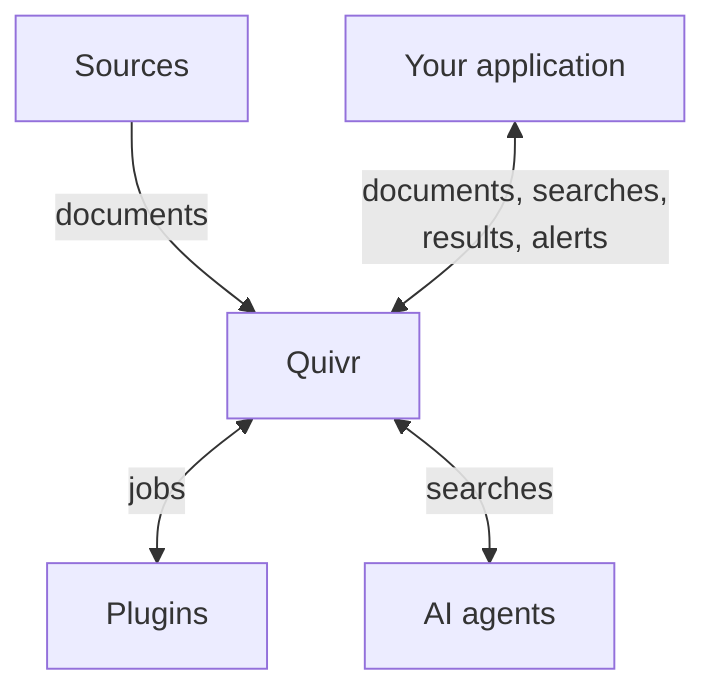

Quivr is an open-source engine for content that keeps arriving: news, feeds, mailboxes, posts. It stores incoming documents, processes them in the background so you can search them, and tells you when a new document matches a topic you follow. Your application talks to it over an HTTP API.

Quivr is an engine, not a finished product: it has no screens or user accounts of its own. You build what your users see, such as a newsroom tool, a media monitoring service or a research assistant, and Quivr collects, searches and watches the content underneath. A small demo app, toured [below](#tour-the-demo), shows what you can build on it.

## Quivr at a glance

Quivr calls plugins for the jobs that depend on your content. A plugin is a small web service that does one kind of job, such as reading PDF files, collecting a feed, preparing text for search or ranking results. Quivr ships with a plugin for each job, and you can swap them or add your own.

Documents come in from your sources and your application, plugins do the jobs that depend on your content, and search results and alerts go out:

In words:

1. Sources are news feeds (RSS and Atom), Microsoft 365 mailboxes and lists on X, which Quivr collects on a schedule, and partners who push documents to it. Your application can send documents too.
2. Quivr stores every version of every document, prepares it for search and checks it against your saved alerts.
3. Plugins do the jobs that depend on your content: read files, collect sources, prepare text for search, rank results and decide alerts. Quivr asks them over HTTP. Only two jobs are required, preparing text for search and ranking results, and Quivr ships a plugin for each. The others are there when you need them.
4. Your application searches Quivr and gets back ranked passages, each linked to its document and version.
5. When a new document matches a saved alert, Quivr sends a signed message (a webhook) to an address your application runs, the alert receiver. Your application then decides how to tell people, by email or in your app.
6. AI agents search Quivr through MCP, a standard way for agents to call tools, and quote what they find. Quivr returns passages; the agent writes the answer. See [Connect an AI agent](/guides/ai-agents).

## What goes in, what comes out

Take one news article: _Harbour strike halts the ferry_, with the line "The harbour strike stopped every ferry to the island on Friday." It comes from a feed Quivr follows, or your application sends it. Quivr files it in a collection (a Corpus, in the API) as a document (a Record).

| What you do | What Quivr gives back |
| --- | --- |
| Search for `ferry` | The passage "The harbour strike stopped every ferry…", with the document, version and character positions it comes from |
| Save the alert `"harbour strike" AND (ferry OR port) NOT football` | A match, recorded with its reason: `Matched "harbour strike" in title, body; "ferry" in title, body.` A signed webhook tells your receiver, and your application reads the reason through the API |
| Let an AI agent answer "what happened to the ferry?" | The same passage, which the agent quotes with its source |
| Receive a correction of the article from the feed | A new version, searchable in place of the old one. The old one stays readable, and the alert sends a follow-up saying whether the new text still matches |

The requests behind each row are in [Add content](/guides/add-content), [Search](/guides/search) and [Keyword alerts](/guides/keyword-alerts).

## What you can do today

<CardGroup cols={2}>
<Card title="Collect content" icon="inbox" href="/guides/add-content">
Send documents one by one or in batches, as text or files such as PDFs. Or let Quivr pull them from RSS and Atom feeds, Microsoft 365 mailboxes and X lists, or receive them from a partner's webhook.
</Card>
<Card title="Search it" icon="search" href="/guides/search">
Search by keywords, by meaning, or both. Each result names the document, the version and the exact passage it comes from.
</Card>
<Card title="Follow a topic" icon="bell" href="/guides/alerts">
Save a keyword query or a plain-language description as an alert. Quivr records why each document matched and sends a signed webhook with its identifiers. Your application reads the explanation through the API.
</Card>
<Card title="Extend it with plugins" icon="puzzle" href="/plugins/overview">
Add a file format, a source, a way to prepare text for meaning search or rank results, or an alert rule, in any language that serves HTTP.
</Card>
</CardGroup>

## What Quivr promises

Quivr confirms a document only once it has stored it, so an outage delays processing and does not lose what it confirmed. Processing has no deadline. While a plugin Quivr needs is down, Quivr waits and retries. A document a plugin rejects is set aside (quarantined) with the reason, and an operator can [process it again](/run-quivr/reprocess-quarantined-versions) once the cause is fixed. A file with no text Quivr can read, such as a scanned PDF, stays stored but is not searchable.

Each document submission must carry an idempotency key, a name your application gives it. Repeating the same submission with the same key returns the same receipt, Quivr's tracking record for it, instead of storing a second copy. Reusing the key for a different submission returns a conflict.

By default, Quivr retries a webhook your receiver does not accept for up to 24 hours, and the operator can change this window. A webhook can therefore arrive more than once, so your receiver ignores the copies it has already seen. Retries stop at the end of the window or when the receiver refuses for good, so a receiver that stays down misses alerts. Your application can still list the matches through the API.

## Who runs what

Quivr runs on servers you control, next to your application. Your users talk to your application, and your application calls Quivr.

| Part | Who runs it, and what it does |
| --- | --- |
| Your application | You. It shows your screens, manages your users and calls Quivr from its server with an API key. |
| Quivr | You, or an operator for you: an API and a worker with their own databases and file storage. The operator creates the API keys. |
| Plugins | Small web services Quivr calls. The default ones run with Quivr; yours run wherever Quivr can reach them over HTTP. |
| Alert receiver | You: an address in your system that receives the signed alerts. The operator lists it in Quivr's settings. |

By default, Quivr itself sends document text nowhere outside your installation: the plugins it runs by default work there, and so does the model that lets it search by meaning. Quivr sends text out only through a plugin the operator turns on that calls an outside service: a hosted model for meaning search, a paid service that re-orders search results, or one that judges alerts described in plain language. Alerts carry identifiers, not text. Anything that holds an API key, your application or an AI agent, reads the documents that key allows, and an agent may pass them to the AI service it runs on.

## What you need

- **To see it:** nothing. The [tour](#tour-the-demo) below shows the demo app.
- **To run it on your machine:** Linux on x86_64 or an Apple Silicon Mac, Docker, Go, Python, a few command-line tools and about 1 GB of downloads. The [Quickstart](/quickstart) takes about fifteen minutes.
- **To build on it:** a running Quivr and an API key from its operator. A key belongs to one organization, can be limited to some collections, and carries only the permissions your application needs, such as `content:write` to add documents, and `content:read` with `search:query` to search them.

## Tour the demo

The repository includes a demo web app: a small monitoring dashboard built only on Quivr's API. It is an example of a product someone could build on Quivr, not part of the engine. Its interface is in French; the screenshots below show three made-up English news feeds.

<Frame caption="The feed (Fil). (1) Documents arrive from three feeds, newest first. (2) The alerts that caught a document are tagged under its title. (3) Each alert counts what it caught.">
  
</Frame>

<Frame caption="A search with Idées proches (similar ideas) on. (1) The question, in plain words. (2) The best result, a storm warning, shares none of the question's words: Quivr found it by meaning. The demo marks such results Même sujet, autres mots (same topic, other words). (3) Meaning search returns the closest documents it has, so less related ones follow.">
  
</Frame>

<Frame caption="An open document. (1) Why each alert caught it. (2) The feed corrected the article: the demo shows what changed, word by word, and can open the earlier text.">
  
</Frame>

<Frame caption="The Admin tab, read-only. (1) How long documents took to become searchable in this demo. (2) Each document's time at every step: received, cut into passages, searchable by keyword, prepared for meaning search, checked against alerts.">
  
</Frame>

To run it yourself, follow the [Quickstart](/quickstart) prerequisites, install Node 22 or later, then run `make demo` from the repository and open `http://127.0.0.1:5183`. The [demo's README](https://github.com/The-Vibe-Company/quivr-v2/tree/main/quivr-search) explains each tab.

The pictured feeds and alerts are example data, and your local demo starts empty. To try it, [add a news site](https://github.com/The-Vibe-Company/quivr-v2/tree/main/quivr-search#sources) in the Sources tab, or paste a document with **Ajouter du texte** (add a text), then [set an alert](https://github.com/The-Vibe-Company/quivr-v2/tree/main/quivr-search#alertes).

## What it does not do yet

Quivr is at the evaluation stage: the API is `v0` and may change, so do not run it in production. The local stack runs on Linux x86_64 and on Apple Silicon Macs. Quivr does not read text inside images, so scanned documents stay unsearchable (there is no OCR).

## Next steps

<CardGroup cols={3}>
<Card title="Quickstart" icon="rocket" href="/quickstart">
Run Quivr locally and search your first article.
</Card>
<Card title="Core concepts" icon="book-open" href="/concepts">
The few ideas you need to use the API.
</Card>
<Card title="How plugins work" icon="puzzle" href="/plugins/overview">
How Quivr calls the plugins that adapt it to your content.
</Card>
</CardGroup>
