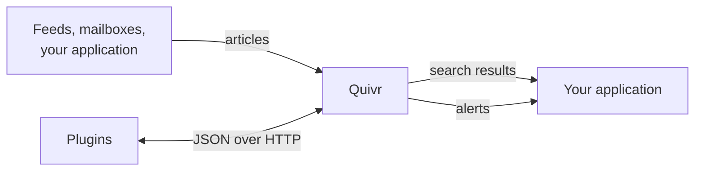

Quivr is an open-source engine for content that keeps arriving: news, feeds, mailboxes, posts. It stores each article safely, makes it searchable within seconds, and tells you when a new article matches a topic you follow. Your application talks to it over an HTTP API.

Quivr has no user interface of its own beyond a small demo. You build the product, and Quivr handles ingestion, search and alerts underneath.

## Who it is for

Developers use Quivr to build products on a stream of content, such as a newsroom tool, a media monitoring service or a research assistant. Ingestion, search and alerts come from one API.

Plugin authors adapt Quivr to their content: a file format, a data source, a ranking strategy or an alert rule. A plugin is a small HTTP service, so Quivr's core never changes.

AI agents can search Quivr and cite their sources through MCP.

## What you can do today

<CardGroup cols={2}>
<Card title="Collect content" icon="inbox">
Send articles one by one or in batches, as text or files such as PDFs. Or let Quivr pull them from RSS and Atom feeds, Microsoft 365 mailboxes and X lists.
</Card>
<Card title="Search it" icon="search">
Search by keywords, by meaning, or both. Each result names the article, the version and the exact passage it comes from.
</Card>
<Card title="Follow a topic" icon="bell">
Save a keyword query or a plain-language description as an alert. Each new article that matches triggers a signed webhook that says why.
</Card>
<Card title="Extend it with plugins" icon="puzzle">
Add a file format, a source, a way to embed or rank text, or an alert rule, in any language that serves HTTP.
</Card>
</CardGroup>

Whatever the source, Quivr confirms an article only once it is stored, so an outage delays processing and never drops content. Every write carries an idempotency key: sending the same request twice never creates a duplicate. A correction creates a new version of the article, earlier versions stay readable, and alerts say when an article they caught was corrected or withdrawn.

## What it does not do yet

Quivr is at the evaluation stage: the API is `v0` and may change, so do not run it in production. The local stack runs on Linux x86_64 only. Scanned documents are not read (there is no OCR), and alerts that match by meaning rely on an external classifier.

## Next steps

<CardGroup cols={3}>
<Card title="Quickstart" icon="rocket" href="/quickstart">
Run Quivr locally and search your first article.
</Card>
<Card title="Core concepts" icon="book-open" href="/concepts">
The few ideas you need to use the API.
</Card>
<Card title="How plugins work" icon="puzzle" href="/plugins/overview">
How Quivr calls the plugins that adapt it to your content.
</Card>
</CardGroup>
