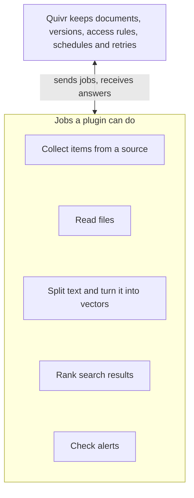
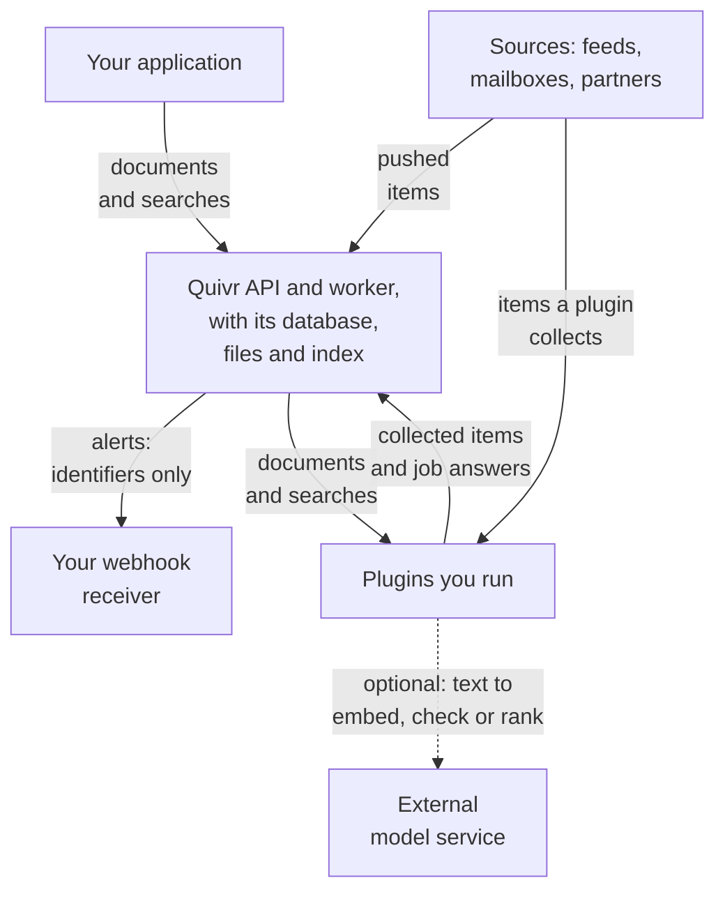

A plugin is a separate web service that Quivr calls over HTTP. Quivr hands it a job, such as reading PDF files or ranking search results, and does everything else itself.

## Five jobs a plugin can do

On this page, a passage is a short piece of a document, and a vector is a list of numbers that captures what a passage means, so Quivr can find passages close in meaning to a search.

Quivr does the bookkeeping that must work the same for everyone, and asks plugins for the decisions that depend on your content:

In words: Quivr keeps your documents, their earlier versions, who may read them, and the schedules and retries of all its work. It asks plugins what a source published, how to read a file, how to cut and compare text, which passages answer a search, and which alerts a document matches.

Each job is one plugin type:

| Job (type) | When Quivr asks |
| --- | --- |
| Collect from a source (`connector`) | On a schedule, or when the source sends Quivr an update |
| Read a file format (`normalizer`) | When a file of that type arrives, such as a PDF |
| Cut and compare text (`ingestion`) | For every new document version, and for every search by meaning |
| Find and rank results (`retrieval`) | For every search |
| Check alerts (`subscription`, the alert rule) | When a document becomes searchable; an alert that needed vectors is asked again once they are ready |

A plugin lists the jobs it does in its manifest, the file that describes it. There, each job is called a Contribution, and its type is one of the five above. Most plugins provide one Contribution, but one plugin can provide several of different types: a plugin for one service could both collect its items (`connector`) and read its file format (`normalizer`). Quivr ships a plugin for each job; [First-party plugins](/plugins/catalog) lists them.

## What Quivr checks, and what it cannot

Quivr checks every answer before it records anything. It checks the shape of the JSON, the limits the plugin declared, and that the answer fits the request: for example, one vector of the right size for each passage. An answer that fails is refused, and nothing from it is recorded: the document is set aside with a diagnostic (quarantined), the search returns an error, or the call is retried.

These checks cannot tell whether an answer is right. A plugin that reads the wrong text from a PDF, or ranks results badly, still passes them. They also do not make plugin code safe to run. A plugin runs with whatever access its process has, and it sees the text Quivr sends it. Install plugins you trust, and try their output on your own content before you rely on it.

## Who runs what

Quivr sends alerts as webhooks: HTTP requests to an address in your system, your webhook receiver.

You run Quivr and every plugin. Quivr sends your plugins what their job needs, and a plugin may send it on to an outside service:

In words:

1. Your application sends documents and searches to Quivr's API. Sources can also push items to the same API.
2. Quivr's API and worker keep everything in their own database, file storage and search index. If you use a managed service for one of these, your documents are stored there.
3. Quivr sends plugins what their job needs: document text, a short-lived link to a file, or a search. Plugins return their answers to Quivr. A connector calls its source itself and returns the items it collected to Quivr.
4. A plugin may call an external model service, such as a hosted embedding model or a classifier, and send it text.
5. Alerts go to your webhook receiver as identifiers, without document text. Your receiver reads the match or the document through the API if it needs more.

| Part | Who runs it, and what it receives |
| --- | --- |
| Quivr API and worker | You, the operator. Every document and version; source credentials are stored encrypted. |
| Plugins | You, as processes, containers or hosted services. What the job needs: text, a file link, a search or a source's update. A connector also gets its source credential. |
| External model service | Its provider, only if a plugin calls one. What that plugin sends it. |
| Your webhook receiver | You. The identifiers of the alert, the match, the document and its version. |

<Warning>
Quivr sends document text to your plugins, which may send it on. Among the plugins that ship with Quivr, `core-ingest` sends passages and searches to the embedding server you configure: it runs locally in the default stack, but its address can be remote. `hosted-embed` sends them to the hosted model you configure, and `alerts` and `jev-rerank` can send text to TypeSafe's Jev model when they have a TypeSafe key. Check what a plugin calls before you give it confidential content. [First-party plugins](/plugins/catalog) describes what each one calls.
</Warning>

## Add a plugin

Quivr does not install, start or scale plugins. You run each one and tell Quivr where it is:

1. Choose a plugin from [First-party plugins](/plugins/catalog), or write your own.
2. Run it as a process, a container or a hosted service that Quivr's API and worker can reach. A plugin that reads or uploads files must also reach Quivr's file storage, because files travel through short-lived links.
3. Give Quivr its manifest and address. Either [pin it](/plugins/pin): list it in the configuration file Quivr reads at startup, then restart Quivr. Or [register it through the API](/plugins/switch-plugins-without-restarting) and switch to it while Quivr runs, with no restart.

Quivr checks the manifest, the version compatibility and the plugin's settings before it sends any work. Before each job, it also checks that the plugin reports the expected identity, version and manifest digest (a fingerprint of the manifest file). This catches a plugin started with the wrong manifest; it does not verify the plugin's code. On a local development stack, `make dev` starts the default plugins for you.

If a plugin is down, background work that needs it waits, and Quivr retries until the plugin is back. A search that needs it fails with `503` instead of returning an empty list. An update a source pushes to Quivr also gets `503`, and the source must send it again. Background work already tied to a plugin version you have since replaced is the exception: it stops after a set number of tries, 10 by default, with a diagnostic that names the plugin. [Switch plugins without restarting](/plugins/switch-plugins-without-restarting#work-finishes-on-the-version-it-started-with) explains that case.

## Write your own

Any language that serves HTTP can implement a plugin, and the Python and Go SDKs handle the protocol for you. `quivr plugin test` checks a plugin against the contract before you install it. [Plugin types](/plugins/types) explains each type and the rules every plugin follows:

- [Ship a manifest](/plugins/types#ship-a-manifest) that describes the plugin.
- [Version the plugin and the protocol](/plugins/types#version-the-plugin-and-the-protocol).
- [Give the same answer to the same request](/plugins/types#give-the-same-answer-to-the-same-request).
- [Pass the Contract Runner](/plugins/types#pass-the-contract-runner).
- [Use an SDK](/plugins/types#use-an-sdk).

## Next

<CardGroup cols={2}>
<Card title="Plugin types" icon="shapes" href="/plugins/types">
What each type does, when Quivr calls it, and the rules every plugin follows.
</Card>
<Card title="Build your first plugin" icon="hammer" href="/plugins/first-plugin">
From an empty folder to a plugin that makes a new file format searchable.
</Card>
</CardGroup>
