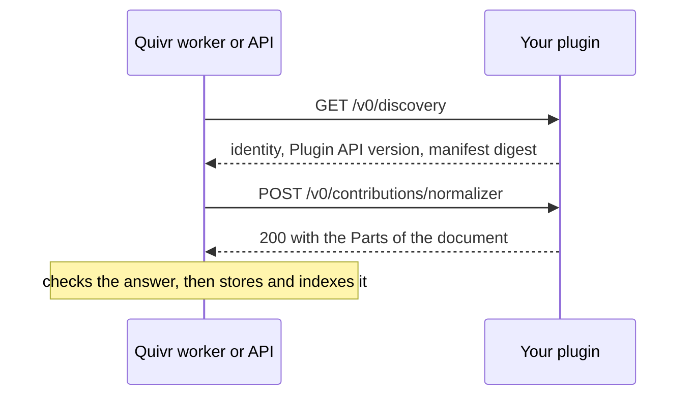

A plugin is a separate HTTP service that Quivr calls with JSON when it needs a decision that depends on your content: how to read a file, what a source published, how to embed or rank text, whether an article matches an alert. Quivr keeps everything that must stay safe and uniform, and the plugin only answers questions.



## The engine keeps the state, the plugin decides

Quivr's core owns storage, identity, versions, the search index, access control, schedules, credentials and retries. A plugin owns one kind of decision and nothing else. It holds no state between calls: a connector gets its last position back in each request, a normalizer gets a signed link to the file it reads.

This split keeps Quivr generic: two organizations with different content run the same engine and pin different plugins. It also bounds the damage a plugin can do: Quivr validates every answer before it records anything, so a buggy plugin produces an error or a quarantined document, never corrupted data.

## Contributions

What a plugin provides is called a Contribution. There are five types:

| Contribution | Quivr calls it | See |
| --- | --- | --- |
| `normalizer` | when a file of a routed media type arrives, to turn it into text Parts | [Build your first plugin](/plugins/first-plugin) |
| `connector` | on a schedule, to fetch what a source published since last time | [Write a connector](/plugins/write-a-connector) |
| `ingestion` | for every new Version, to cut its text into passages and embed them | [Write an ingestion plugin](/plugins/write-an-ingestion-plugin) |
| `retrieval` | for every search, to choose candidates and rank them | [Write a retrieval plugin](/plugins/write-a-retrieval-plugin) |
| `subscription` | when a Version becomes searchable, to decide which alerts it matches | [Write an alert rule](/plugins/write-an-alert-rule) |

One plugin may provide several Contributions. [Plugin types](/plugins/types) compares them in detail.

## The manifest

Every plugin ships a `quivr-plugin.yaml` that declares its identity, version, compatibility ranges, Contributions and limits:

```yaml quivr-plugin.yaml
id: acme.markdown
version: 0.1.0
compatibility:
  engine: ">=0.1.0 <0.2.0"
  plugin_api: ">=0.1.0 <0.2.0"
contributions:
  normalizer:
    media_types: [text/markdown]
    timeout_ms: 10000
run:
  command: [python3, -m, acme_markdown]
```

The operator gives Quivr the same file. At call time Quivr compares its SHA-256 digest with the `manifest_digest` the running plugin reports on `GET /v0/discovery`, so Quivr never talks to a plugin built from a different manifest. The [plugin manifest reference](/reference/plugin-manifest) lists every field.

## The operator runs it, Quivr never starts it

Quivr does not install, launch or scale plugins. You run the plugin wherever you like, as a process, a container or a managed service, then pin it in Quivr's configuration with its manifest and address:

```json
{"plugins": [{"manifest": "/etc/quivr/plugins/acme-markdown/quivr-plugin.yaml",
              "endpoint": "http://127.0.0.1:9900",
              "routes": [{"media_type": "text/markdown"}]}]}
```

At startup Quivr validates each pin without contacting the plugin: the manifest, the compatibility ranges, the configuration against the plugin's schema, and conflicts between pins. An invalid pin stops startup with the list of problems. A plugin that is down does not: work that needs it waits and is retried, and resumes when the plugin is back. Nothing is lost and nothing is decided in its absence. [Pin a plugin](/plugins/pin) shows the configuration for each type. To change plugins while Quivr runs, register the new version through the API instead: Quivr checks it, and you activate it without a restart ([Switch plugins without restarting](/plugins/switch-plugins-without-restarting)).

## Versions

Two version numbers matter. The plugin's own `version` is SemVer; bump it when its output changes, because documents record which version produced them. The Plugin API version is the version of the protocol itself. A plugin declares the range it supports in `compatibility.plugin_api`, and Quivr speaks the highest version in that range it implements. A minor Plugin API version only adds to the previous one, so a plugin built for an earlier minor keeps working.

## Same input, same answer

Quivr retries calls and replays them during rebuilds. Each request carries an `idempotency_key` that stays the same across retries of the same logical call, and a plugin must answer the same thing for the same key. Quivr keeps the first answer it recorded and treats a different one as a conflict.

## Certification

`quivr plugin test` is the Contract Runner. It starts your plugin, calls every route over HTTP with the normative fixtures and your own, and judges each answer with the engine's own validation code. It also replays calls to check determinism, sends invalid requests, enforces the declared deadlines and checks that no secret leaks. When it prints `CERTIFIED`, Quivr can safely call your plugin. It works offline, in any language's CI.

## SDKs

Any language that serves HTTP can implement the [plugin protocol](/reference/plugin-protocol). Two SDKs handle routing, validation, errors and the digest for you:

| SDK | Contributions |
| --- | --- |
| Python (`sdks/python`) | `normalizer`, `subscription` |
| Go (`sdks/go`) | `connector`, `ingestion`, `retrieval` |

## Next

<CardGroup cols={2}>
<Card title="Plugin types" icon="shapes" href="/plugins/types">
What each Contribution does, when Quivr calls it, and a minimal manifest.
</Card>
<Card title="Build your first plugin" icon="hammer" href="/plugins/first-plugin">
From an empty folder to a certified plugin that makes a new file format searchable.
</Card>
</CardGroup>
