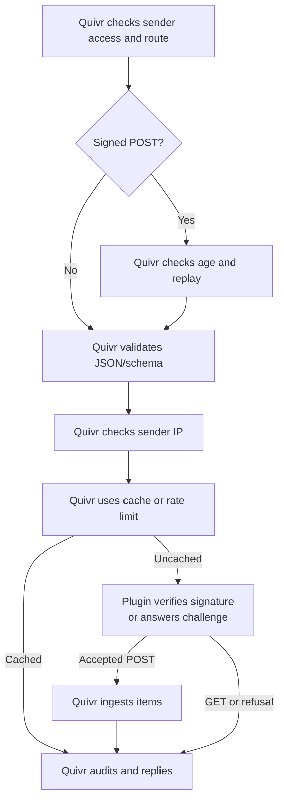

Your source plugin turns incoming requests into records, or answers a provider's challenge to confirm the webhook address. Quivr checks the route and admission policy; your handler verifies any provider signature before accepting data.

## Prerequisites

- Python 3.12+ (`python3 --version`), a Quivr checkout and its CLI (`go build -o .scratch/quivr ./cmd/quivr`). Add `.scratch` to your `PATH`.
- Read [How plugins work](/plugins/overview) for the engine/plugin boundary and [Write a connector](/plugins/write-a-connector) for source kinds and stable record identities.
- For signature routes, the provider's signature format and signing secret. The operator deposits that secret as the instance's credential; you receive it decrypted in the handler. The offline sample below needs no provider account.

## Steps

### Generate a push source

From the checkout:

```bash
quivr plugin init incoming-records --kind connector --push
python3 -m venv incoming-records/.venv
. incoming-records/.venv/bin/activate
pip install -e sdks/python
cd incoming-records
python3 -m unittest discover -s tests
quivr plugin test --report contract-report.json
```

Expect `CERTIFIED`. The generated fixture covers an accepted record and a refused blank record. The offline sample in `plugins/push-source` follows the same pattern; its CI report is uploaded as `push-source-contract-reports`.

### Declare and handle a route

Declare `modes: [pull, push]` on your source kind; API routes require push mode, and a push kind must also support pull. Declare the requests it accepts under `api.routes`. Its `method` and relative `path` select a named handler; `request_schema` validates JSON before the handler runs. The generated manifest contains this route under `contributions.connector.kinds.events.api.routes`:

```yaml
- name: publish
  method: POST
  path: records
  auth: instance_token
  request_schema:
    type: object
    additionalProperties: false
    required: [key, revision, title, text]
    properties:
      key: {type: string, minLength: 1, maxLength: 256}
      revision: {type: string, minLength: 1, maxLength: 256}
      title: {type: string, minLength: 1, maxLength: 256}
      text: {type: string, minLength: 1, maxLength: 65536}
```

The Python SDK dispatches `@plugin.connector_route("events", "publish")` with a typed `ReceiveRequest`. `request.body` holds parsed JSON; `request.request` preserves the caller's path, query and raw body. Return a `ConnectorReceiveResponse` with accepted items or a refusal; the generated handler shows the complete mapping. Go implements `Receiver.Receive`, selects `req.Route` and decodes `req.Body`. For a route such as `events/{category}`, read the actual relative path, such as `events/news`, from Python's `request.request.path` or Go's `req.Request.Path`.

Return a stable Record Key for each document and a new `revision` when its source content changes. Accepted POST items enter normal ingestion, and Quivr returns `202` with Receipts, identifiers used to follow processing. The handler's accepted status does not replace that response. Read [the plugin contract](/reference/plugin-protocol#connector) for wire fields and the [Python kit](https://github.com/The-Vibe-Company/quivr/blob/main/sdks/python/README.md) or [Go kit](https://github.com/The-Vibe-Company/quivr/blob/main/sdks/go/README.md) for handler types.

For certification, a fixture's `receive` case sets `route: "publish"` and `request.path: "records"`, with source JSON in `request.body`. The runner checks plugin handling; engine authentication and admission are separate checks.

### Choose authentication

| Route `auth` | Responsibility |
| --- | --- |
| `quivr_key` | Quivr checks the API key's `connector:push` permission and Corpus scope. Requires Plugin API 0.11. |
| `instance_token` | Quivr checks a token restricted to that instance. Requires Plugin API 0.12. |
| `signature` | Quivr guards freshness and replay for POST; your plugin verifies the provider's cryptographic signature. Requires Plugin API 0.12. |

Your compatibility range must admit that Plugin API version. Token routes and Quivr-key routes accept only their declared credential type. Quivr strips bearer credentials and cookies before relaying requests; they never reach your handler.

### Verify provider signatures

Declare `signature: {header, timestamp_header?, window_seconds}` on a signature route. The window is 1–86400 seconds. If the provider signs a Unix-seconds timestamp, name its header: Quivr rejects timestamps outside the window, including too far in the future. Without a signed timestamp, replay protection lasts only for the reservation window.

Your handler verifies the provider's signature over the exact raw bytes before accepting items. On the wire these are `request.body_base64`. In Python, decode `request.request.body_base64` with `base64.b64decode`; Go exposes `req.Request.Body()`. Re-encoding parsed JSON can change the bytes and invalidate the signature. If you declare `timestamp_header`, verify that timestamp as part of the signed message too. Quivr checks its age, not its authenticity.

For example, the first-party X plugin compares `sha256=` plus the base64 HMAC-SHA256 of the raw body against `x-twitter-webhooks-signature`, using the deposited consumer secret and a constant-time comparison. It refuses a mismatch with `401` and no items. See its [handler](https://github.com/The-Vibe-Company/quivr/blob/main/plugins/x-list/webhook.go) and [offline checks](https://github.com/The-Vibe-Company/quivr/blob/main/plugins/x-list/webhook_test.go).

### Answer provider challenges

A challenge asks your plugin to prove it can receive at this address. Declare a GET signature route and return its response synchronously, without ingestion items. GET skips the POST signature-header, freshness and replay guards, but still passes JSON/schema, IP and rate admission. An empty GET body is validated as `null`, so omit `request_schema` or allow `null` on that route.

For example, not run: X's route declarations, under a kind's `api.routes`:

```yaml
- name: receive
  method: POST
  path: receive
  auth: signature
  signature: {header: x-twitter-webhooks-signature, window_seconds: 300}
- name: challenge
  method: GET
  path: receive
  auth: signature
  signature: {header: x-twitter-webhooks-signature, window_seconds: 300}
```

X calls `GET /v0/connectors/<instance_id>/api/receive?crc_token=<challenge>`. The plugin signs the query's challenge with the consumer secret and returns `200 application/json` containing `{"response_token":"sha256=<base64 HMAC>"}`. Missing `crc_token` returns `400`. The GET needs no POST signature header, and its `Idempotency-Key` never retrieves a cached answer. Test the reply offline with the linked X checks; registering the address with X needs provider credentials.

This Python excerpt implements the same signature and challenge format. In your plugin module, declare the two routes above on `events` and a credential schema with a required `consumer_secret` string; the operator deposits that credential. Reuse your module's `plugin` object. The POST branch accepts an empty delivery to show verification; add your record mapping after the signature check.

<CodeGroup>
```python Python handler (excerpt)
import base64
import hashlib
import hmac
import json
from urllib.parse import parse_qs

from quivr_plugin import ConnectorReceiveResponse, ReceiveAnswer, ReceiveRequest


@plugin.connector_route("events", "receive")
@plugin.connector_route("events", "challenge")
def receive(request: ReceiveRequest) -> ConnectorReceiveResponse:
    secret = request.credential.decode()["consumer_secret"].encode()

    def sign(raw: bytes) -> str:
        digest = hmac.new(secret, raw, hashlib.sha256).digest()
        return "sha256=" + base64.b64encode(digest).decode("ascii")

    if request.request.method == "GET":
        token = parse_qs(request.request.query).get("crc_token", [""])[0]
        if not token:
            return ConnectorReceiveResponse(
                verdict="refused", response=ReceiveAnswer(status=400, body="crc_token is missing")
            )
        return ConnectorReceiveResponse(
            verdict="accepted",
            response=ReceiveAnswer(
                status=200, content_type="application/json",
                body=json.dumps({"response_token": sign(token.encode())}),
            ),
        )

    raw = base64.b64decode(request.request.body_base64)
    values = request.request.headers.get("x-twitter-webhooks-signature", [])
    if len(values) != 1 or not hmac.compare_digest(values[0], sign(raw)):
        return ConnectorReceiveResponse(
            verdict="refused", response=ReceiveAnswer(status=401, body="invalid signature")
        )
    return ConnectorReceiveResponse(
        verdict="accepted", response=ReceiveAnswer(status=202), items=[]
    )
```
</CodeGroup>


## Push checks

An IP allowlist restricts sender addresses; a rate bucket limits how quickly an instance admits requests. An idempotency key names one delivery: bearer routes (`quivr_key` and `instance_token`) may reuse its cached answer, while signed POSTs reserve fingerprints to refuse replay. The operator configures these policies in [Receive and secure pushes](/run-quivr/receive-pushes).

Quivr runs freshness and replay before schema validation, then IP and rate admission; only your plugin verifies the provider's cryptographic signature.



1. Quivr recognizes a supplied bearer, checks a recognized API key's push permission and bounds the request.
2. It loads the enabled instance, checks API key Organization and Corpus scope, resolves the route and checks its authentication, including an instance token.
3. Signed POSTs require one signature header, check any timestamp's age and reserve signature and delivery-key fingerprints to refuse replays. GET challenges skip these guards.
4. Quivr checks delivery-key metadata, parses JSON and validates the route schema, then checks the IP allowlist.
5. A completed bearer cache entry skips the rate limit and plugin. Otherwise, a bearer request with a delivery key claims its cache entry; all uncached requests pass the rate bucket.
6. Quivr opens the source credential and calls the plugin. The plugin verifies a signed POST over raw bytes, maps a bearer POST to items, or answers a GET challenge without items.
7. Quivr validates and ingests accepted POST items, records acceptance, then caches bearer answers or keeps successful signed reservations. Failed signed processing releases its reservation when cleanup succeeds.
8. Quivr commits the attempt's audit and counters before replying with Receipts, a challenge answer or a refusal. Cached answers follow this audit step too.

Each failed check stops later checks. Existing-instance refusals are audited too. Successful signed POSTs retain their reservation for the window, including accepted empty deliveries. Refusals and failed processing release it within the request deadline; cleanup failure or an expired deadline leaves it until expiry. GET signature routes skip the POST guard and response cache, so an admitted challenge reaches the plugin every time. See [retry behaviour](/run-quivr/receive-pushes#how-retries-behave) for examples and limits.

For a kind with signature routes, the legacy webhook address aliases only its declared signature `receive` path, with the same protections and audit. The X plugin supports this alias; its old address is scheduled for removal in engine 1.0.0. Other legacy webhooks keep their plugin-owned authentication.

## Check it worked

Certify the generated handler, then [pin it](/run-quivr/pin) or [register and activate it](/run-quivr/upgrade-a-plugin). The local stack already runs the sample in `plugins/push-source`; [the offline push example](/run-quivr/receive-pushes#steps) exercises that sample. To exercise your generated plugin, run `quivr plugin dev --port 9940 incoming-records` from the checkout, replace the sample's pin with its absolute manifest path and an endpoint reachable by Quivr, then restart Quivr. Follow the same instance and push steps with your declared kind and route. Add provider-specific fixtures for valid signatures, invalid signatures and challenges before deploying a signed handler.

## Clean up

The generated `incoming-records` directory is local to your checkout. Remove it when you no longer need the example. [Revoke issued tokens](/run-quivr/receive-pushes#manage-tokens) and [disable any deployed example instance](/guides/connectors#disable-an-instance).

## Next

<span id="create-a-collection-and-source-instance" />
<span id="issue-a-token-and-push" />

- [Receive and secure pushes](/run-quivr/receive-pushes) for token lifecycle, limits, retries and audit.
- [Write a connector](/plugins/write-a-connector) for scheduled collection and attachments.
- [Plugin protocol](/reference/plugin-protocol#connector) for the exact request and response fields.
