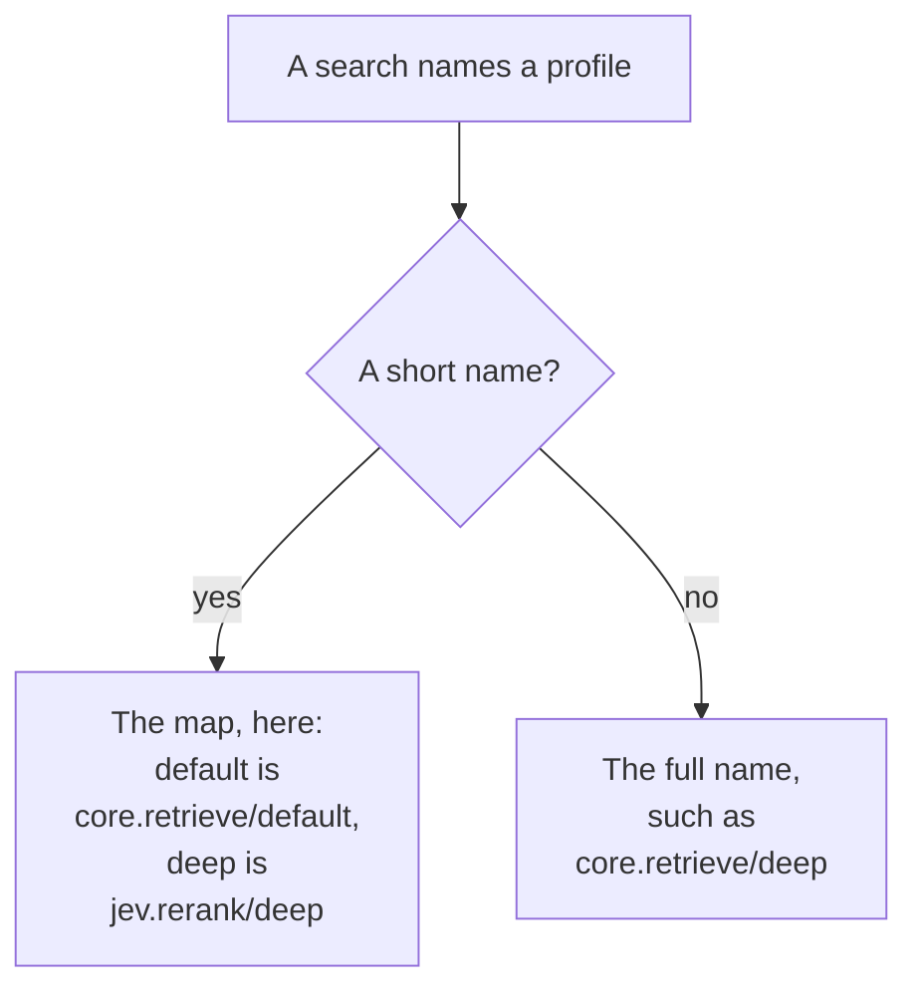
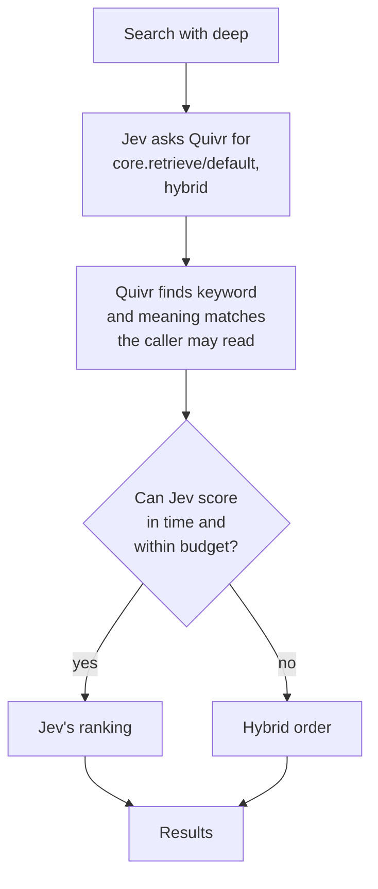

A search profile names how Quivr finds and ranks results. Your deployment chooses which plugin handles names such as `default` and `deep`, and one profile can start from another profile's results and re-rank them, within one time and cost budget.

## Short names and full names

A retrieval plugin is the plugin that answers searches. Each profile it declares has a full name, the plugin's id and the profile joined by a slash: `core.retrieve/default`. Clients usually send a short name, such as `deep`, and the deployment maps each short name to one full name. A search that names no profile uses `default`.

Two plugins can each declare a profile called `deep`, and they are different profiles:

| Full name | What it does; latency target and maximum reported cost |
| --- | --- |
| `core.retrieve/default` | Keywords, meaning or both, following the search's `mode`. 500 ms, no paid call. |
| `core.retrieve/deep` | Ranks like `default` today and makes no paid call; it only declares a larger allowance. 3 s, 1 cent. |
| `jev.rerank/deep` | Re-ranks `core.retrieve/default` with Jev, a paid model. 3 s, 1 cent. |

`core.retrieve` ships with Quivr, and the `make dev` stack pins it: it lists it in Quivr's startup configuration, which is how a deployment [installs a plugin](/run-quivr/pin). Quivr's API refuses to start without a pinned retrieval plugin. `jev.rerank` is optional. Pinning it beside `core.retrieve` makes a map of short names required, and `deep` means Jev only if that map says so.

A short name goes through the deployment's map; a full name goes straight to its profile. Example deployment mapping, with Jev installed:



In words: Quivr looks up a short name in the deployment's map. In this example, `default` reaches `core.retrieve/default` and `deep` reaches `jev.rerank/deep`. A full name skips the map, so `core.retrieve/deep`, which has no short name left, is reached by its full name.

## How a deployment chooses

The map is `retrieval.profiles` in the startup configuration. This one makes `deep` mean Jev:

```json QUIVR_CONFIG (excerpt)
{"retrieval": {"profiles": {"default": "core.retrieve/default", "deep": "jev.rerank/deep"}}}
```

- **One retrieval plugin and no map**: its own profile names are the short names. It must declare `default`.
- **Several retrieval plugins**: the map is required and must contain `default`. Each target must be a profile of an installed retrieval plugin.
- **Full names always work**, including for profiles that no short name maps to.

Quivr refuses to start when a required map is missing or a target does not resolve, and the error names the problem. Activating a new version of a plugin keeps the map, and Quivr refuses an activation that would leave the map unresolved. [Search profiles in the configuration reference](/reference/configuration#search-profiles) lists the rules, and [Re-rank with Jev](/guides/rerank-with-jev) pins both plugins.

## Core retrieval settings

Set `configuration` on the `core.retrieve` plugin pin to change the keyword/meaning mix and candidate depth.
Both `core.retrieve/default` and `core.retrieve/deep` use the same settings, including when another profile calls them.
For example, this startup configuration pins the plugin and requests 30 candidates per served vector space:

```json QUIVR_CONFIG (excerpt)
{"plugins": [{
  "manifest": "plugins/core-retrieve/quivr-plugin.yaml",
  "endpoint": "http://127.0.0.1:9906",
  "configuration": {
    "dense_weight": 0.7,
    "candidate_count": 30,
    "hybrid_fusion": "relative_score"
  }
}]}
```

The endpoint must be your running plugin's address; restart Quivr after changing its startup configuration.
The manifest validates these settings and refuses unknown keys, wrong types and values outside the bounds:

- `dense_weight`: 0–1, default 0.5. In hybrid mode it is Weaviate's vector weight (`alpha`); keyword weight is `1 - dense_weight`.
- `candidate_count`: integer 1–100, default the search's limit. Each served space requests that many candidates; lexical mode makes one request. Final ranking returns at most the search limit, and a smaller depth can return a shorter page.
- `hybrid_fusion`: `relative_score` (default) normalizes each side's scores before weighting them; `ranked` uses Weaviate reciprocal rank fusion (RRF, constant 60), based on positions in each list. See [Weaviate's fusion explanation](https://docs.weaviate.io/weaviate/concepts/search/hybrid-search).

Weight and fusion apply only in hybrid mode. With no settings, candidate requests and ranking remain unchanged.
The engine fetches at least `max(150, 3 * candidate_count)` index objects, then hydrates readable candidates up to that depth.
Candidate depth is the returned shortlist size, not the size of each input list inside Weaviate's fusion.

Search improvement trials use the same `dense_weight` and `candidate_count` names.
Mixed keyword/vector tier-1 trials use weighted RRF: select `hybrid_fusion: ranked` for that fusion family.
This does not promise identical rankings across the direct trial and Weaviate, whose candidate lists and scores differ.
When promoting a trial, record its fusion method explicitly and reject candidate counts above 100, the current plugin protocol bound.
Jev's separate `candidate_count` controls how many inner ranked results go to re-ranking; increasing core depth does not increase Jev's shortlist.

## See and call the profiles

`GET /v0/search/profiles` lists every installed profile, the one `default` maps to first. It needs a key with `search:query`. The `make dev` stack pins only `core.retrieve` and no map, so there `deep` is `core.retrieve/deep`:

{/* runnable */}
```bash
curl -s "$QUIVR_API_URL/v0/search/profiles" -H "Authorization: Bearer $QUIVR_API_KEY" \
  | jq -c '.items[] | {full_name, aliases, max_latency_ms, max_cost_cents}'
```

{/* output */}
```text
{"full_name":"core.retrieve/default","aliases":["default"],"max_latency_ms":500,"max_cost_cents":0}
{"full_name":"core.retrieve/deep","aliases":["deep"],"max_latency_ms":3000,"max_cost_cents":1}
```

`aliases` holds the short names that select a profile, and is empty for a profile reachable only by its full name. Each item also has `name`, the plugin's own name for the profile: with Jev mapped, two items are named `deep`, and only `jev.rerank/deep` has `deep` in its `aliases`.

To call a profile, put either name in the search's `profile` field, `"profile": "deep"` or `"profile": "core.retrieve/deep"`. The response's `retrieval_profile.name` echoes the name you sent, and `usage.profiles` lists the full name of each profile that ran. [Choose a profile](/guides/search#choose-a-profile) in the Search guide runs both. A name that maps to nothing is refused with `422 unsupported_profile`.

## One profile building on another

A profile can ask Quivr for another profile's ranked results and re-rank them. `jev.rerank/deep` does this: it asks for `core.retrieve/default`'s hybrid results, which combine keyword and meaning matches, then sends each passage and the query to Jev, a paid model from TypeSafe that scores how well the passage answers. To find meaning matches, Quivr first turns the query into a vector with the ingestion plugin, the plugin that made the passages' vectors.

Quivr runs the inner profile itself, so neither plugin sees a passage the caller may not read:



In words:

1. Your app searches with `profile: deep`, which the map resolves to `jev.rerank/deep`.
2. Quivr sends Jev the query and the time and cost left. Jev asks for the top results of `core.retrieve/default` in hybrid mode, whatever `mode` your search sent. Its `candidate_count` setting sets how many: 30 by default.
3. Quivr runs `core.retrieve/default` with the same query, Corpora, filter and access. Quivr has the ingestion plugin encode the query, queries the index, drops passages the caller may not read or that were withdrawn, and reads the rest from storage.
4. Quivr hands Jev that ranking with each passage's text and score. Jev scores the passages with the Jev model and returns its ranking and what it spent, or the hybrid order when it cannot score.
5. Quivr returns the results. `usage.elapsed_ms` reports the whole search's elapsed time, and `usage.profiles` lists each profile's rounds, paid calls and cost. Quivr does not report time per profile.

[Write a retrieval plugin](/plugins/write-a-retrieval-plugin#start-from-another-plugins-ranking) describes the rounds a plugin exchanges with Quivr.

## Time and cost budgets

Each profile declares a latency objective, `max_latency_ms`, and the most a search may spend on paid calls, `max_cost_cents`. The profile list shows both.

- **The objective is a target, not a cutoff.** A slower search still answers and is counted as over its objective. Quivr stops a search only at its hard limit, four times the objective, between 2 and 9 seconds. Past it, the search fails with `504 search_deadline_exceeded`, or `503 search_unavailable` when the time ran out while Quivr served candidates.
- **The outer profile's limit covers the chain.** A `jev.rerank/deep` search, inner profile included, has 9 seconds: four times 3 seconds, capped at 9. The inner profile gets the time left or its own hard limit, whichever is shorter: 2 seconds for `core.retrieve/default`.
- **Spending counts at every level.** Each plugin reports only its own paid calls. Quivr adds them up in `usage.paid_calls` and `usage.cost_cents`, and lists each profile's own share in `usage.profiles`, outer first. Inner spending counts against the inner profile's allowance and the outer one's. A plugin on Plugin API 0.12 or later receives the time and cost left each round, and a reported spend over an allowance fails the search with `502 retrieval_plugin_invalid`.

Within that time, Jev gives its call to the Jev model at most 2 seconds, and less when less time is left. Before each attempt, it reserves the attempt's maximum cost and checks that it fits the cost left.

## When Jev returns hybrid results

If hybrid retrieval succeeds and the Jev plugin can respond, the Jev plugin handles errors from the Jev model itself and returns `core.retrieve/default`'s hybrid order instead of failing the search. This covers a missing TypeSafe key, provider errors, invalid answers, and a deadline or cost left too small for a call. Each hit's `explanation` field then reads `re-ranker unavailable: <reason>` instead of Jev's probability; without a key, the reason is `API key not configured`.

Retrieval or plugin outages can still fail the search: a Jev plugin that is down or unreachable, or an ingestion plugin that cannot encode the query, returns `503 search_unavailable`.

Without a key, there is no paid call and no reported cost. With a key, a failed paid attempt can still report cost: an attempt that fails without usage from the provider reports a reserved upper-bound cost, not an invoice.

## What composition does not do

- **No automatic stacking.** A profile builds on another only when its plugin declares that dependency in its manifest and asks for it. Mapping `deep` to Jev does not change `default` or `core.retrieve/deep`.
- **Two levels at most.** A profile that builds on another cannot itself be built on, and a chain cannot loop. Quivr refuses a missing or invalid dependency when the plugin is installed or activated.
- **No wider access.** The inner profile runs with the caller's Corpora, filter and access. The outer and inner retrieval profiles use the same snapshot of retrieval plugin versions, even if an activation happens during the search.

## Next

<CardGroup cols={2}>
<Card title="Re-rank with Jev" icon="ranking-star" href="/guides/rerank-with-jev">
Run the Jev plugin beside core.retrieve and map deep to it.
</Card>
<Card title="Write a retrieval plugin" icon="code" href="/plugins/write-a-retrieval-plugin#start-from-another-plugins-ranking">
Declare profiles and start from another plugin's ranking.
</Card>
</CardGroup>
