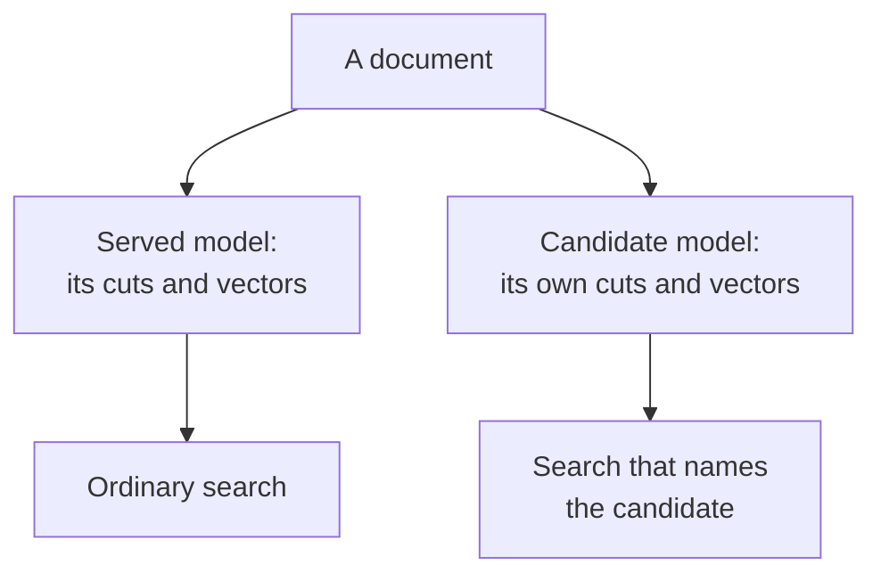
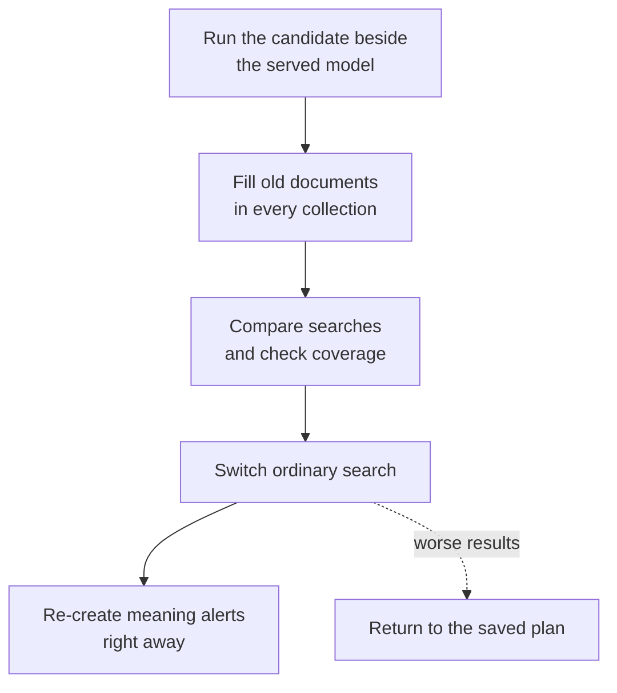

Run a second embedding model (a model that turns text into numeric vectors) beside the current one. Fill it for existing documents, compare searches, then switch with a way back and update alerts that match by meaning.

**On this page**

- [Steps](#steps): prepare the second model, run it for evaluation, fill existing documents, compare searches, switch, then move meaning alerts.
- [Check it worked](#check-it-worked), [roll back](#roll-back), and [clean up](#clean-up) once you no longer need the way back.

## Prerequisites

- A running Quivr with [an ingestion plugin pinned](/run-quivr/pin). This guide keeps `core.ingest` serving and adds `hosted.embed`, the [hosted text embedding plugin](https://github.com/The-Vibe-Company/quivr/tree/main/plugins/hosted-embed).
- `curl`, `jq`, Go and the `quivr` CLI (`curl --version`, `jq --version`, `go version`, `command -v quivr`). Run package commands from a Quivr checkout.
- Your API address in `QUIVR_API_URL` and the id of a collection of documents (Corpus) in `CORPUS_ID`.
- [API keys](/reference/configuration#api-keys) with the following permissions and grants for the Corpus:

| Key variable | Permissions |
| --- | --- |
| `QUIVR_API_KEY` | `content:read`, `search:query`, `corpora:read` |
| `QUIVR_OPERATOR_KEY` | `plugins:admin`, `operations:read` |
| `QUIVR_ALERT_KEY` (for meaning alerts) | `monitoring:read`, `monitoring:write` |

All three keys for a Corpus must belong to its Organization. Plugin, plan and promotion requests affect the whole deployment; backfills and coverage reads see only the key's Organization and grants.

You also need a reachable model endpoint, its model name and dimensions, and its credential in the **plugin process** environment. The plugin reads `EMBED_API_KEY` for authenticated providers. The examples use a hosted Cohere v2 endpoint and 1024 dimensions; choose a model that supports them.

<Warning>
Hosted embedding sends document text and search queries to your provider and can incur charges, including during certification and evaluation. Keep provider keys out of configuration files and API requests.
</Warning>

The package generation runs offline. The API sequence is checked with a local fake embedding provider; the provider configuration below is an example, not a live provider run. Replace placeholders with your installation's values.

This procedure changes the plugin that produces segments and vectors (the ingestion owner). If your new model is another space of the same plugin, follow [Fill a new vector space](/run-quivr/backfill-a-vector-space), then use this page's comparison checks and [move meaning alerts](/run-quivr/move-meaning-alerts). That path promotes a space; this example activates a registration.

Keep the former model reachable and filling new documents throughout the trial and switch, so rollback remains possible.

## Steps

<Steps>
<Step title="Prepare the second model">

Build the plugin, then write its configuration. Replace the URL and model placeholders before generating the manifest:

```bash
mkdir -p .scratch/hosted-embed/package
(cd plugins/hosted-embed && go build -o ../../.scratch/hosted-embed/hosted-embed .)
cat > .scratch/hosted-embed/configuration.json <<'EOF'
{
  "format": "cohere",
  "base_url": "https://<your model endpoint>/providers/cohere/v2",
  "auth": "api-key",
  "model": "<your embedding model>",
  "dimensions": 1024,
  "max_tokens_per_segment": 2048,
  "max_batch_tokens": 32768
}
EOF
.scratch/hosted-embed/hosted-embed configure .scratch/hosted-embed/configuration.json \
  > .scratch/hosted-embed/package/quivr-plugin.yaml
```

For Cohere’s own API, use `"base_url":"https://api.cohere.com/v2"` and `"auth":"bearer"` in both configuration copies instead.

For archive imports, `hosted.embed` combines concurrent document inputs from
the same Organization within each plugin process. The `batch_wait_ms` window
(default 25, range 0–100 ms) can extend while awaiting provider admission.
Batches respect `batch_size`, `max_batch_tokens` and the shared
`max_concurrent_requests` cap. Set `batch_wait_ms: 0` to disable collection.
Queries bypass the collection window. See the plugin's
[limits and defaults](https://github.com/The-Vibe-Company/quivr/blob/main/plugins/hosted-embed/README.md#limits-and-defaults)
for cancellation, refusal isolation and batch usage logs.


The generated manifest binds the model and settings to a distinct vector space, the coordinate system for its numeric vectors. Use that exact configuration when pinning or registering it. Copy the space name from `contributions.ingestion.spaces`; its API id is that name followed by `@` and the declared space `version`.

Certify with a fixture carrying the same configuration. Inject `EMBED_API_KEY` into the certification command's environment so its plugin subprocess receives it. This step calls your provider:

```bash
jq --slurpfile config .scratch/hosted-embed/configuration.json \
  '.ingestion.configuration = $config[0]' \
  contracts/plugins/v0/fixtures/ingestion/article.json > .scratch/hosted-embed/fixture.json
quivr plugin test --fixture .scratch/hosted-embed/fixture.json .scratch/hosted-embed/package
```

Check that the report says `CERTIFIED`. Start the plugin in a separate terminal, with the provider key injected from your secret manager. Choose a free port reachable by Quivr's API and workers:

```bash
QUIVR_PLUGIN_MANIFEST="$PWD/.scratch/hosted-embed/package/quivr-plugin.yaml" \
QUIVR_PLUGIN_HOST=0.0.0.0 QUIVR_PLUGIN_PORT=8087 \
EMBED_API_KEY="${EMBED_API_KEY:?Set the provider key in this terminal}" \
  .scratch/hosted-embed/hosted-embed
```

Set `document_template` and `query_template` explicitly for models with special prompts;
the model name never selects a template. EmbeddingGemma 2 has its own
[example configuration](https://github.com/The-Vibe-Company/quivr/blob/main/plugins/hosted-embed/examples/embeddinggemma-2.json).

Changing the model, dimensions, format, metric, input templates or `model_revision` creates another space. A running deployment needs fresh ingestion or a rebuild
before it serves that space. Set `model_revision` when the provider changes weights behind a stable model name. A changed package needs a new immutable registration: increment `plugin_version`, regenerate and certify it. To compare several hosted models at once, give each a distinct `plugin_id` before generation.

</Step>
<Step title="Install it for evaluation">

Keep your current [served routing](/reference/configuration#ingestion-routing), and add `hosted.embed` under `ingestion.evaluation` for each source format you want to compare. An ingestion owner is the plugin that produces a document's segments and vectors. Evaluation adds another owner's output without replacing the served owner's output.

For example, merge these settings into each API, worker and migrate configuration, preserving existing pins and routes:

```json
{
  "ingestion": {
    "default": "core.ingest",
    "evaluation": {
      "text/plain": ["hosted.embed"],
      "text/html": ["hosted.embed"],
      "application/pdf": ["hosted.embed"]
    }
  },
  "plugins": [{
    "manifest": "<absolute path to generated quivr-plugin.yaml>",
    "endpoint": "<plugin HTTP address reachable by Quivr>",
    "configuration": {
      "format": "cohere",
      "base_url": "https://<your model endpoint>/providers/cohere/v2",
      "auth": "api-key",
      "model": "<your embedding model>",
      "dimensions": 1024,
      "max_tokens_per_segment": 2048,
      "max_batch_tokens": 32768
    },
    "spaces": {"<space name from generated manifest>": "served"}
  }]
}
```

Two settings use the same words. The `spaces` pin picks which of this plugin’s spaces it uses: `hosted.embed` has only one, so it is `served`. `ingestion.evaluation` decides whether its output reaches ordinary search: it does not until you activate it in step 5. [Apply the pin](/run-quivr/pin); for a runtime registration, follow [Upgrade or switch a plugin](/run-quivr/upgrade-a-plugin).

Routing uses the original source media type: a PDF normalized to text still follows `application/pdf`. Both owners read the normalized document pieces (canonical Parts), but each keeps its own segment cuts and vectors.

Ordinary search reads the served owner's output; an explicit evaluation search reads the second owner's output.



In words: each model builds its own segments and vectors from the same document. Ordinary search uses the served model; evaluation search names the candidate and its space. An evaluation failure is recorded in document diagnostics and does not change served readiness.

Find the active `hosted.embed` registration and save its `registration_id` as `REGISTRATION_ID`:

```bash
curl -fsS "$QUIVR_API_URL/v0/admin/plugins" \
  -H "Authorization: Bearer $QUIVR_OPERATOR_KEY" \
  | jq '[.items[] | select(.plugin_id == "hosted.embed" and .state == "active") |
      {registration_id, state}]'
```

Extract `SPACE_ID` from the generated manifest, which is JSON-compatible YAML. Save the current plan for an exact rollback target:

```bash
SPACE_ID=$(jq -r '.contributions.ingestion.spaces | to_entries[0] |
  "\(.key)@\(.value.version)"' .scratch/hosted-embed/package/quivr-plugin.yaml)
```

```bash
BASE_PLAN_ID=$(curl -fsS "$QUIVR_API_URL/v0/admin/plugins/plan" \
  -H "Authorization: Bearer $QUIVR_OPERATOR_KEY" | jq -r .plan_id)
```

</Step>
<Step title="Fill existing documents">

Live ingestion fills a space once the Corpus's search index carries it. Installing the plugin alone does not prepare every existing Corpus. A backfill can add the space and fill old documents. Run it for **every Corpus in the deployment, in every Organization, including empty ones**, without date filters.

Use your deployment's list of Organizations and each Organization's keys. List its authorized Corpora:

```bash
curl -fsS "$QUIVR_API_URL/v0/corpora?limit=100" \
  -H "Authorization: Bearer $QUIVR_API_KEY" | jq '{items, next_page_cursor}'
```

Follow `next_page_cursor` by sending it as `page_cursor` until it is absent (displayed here as `null`). Quivr cannot list all Organizations' Corpora with one key. Ensure the key grants access to every Corpus in its Organization.

Make a dry run with an explicit registration and its primary space:

```bash
curl -fsS -X POST "$QUIVR_API_URL/v0/admin/backfills" \
  -H "Authorization: Bearer $QUIVR_OPERATOR_KEY" -H "Content-Type: application/json" \
  -d @- <<EOF | jq
{"idempotency_key":"try-model-$CORPUS_ID","corpus_id":"$CORPUS_ID",
 "registration_id":"$REGISTRATION_ID","spaces":["$SPACE_ID"],"dry_run":true}
EOF
```

For two short documents, the dry run includes these fields (trimmed; your counts vary):

```json
{"versions":2,"segments":2,"input_tokens":34,
 "estimated_seconds":2,"confirmation_required":false}
```

Read `versions`, `segments`, `input_tokens`, `estimated_seconds` and `confirmation_required`. Cost is unknown when `estimated_cost_usd` is absent. A plugin without its own segments yet is estimated using the current owner's cuts; completion uses the new owner's actual cuts.

The start request **must reuse the dry run’s key** and scope, changing `dry_run` to `false`. Add `confirm_cost:true` only after accepting an estimate that requires confirmation:

```bash
curl -fsS -X POST "$QUIVR_API_URL/v0/admin/backfills" \
  -H "Authorization: Bearer $QUIVR_OPERATOR_KEY" -H "Content-Type: application/json" \
  -d @- <<EOF | jq '{operation_id, state}'
{"idempotency_key":"try-model-$CORPUS_ID","corpus_id":"$CORPUS_ID",
 "registration_id":"$REGISTRATION_ID","spaces":["$SPACE_ID"],"dry_run":false}
EOF
```

Save the returned `operation_id` in `OPERATION_ID`. An Operation records this long-running task. Follow it until `state` is `succeeded`, `failed` or `canceled`. Continue only after `succeeded`; otherwise inspect the failure or rerun the fill:

```bash
curl -fsS "$QUIVR_API_URL/v0/operations/$OPERATION_ID" \
  -H "Authorization: Bearer $QUIVR_OPERATOR_KEY" | jq '{state, counters, backfill}'
```

See [Fill a new vector space](/run-quivr/backfill-a-vector-space) for pausing, resuming and failures. The same accepted key and body return the same Operation; a later fill needs a fresh key and its own dry run before starting. One unfinished backfill per Corpus is allowed.

</Step>
<Step title="Compare searches and coverage">

Use the same query, Corpora, mode, [search profile](/guides/search#choose-a-profile), filters and limit. These two requests differ only in selecting the evaluation path:

<CodeGroup>
```bash Current model
curl -fsS -X POST "$QUIVR_API_URL/v0/search" \
  -H "Authorization: Bearer $QUIVR_API_KEY" -H "Content-Type: application/json" \
  -d @- <<EOF | jq
{"corpus_ids":["$CORPUS_ID"],"query":"Labour strikes at ports and harbours",
 "mode":"semantic","profile":"default","limit":10}
EOF
```
```bash Evaluation model
curl -fsS -X POST "$QUIVR_API_URL/v0/search" \
  -H "Authorization: Bearer $QUIVR_API_KEY" -H "Content-Type: application/json" \
  -d @- <<EOF | jq
{"corpus_ids":["$CORPUS_ID"],"query":"Labour strikes at ports and harbours",
 "mode":"semantic","profile":"default","limit":10,
 "evaluation_plugin":"hosted.embed","evaluation_space":"$SPACE_ID"}
EOF
```
</CodeGroup>

Both evaluation fields are required together. The space must belong to that plugin and be carried by every requested Corpus; invalid selections return `422 unsupported_search`.

Each hit is one segment (passage), so one document can appear several times. Compare relevant document ids and passage order across several queries, including paraphrases and other languages. Owners can cut documents differently, so segment offsets need not match. Raw similarity scores from different models are not comparable probabilities. Check hit `vector_space_id` to confirm which model answered.

Read each Corpus's coverage:

```bash
curl -fsS "$QUIVR_API_URL/v0/corpora/$CORPUS_ID/vector-spaces" \
  -H "Authorization: Bearer $QUIVR_API_KEY" \
  | jq '{spaces: [.items[] | {vector_space_id, owner, role, coverage}]}'
```

In the same two-document run, the candidate entry reads (trimmed):

```json
{"vector_space_id":"<SPACE_ID>","role":"evaluation",
 "coverage":{"segments":2,"total_segments":2,"versions_covered":2}}
```

For each space, `coverage.segments` counts vectors present, `coverage.total_segments` counts **that owner's** current segments, and `coverage.versions_covered` counts current document revisions fully covered. Compare segment counts within that owner; the response's top-level `segments` describes served segments and can differ.

Before switching, require `coverage.segments` to equal `coverage.total_segments` and the backfill Operation to be `succeeded` for each Corpus. An empty Corpus reads 0/0, which is fine. These counts describe stored segments; skipped documents can still lack candidate output. The switch rechecks coverage across the deployment and refuses if anything is missing.

</Step>
<Step title="Switch the model">

Fill and compare before switching ordinary search; migrate meaning alerts immediately afterward.



In words: run both models, fill existing documents, compare, then switch and update alerts. If results worsen, return to the saved plan and update alerts again. Changing spaces within one owner uses space promotion; changing the ingestion owner uses registration activation.

**Different owner, as in this `hosted.embed` example:** activate the already active evaluation registration:

```bash
curl -fsS -X POST "$QUIVR_API_URL/v0/admin/plugins/$REGISTRATION_ID/activate" \
  -H "Authorization: Bearer $QUIVR_OPERATOR_KEY" \
  | jq '{plan_id, routes: [.roles[] | select(.role | startswith("ingestion-route:")) |
      {role, plugin_id}]}'
```

For the example's three source formats, expect this output (plan id replaced):

```json
{"plan_id":"<new plan id>","routes":[
 {"role":"ingestion-route:application/pdf","plugin_id":"hosted.embed"},
 {"role":"ingestion-route:text/html","plugin_id":"hosted.embed"},
 {"role":"ingestion-route:text/plain","plugin_id":"hosted.embed"}]}
```

This switches every source format that names this plugin as an evaluation owner, moving its segments and vectors together. Its primary space must be carried by every Corpus's index across every Organization, including empty Corpora. Every current document routed to the candidate must have all its candidate segments and primary vectors.

Missing coverage returns `409 plugin_conflict` and leaves the plan unchanged; an unreachable candidate returns `409 plugin_unreachable`. Repeating activation returns the same plan. The previous owner becomes an evaluation owner for those formats and continues filling new documents asynchronously. If a configuration change leaves an existing Corpus serving another owner, new documents also fill the active plan's default or source-route owner. Keep these plugins reachable and check coverage before returning to either model.

**Same owner, another space:** follow [Fill a new vector space](/run-quivr/backfill-a-vector-space), which ends with a space promotion. That API allows `force` as an explicit exception for incomplete coverage; documents without vectors then disappear from semantic results until filled. Registration activation has no force option.

</Step>
<Step title="Move vector meaning alerts">

Switching search does not re-encode the query vectors of alerts that match by meaning, so those alerts return `not_ready` until you re-create them. Do it right away: follow [Move meaning alerts to a new vector model](/run-quivr/move-meaning-alerts).

</Step>
</Steps>

## Check it worked

Repeat the current-model search without evaluation fields:

```bash
curl -fsS -X POST "$QUIVR_API_URL/v0/search" \
  -H "Authorization: Bearer $QUIVR_API_KEY" -H "Content-Type: application/json" \
  -d @- <<EOF | jq '[.items[].vector_space_id] | unique'
{"corpus_ids":["$CORPUS_ID"],"query":"Labour strikes at ports and harbours",
 "mode":"semantic","profile":"default","limit":10}
EOF
```

With matching documents in the switched formats, expect your candidate's space id:

```json
["<SPACE_ID>"]
```

Read the active plan's served routes:

```bash
curl -fsS "$QUIVR_API_URL/v0/admin/plugins/plan" \
  -H "Authorization: Bearer $QUIVR_OPERATOR_KEY" \
  | jq '[.roles[] | select(.role | startswith("ingestion-route:")) | {role, plugin_id}]'
```

```json
[{"role":"ingestion-route:application/pdf","plugin_id":"hosted.embed"},
 {"role":"ingestion-route:text/html","plugin_id":"hosted.embed"},
 {"role":"ingestion-route:text/plain","plugin_id":"hosted.embed"}]
```

API and worker processes poll for plan changes. If loading a plan fails, they keep the old plan and do not retry that plan id until another plan appears; inspect their logs and fix the reported error before applying another plan change.

Inspect every Corpus's coverage. Submit a new document and confirm the new model fills it. Check the migrated alerts as [Move meaning alerts](/run-quivr/move-meaning-alerts#check-it-worked) shows.

## Roll back

Keep the previous plugin reachable with its expected build, and keep its evaluation coverage filling new documents. A missing vector or owner projection can block rollback; backfill the returning owner first. Do not stop it while work or alerts still pin it.

For an owner switch, return to the saved plan, using a new key for this rollback attempt:

```bash
curl -fsS -X POST "$QUIVR_API_URL/v0/admin/plugins/plan/rollback" \
  -H "Authorization: Bearer $QUIVR_OPERATOR_KEY" -H "Content-Type: application/json" \
  -d @- <<EOF | jq '{plan_id, source, roles}'
{"idempotency_key":"undo-model-switch-$BASE_PLAN_ID","plan_id":"$BASE_PLAN_ID",
 "pinned_work":"drain"}
EOF
```

Use `drain` for sound output; [use `stop` for bad output or hangs](/run-quivr/upgrade-a-plugin#roll-back). The same key and body replay this rollback. Keep the explicit target: another untargeted rollback can return to the plan you just left. Unreachable builds return `409 plugin_unreachable`; missing owner coverage returns `409 plugin_conflict`. Its message names the owner, space and number of missing documents, and points to `POST /v0/admin/backfills`. It also reports missing index generations: even an empty Corpus must carry the returning space. Find the returning owner's registration with `GET /v0/admin/plugins` and read each Corpus's coverage to locate gaps. Use the [backfill procedure](/run-quivr/backfill-a-vector-space) for that registration and space in each affected Corpus, wait for complete coverage, then retry. Historical gaps and failed optional calls still need this recovery.

For a same-owner space switch, promote the returned `previous_space_id` back with the space-promotion request. It needs complete coverage too. Immediately after either rollback, [move meaning alerts](/run-quivr/move-meaning-alerts#after-a-rollback) again to the restored space; the earlier migrations do not reverse themselves.

Compatible redeploys preserve activated serving and evaluation routes; see [Redeploy a configured build](/run-quivr/upgrade-a-plugin#redeploy-a-configured-build) for the compatibility conditions. Earlier plans and pinned work still require their original builds. If a redeploy makes the saved plan unreachable, restore that build or follow the linked procedure to activate the returning owner's current evaluation registration, then [move meaning alerts](/run-quivr/move-meaning-alerts) again.

## Encode queries on a local CPU

If you use `hosted.embed` with an OpenAI-compatible model, you can keep documents
on the remote service and encode search questions beside the API. The optional
local text encoder must use the same model revision, dimensions and input prefix.
Changing where that computation runs leaves the vector space unchanged, so this
execution change needs no Corpus rebuild or alert migration.

Before enabling local routing, compare at least 200 distinct queries: cosine
similarity must be at least `0.999`, and the ordered top-10 evaluation results must
match. Measure the encoder and deployed search under representative concurrency;
local query-encoding p95 must be well below `100 ms` before rollout.

For the Railway reference deployment, build the image with
`QUIVR_BUILD_LOCAL_QUERY_ENCODER=1`, then set `QUIVR_LOCAL_QUERY_ENCODER=1` on the
API. Start with four CPU cores and 4 GB RAM, and measure actual memory use.
Documents continue remotely. The API refuses startup without the offline assets
or matching encoder readiness. A local outage returns a bounded query error,
without automatically falling back to the remote provider.
Unset `QUIVR_LOCAL_QUERY_ENCODER` and redeploy the API to restore remote queries.
The [deployment instructions](https://github.com/The-Vibe-Company/quivr/blob/main/deploy/railway/README.md#optional-cpu-query-encoding)
list the pinned runtime, thread/startup variables, parity CLI and validation gates.

For other deployments, set `QUIVR_HOSTED_QUERY_URL` only in the API's hosted
plugin process. Use a loopback HTTP `/v1` base, and keep the API and worker plugin
pins identical. The same [plugin reference](https://github.com/The-Vibe-Company/quivr/blob/main/plugins/hosted-embed/README.md#optional-local-cpu-queries)
describes the required readiness metadata and supported format.

## Clean up

Retaining an evaluation owner is useful for rollback but continues provider calls. Once you no longer need that rollback option:

1. Copy the active plan's default, served routes and evaluation owners into `ingestion.default`, `ingestion.routes` and `ingestion.evaluation` in every process's configuration. [Apply this configuration](/run-quivr/pin) first, so it records the routing you chose by activation or rollback.
2. Remove the retiring owner from each `ingestion.evaluation` list and apply the configuration again. After rollback in this example, remove `hosted.embed`; if you keep the candidate serving, remove the former owner instead. This stops new evaluation calls for those formats.
3. If that plugin no longer serves any format or other plugin role, remove its `plugins` pin too. Keep it reachable until pinned work and Subscriptions release it and its registration becomes `inactive`; see [the plugin lifecycle](/run-quivr/upgrade-a-plugin#plugin-lifecycle). A plugin still serving another format or role must keep running.

Preserve the served routes and remaining owners' pins throughout cleanup. Stored alert Versions and Matches remain readable.

## Next

- [Fill a new vector space](/run-quivr/backfill-a-vector-space) for estimates and Operation controls.
- [Plugin lifecycle](/run-quivr/upgrade-a-plugin#plugin-lifecycle) for draining work and deciding when a plugin can stop.
- [Move meaning alerts to a new vector model](/run-quivr/move-meaning-alerts) for the alert migration after a switch.
