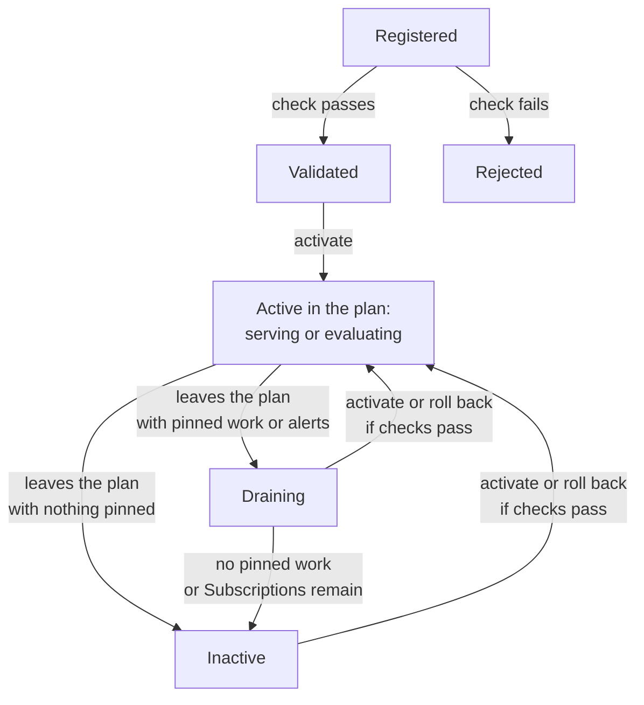

Run the new plugin beside the old one, let Quivr check it, then activate it without restarting Quivr. Keep the old process running until its work drains; if needed, roll back after Quivr checks the returning plugins.

For a first installation through configuration, use [Pin a plugin](/run-quivr/pin). The examples here use the plugin from [Write an ingestion plugin](/plugins/write-an-ingestion-plugin); replace its manifest, address and settings with yours.

**On this page**

- [Steps](#steps): register the new version, let Quivr check it, activate it, and stop the old one once it drains. [Roll back](#roll-back) if it misbehaves.
- [Plugin lifecycle](#plugin-lifecycle) and [work pinned to a version](#work-finishes-on-the-version-it-started-with): when an old version may stop.
- Other cases: [change a chunking or embedding recipe](#change-a-chunking-or-embedding-recipe), [redeploy a configured build](#redeploy-a-configured-build), [promote an evaluation plugin](#promote-an-evaluation-plugin), [alert rules](#upgrade-an-alert-rule) and [vector spaces](#fill-a-new-vector-space).
- Background: [restarts](#restarts-during-an-upgrade), [the configuration and the plan](#the-configuration-and-the-plan), and [limits](#limits).

## Prerequisites

- A running Quivr API, with its address in `QUIVR_API_URL`, and `curl` and `jq` installed (`curl --version`, `jq --version`).
- An operator API key in `QUIVR_OPERATOR_KEY` with `plugins:admin` for registration, activation, rollback, starting backfills and reprocessing. Reserve that action for operators; an application's Organization key should carry only its content and search permissions. Both keys belong to one Organization and carry grants for collections of documents (Corpora; [API key configuration](/reference/configuration#api-keys)). With the local stack, `eval "$(make -s env)"` sets an operator key.
- For plugin statistics, `observability:read` and grants for every Corpus of the key's Organization. To follow a backfill or reprocess Operation, `operations:read`; to pause, resume or cancel it, `operations:write`.
- Registering, activating and rolling back affect the whole deployment. Stats, quarantine lists, backfills and Subscription migrations cover the key's Organization and Corpus grants; inspect each Organization with its own key.
- The new plugin certified by `quivr plugin test`, and reachable from the API and worker processes. Keep the old plugin running at its own address.

A plugin that reads or uploads files must also reach Quivr’s file storage, because files travel through short-lived links.

The requests and outputs below are examples, not run here. Set the variables from your deployment; the address `http://127.0.0.1:9960` works only when Quivr can reach that loopback process.

## Plugin lifecycle

A registration records one plugin build and address. Its state says where it is in its life; its role says what it does in the Pipeline Plan, the map of plugins Quivr uses. An ingestion plugin can be `active` while it only computes results for comparison (evaluation), and another plugin serves searches. An alert (a Subscription) pins a specific alert-rule version. Work pinned to a version keeps calling it after the plan changes.

A replaced version keeps running its started work and its alerts until nothing pins it; only then can you stop it.



In words:

1. Registration queues a check. Passing gives `validated`; failing gives `rejected`. Register a fixed build with a new key.
2. Activation puts the registration in the plan as `active`. Serving and evaluation are roles, separate from this state. Promoting an evaluation owner checks complete coverage first.
3. A version removed from the plan is `draining` while work or Subscriptions still pin it. Old alert rules keep producing evaluations for those Subscriptions. With neither left, it reads `inactive`; it can skip draining when there is nothing to finish.
4. A draining or inactive registration can be activated again, or restored by rollback. Rollback requires the registrations it brings back to be reachable with the expected build. Changing the ingestion plugin that serves a source format also needs complete coverage of its primary vectors for every current document revision. Refusal leaves the plan unchanged.

Each API and worker process polls for plan changes using `plugin_plan_poll`, 2 seconds by default. That is a polling interval, not a guarantee that a switch finishes in 2 seconds. Check the active plan and watch work after switching.

## Steps

<Steps>
<Step title="Record the plan, then run the new version">

Read `GET /v0/admin/plugins/plan` and save its `plan_id`. A rollback without an explicit target returns to the immediately previous plan; send the saved `plan_id` to return to this exact one.

```bash
curl -s "$QUIVR_API_URL/v0/admin/plugins/plan" \
  -H "Authorization: Bearer $QUIVR_OPERATOR_KEY" | jq '{plan_id, roles}'
```

Run the new version at its own address, next to the version in service. Here, from the folder that holds `my-embedder`:

```bash
quivr plugin dev --port 9960 my-embedder
```

</Step>
<Step title="Register it">

Send the exact text of the `quivr-plugin.yaml` the plugin was built from, its address, the settings you would give it in a [pin](/run-quivr/pin) (`configuration`, `routes`, `kinds` or `spaces`), and the files of its `fixtures/` folder. Quivr checks the plugin with them, as `quivr plugin test` does. A connector, or a normalizer for a media type other than `text/markdown`, needs its own fixtures to pass. Each file goes in `fixtures`, base64-encoded, under its path inside the folder:

```bash
FIXTURES=$(cd my-embedder/fixtures && find . -type f | sed 's|^\./||' | sort | while IFS= read -r f; do
  jq -n --arg path "$f" --arg content "$(base64 < "$f" | tr -d '\n')" '{($path): $content}'
done | jq -s 'add // {}')

jq -n --rawfile manifest my-embedder/quivr-plugin.yaml --argjson fixtures "$FIXTURES" '{
  idempotency_key: "acme-embedder-0.1.0", endpoint: "http://127.0.0.1:9960",
  manifest: $manifest, spaces: {"acme.embedder.base": "served"}, fixtures: $fixtures
}' | curl -s -X POST "$QUIVR_API_URL/v0/admin/plugins" -H "Authorization: Bearer $QUIVR_OPERATOR_KEY" \
  -H "Content-Type: application/json" -d @- | jq '{registration_id, plugin_id, version, state}'
```

```json
{"registration_id": "plugin_registration_…", "plugin_id": "acme.embedder", "version": "0.1.0", "state": "registered"}
```

```bash
export REGISTRATION_ID=<the registration_id above>
```

For another embedding model in the same plugin, preserve its stored segment boundaries. Keep the current space `served` and add the new one as `evaluation`:

```json
{"spaces": {"acme.embedder.base": "served", "acme.embedder.large": "evaluation"}}
```

[Backfill and promote the new space](/run-quivr/backfill-a-vector-space) for every existing Corpus, without `accepted_before`. The backfill fills past documents and enables live ingestion to fill the space for new ones.

Quivr refuses at once, with `422 invalid_plugin`, anything it would refuse at startup, such as a configuration that fails the plugin's schema, and a fixture path that leaves the folder. The fixtures are at most 100 files and 4 MiB in total. The same `idempotency_key` returns the same registration.

</Step>
<Step title="Wait for the check">

Quivr runs the Contract Runner, the checks of `quivr plugin test`, against the plugin's address. Read the registration until its `state` is `validated`:

```bash
curl -s "$QUIVR_API_URL/v0/admin/plugins/$REGISTRATION_ID" -H "Authorization: Bearer $QUIVR_OPERATOR_KEY" \
  | jq '{state, certified: .check.certified}'
```

```json
{"state": "validated", "certified": true}
```

A `rejected` registration lists every check and its issues in `check.checks`; a check that ran one of your fixtures names it in `fixture`. The plugin must report the digest of the manifest you sent, so one built from another manifest is rejected. To check a fixed build or fixed fixtures, register it again with a new `idempotency_key`.

</Step>
<Step title="Activate it">

Capture the UTC time immediately before activation, so the quarantine check below covers the switch:

```bash
export SWITCHED_AT=$(date -u +%Y-%m-%dT%H:%M:%SZ)
curl -s -X POST "$QUIVR_API_URL/v0/admin/plugins/$REGISTRATION_ID/activate" -H "Authorization: Bearer $QUIVR_OPERATOR_KEY" \
  | jq '{plan_id, roles: [.roles[] | {role, plugin_id, version}]}'
```

The answer is the new Pipeline Plan: every role in the deployment and the plugin that fills it. Your registration holds the roles selected by its manifest and settings; ingestion source routes decide which plugin serves each source format and which plugins evaluate it. The previous version of the same plugin leaves the plan, and so does a plugin whose roles it takes over entirely, here `core.ingest`.

</Step>
<Step title="Watch the old version drain">

Work that started before the switch finishes on the old version (see [below](#work-finishes-on-the-version-it-started-with)). The old registration reads `draining` while work or alerts pin it. Its `pinned_work` counts outstanding work; `subscriptions` counts alerts still using its rule version:

```bash
curl -s "$QUIVR_API_URL/v0/admin/plugins" -H "Authorization: Bearer $QUIVR_OPERATOR_KEY" \
  | jq '[.items[] | {plugin_id, version, state, pinned_work, subscriptions}]'
```

Also inspect `subscriptions` for alert-rule plugins. Those alerts keep creating evaluations on the old rule until you [migrate them](/run-quivr/upgrade-an-alert-rule).

Watch calls, errors and documents quarantined since the `SWITCHED_AT` captured before activation:

```bash
curl -s "$QUIVR_API_URL/v0/admin/stats/plugins?window=1h" \
  -H "Authorization: Bearer $QUIVR_OPERATOR_KEY" \
  | jq '[.items[] | {plugin_id, plugin_version, operation, summary}]'
curl -s "$QUIVR_API_URL/v0/admin/quarantine?quarantined_after=$SWITCHED_AT" \
  -H "Authorization: Bearer $QUIVR_OPERATOR_KEY" \
  | jq '[.items[] | {version_id, code: .reason.code, plugin: .reason.plugin}]'
```

If errors rise or documents are quarantined, inspect the reason and [roll back](#roll-back) when needed.

</Step>
<Step title="Stop the old version once it is inactive">

Stop its process once its `state` is `inactive`. To keep rollback available, retain the build and its address so you can start it again. Earlier plans stay readable at `GET /v0/admin/plugins/plans/{plan_id}`.

</Step>
</Steps>

## Check it worked

```bash
curl -s "$QUIVR_API_URL/v0/admin/plugins/plan" -H "Authorization: Bearer $QUIVR_OPERATOR_KEY" \
  | jq '[.roles[] | select(.plugin_id == "acme.embedder") | .role]'
```

The active plan names your plugin for its roles. Each process swaps in the new plan whole after its next successful poll ([configuration](/reference/configuration)). Work and searches started after that process follows the switch use the new plan. Check each Organization for unexpected quarantine entries and plugin errors before ending the upgrade. After promoting a new vector space, semantic search hits name it in `vector_space_id`.

## Roll back

If the new version misbehaves, request a return to the previous plan. Choose what happens to its pinned work:

```bash
curl -s -X POST "$QUIVR_API_URL/v0/admin/plugins/plan/rollback" -H "Authorization: Bearer $QUIVR_OPERATOR_KEY" \
  -H "Content-Type: application/json" -d '{"idempotency_key": "rollback-acme-embedder-0.1.0", "pinned_work": "stop"}' \
  | jq '{source, previous_plan_id, roles: [.roles[] | {role, plugin_id, version}]}'
```

```json
{"source": "rollback", "previous_plan_id": "plan_…", "roles": [{"role": "ingestion:core.ingest", "plugin_id": "core.ingest", "version": "…"}, "…"]}
```

The answer is a new plan whose roles are the previous plan's, and `previous_plan_id` names the plan you left. To return to the plan you saved before the upgrade, add its `plan_id` to the request. A second rollback without a target can return to the bad plan you just left. Retry with the same `idempotency_key` and body to replay the original rollback; a new request needs an explicit target if you want to stay on the saved plan.

The API and worker follow a rollback as they follow an activation. Canonical Parts, the normalized pieces of each document, are retained. For a change of ingestion owner, the plugin serving a source format, rollback checks the returning plugin and complete primary-vector coverage on every current Version (stored document revision) before switching its segments and vectors together. If evaluation failed to fill that owner on new Versions, backfill it first; an incomplete rollback leaves the plan unchanged.

`pinned_work` decides what happens to work pinned to the version you left. For an ingestion owner switch, `stop` also stops outgoing receipts for the affected source formats when their owner remains an evaluation member:

| Value | What happens |
| --- | --- |
| `drain` (default) | Use when output is sound, for example it is slower. Work finishes on the version you are leaving; keep that process running until `inactive`. |
| `stop` | Use for bad output or hangs. The next call fails after each process follows the rollback; work does not move to another version. |

With `stop`, a Version waiting for text is quarantined with `pinned_plan_stopped`; an already searchable Version retains its text, and enrichment stops. A rebuild fails with that code. A connector run fails, and its next run uses the restored plan.

After `stop`, [reprocess quarantined Versions](/run-quivr/reprocess-quarantined-versions) through the restored plan. Stop the bad plugin process only once it reads `inactive`; alerts keep their rule pins and need [migration](/run-quivr/upgrade-an-alert-rule) separately.

Quivr first checks that every plugin the rollback brings back still answers at its address. If one does not, or a different build answers, the call is refused with `409 plugin_unreachable`, naming the plugin and the cause, and the plan stays as it was. Start the plugin again, then retry. A rollback that would break one of the rules under [Limits](#limits) is refused like an activation.

`GET /v0/admin/plugins/plans` lists the latest plans, newest first. Each plan shows what recorded it (`source`: `configuration`, `activation` or `rollback`) and the plan it replaced.

## Redeploy a configured build

A plugin in startup configuration can keep an operator activation when its build changes. Redeploy api and worker with identical pins. Quivr creates a new registration and plan, keeping the operator's serving and evaluation routes, when the plugin id, version, endpoint, installed settings and contribution contracts stay the same. Those contracts include the complete vector-space declarations, requirements, extensions and secrets. The new manifest may change its run command, description or configuration schema if the installed settings still validate. Other changes follow normal configuration reconciliation; inspect the active plan after deployment.

The earlier registration and plans stay exact. Work already started stays on its earlier build; keep that build reachable until its `pinned_work` reaches zero. Use the separate-address upgrade steps above when work must drain during deployment.

A saved rollback plan may name the replaced build, even as an evaluation member. Quivr refuses that rollback with `409 plugin_unreachable` until the exact build runs again at its recorded endpoint. To restore the previous ingestion owner while keeping the new build installed, activate that owner's current evaluation registration from `GET /v0/admin/plugins`: select its `plugin_id` with `state: active`, then use its `registration_id` in the activation call above. Its evaluated source formats become served again, subject to [complete coverage](/run-quivr/backfill-a-vector-space). For example, activating the current `core.ingest` registration reverses a promotion to another embedding owner. The newer owner remains available for evaluation.

## Tune embedding throughput

The hosted embedding plugin declares `max_concurrent_requests`, `batch_size`,
`max_batch_tokens`, `request_timeout_ms`, `call_budget_ms`, `batch_wait_ms`,
`max_retries` and `tokenizer_processes` as execution-only settings. Change them while keeping the plugin
id and version, regenerate and certify its manifest, then register and activate
it using the steps above. With identical semantic settings, vector-space
declarations and enabled spaces, pinned ingestion, rebuilds and queries can use
the active equivalent registration at the same address. Discovery checks that
registration's exact manifest, and requests use its installed execution settings.
The original work plan, recipe, provenance and invocation keys stay unchanged;
cancelling the original Operation or applying an explicit rollback stop still stops
its requests through the replacement.

Quivr keeps the active ingestion recipe and its derivation provenance, even on
the first upgrade from a manifest without execution declarations and when a
later manifest adds a new execution key. An added declaration cannot reclassify
an existing semantic setting for serving replacement. For added keys, a historical
schema with composition (`allOf`, `anyOf` or `oneOf`), references, wildcard constraints or other unsupported
keywords cannot prove equivalence; keep its original build reachable. Adopting an
explicitly configured legacy setting in the first declaration preserves the stored
recipe, but does not qualify for automatic serving replacement. Keep that exact
old process reachable until its pinned work drains. Existing vectors stay served
and imports do not settle with `rebuild_required` for tuning changes. After activation, inspect `GET /v0/admin/documents/{version_id}/timeline`
for existing and newly imported documents: their enrichment should settle
without `rebuild_required`. Repeat a semantic search against existing documents
to confirm their vectors still serve; check `GET /v0/admin/plugins` for the
previous registration’s state before stopping a separately hosted process.
Model, templates, packing, tokenizer, tokens per chunk and plugin version
changes still need the recipe-change procedure below.

Plan rollback on the upgraded engine preserves the active recipe through tuning
changes. A binary downgrade also requires legacy-compatible manifests and
recipes that match that binary's computation; an old binary cannot read the new
manifest declaration or honor plan anchors.

## Change a chunking or embedding recipe

An engine upgrade that changes packing also changes the paged ingestion recipe. Bounded items with several text Parts pack consecutive body Parts together; large items and size refusals retain full-text paging. Rebuild affected Corpora to replace existing per-Part passages. Single-text-Part segmentation stays the same.

When settings that affect chunking or vectors change for the same ingestion plugin, [rebuild each affected Corpus](/plugins/write-an-ingestion-plugin) to switch its search data. Imports continue before and during the rebuild: new Versions remain searchable by text through the search index currently serving that Corpus. If the new plugin cannot produce vectors for the current model, enrichment stops once with `rebuild_required`; it does not retry the recipe mismatch. The rebuild catches up new Versions before switching the route, and the diagnostic disappears when the vectors in that serving index are complete.

Receipts already pinned to the previous recipe keep that pin. If their results arrive after the route switches, Quivr automatically starts separate work pinned to the current plan to finish their serving segments and vectors. Keep the old build reachable until its pinned work drains. Versions quarantined by an operator remain quarantined; after the rebuild activates, [reprocess them](/run-quivr/reprocess-quarantined-versions) through the active plan, using their existing quarantine code.

## Troubleshooting

| Symptom | Cause and action |
| --- | --- |
| Documents are quarantined after the switch | Inspect their reasons, roll back if the new plugin caused them, then reprocess through the restored plan. |
| Old version stays `draining` | Work or Subscriptions still pin it. Keep it running; migrate alerts if appropriate. Never terminate pinned work by hand in Temporal. |
| `409 registration_not_validated` | Read `check.checks`, fix the build or fixtures, and register with a new key. |
| `409 plugin_unreachable` on activation or rollback | Restore the exact registered build, or activate the current registration of the owner you want. |
| `409 plugin_conflict` on owner switch or rollback | Backfill missing owner coverage, or correct the conflicting routes and settings; the plan stays unchanged. |

## Promote an evaluation plugin

For a plugin already active in `ingestion.evaluation`, follow [Try and switch a vector model](/run-quivr/switch-a-vector-model). It covers filling every Corpus across the deployment, comparing search results, activating the evaluation registration, migrating meaning alerts and rolling back. Activation moves the previous owner into evaluation, so keep it running to fill new documents while rollback remains necessary.

Pending Versions retain their original work pins. A separate job, pinned to the new plan, produces the new owner's projection before publishing the Version. Until then, the previous current Version remains searchable. Late results and refusals from the old owner cannot advance currentness or quarantine the new served path.

## Upgrade an alert rule

[Move Subscriptions to the new rule](/run-quivr/upgrade-an-alert-rule) after activating it. The old rule keeps evaluating its pinned Subscriptions; stopping it early leaves evaluations retrying.

## Fill a new vector space

For another space of the same ingestion owner, [Fill a new vector space](/run-quivr/backfill-a-vector-space) owns the dry run, backfill and space promotion. For another ingestion owner, [Try and switch a vector model](/run-quivr/switch-a-vector-model) owns the complete comparison and switch procedure.

## Work finishes on the version it started with

<Accordion title="Work finishes on the version it started with">
The processing of a receipt, a connector run and a rebuild each record the plan that was active when they started. Their retries, their later steps and a worker restart keep calling that plan's plugins, so a document is never processed half by one version and half by the other. Keep the old version running until it is `inactive`.

If the old version cannot be reached while it drains, imports, normalization and Operations keep retrying with backoff on their original pin, even after `pinned_plugin_attempts` attempts. A manifest digest mismatch is also unavailability. An execution-equivalent ingestion registration can serve that work; otherwise restore the exact registered build at its address so it can finish and release its pins. Quivr never substitutes different semantic settings, spaces or plugin versions. An explicit rollback with `pinned_work: stop` still stops the work.

Incompatible ingestion owners and reached ingestion invocation deadlines retain the `pinned_plugin_attempts` budget (10 by default). Interrupted bounded ingestion pages keep completed pages committed and still spend `pinned_plugin_attempts` after their owner leaves the active plan. Exhausting a deterministic incompatibility or deadline budget records `pinned_plugin_unavailable`, naming the plan and plugin. A Version waiting for text is quarantined, a searchable Version keeps its text while enrichment stops, and rebuild processing holds the affected Version. Discovery and transport outages never spend that budget. A rebuild shares enrichment's budget of three reached embedding deadlines per Version; outages do not consume it. Backfill keeps its skip-on-deadline policy. Do not terminate pinned work by hand in Temporal, since its count would never be released.
</Accordion>

## Restarts during an upgrade

<Accordion title="Restarts during an upgrade">
Every step survives a restart of the api or the worker:

- an activation or a rollback is kept in the database, and the configuration applies at startup only what changed in it;
- pinned work keeps its plan across worker restarts. A step that a killed worker was running is retried within about 10 seconds, and the old version stays `draining` until that retry finishes;
- a backfill resumes after its checkpoint.

A single api process does not answer while it restarts. Run two or more behind a load balancer if you restart the api during an upgrade.
</Accordion>

## The configuration and the plan

<Accordion title="The configuration and the plan">
The plugins pinned in `QUIVR_CONFIG` are registered at every start. The configuration normally applies, role by role, only what changed since it last applied. Changed roles follow the configuration; unchanged roles keep the active plan, so activation survives restarts. If there is no previous configuration snapshot, the merged plan violates a startup rule, or a plugin would retain only some of its roles, the configured plan replaces the active one as a whole.
</Accordion>

## Limits

<Accordion title="Limits">
- A normalizer's check gives each fixture's input file by its path on the api's machine, a `file://` URL, as `quivr plugin test` does. The normalizer must run where it can read the api's temporary folder, for example on the same machine; elsewhere it is rejected, so pin it in the configuration instead.
- An activation replaces only the retrieval provider with the same plugin id; other retrieval providers keep serving. Configured profile aliases must still resolve in the resulting plan.
- An activation that would break a startup rule is refused with `409 plugin_conflict`: one normalizer per media type, one provider per connector kind, valid ingestion source routes and retrieval providers per plugin id, extension namespaces, and vector spaces whose model changes without a new space version.
</Accordion>

## Next

- [Fill a new vector space](/run-quivr/backfill-a-vector-space) before using a new model for search.
- [Upgrade an alert rule](/run-quivr/upgrade-an-alert-rule) to move existing alerts.
- [Reprocess quarantined documents](/run-quivr/reprocess-quarantined-versions) after fixing or rolling back a plugin.
