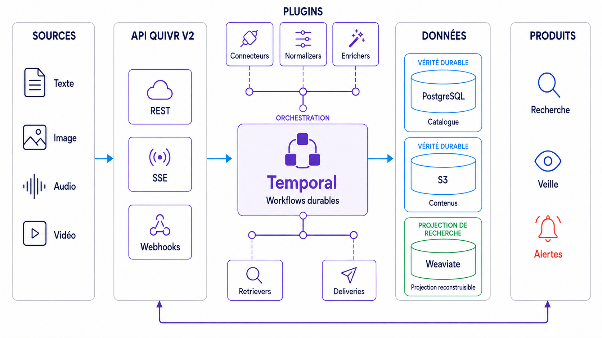
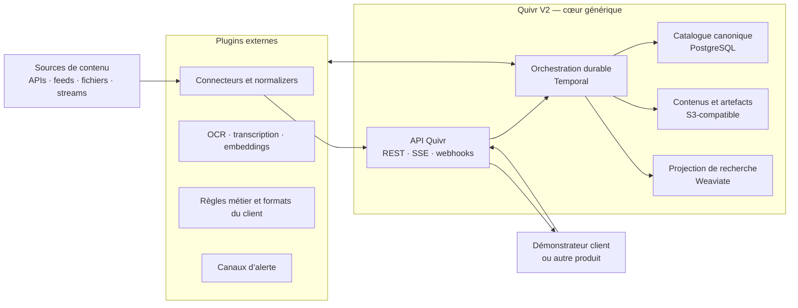
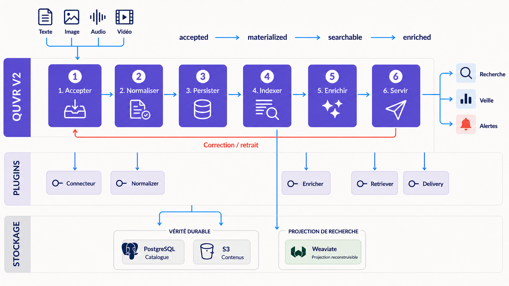
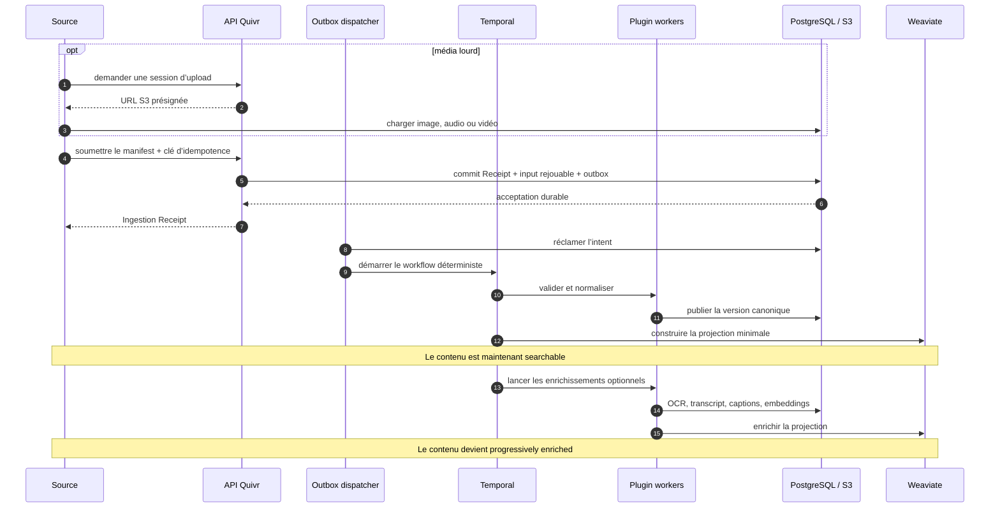
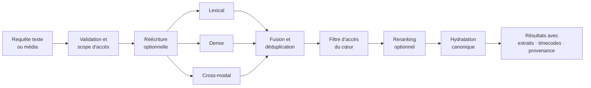
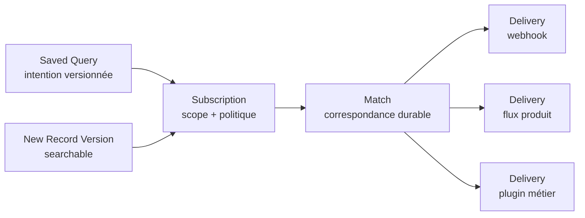
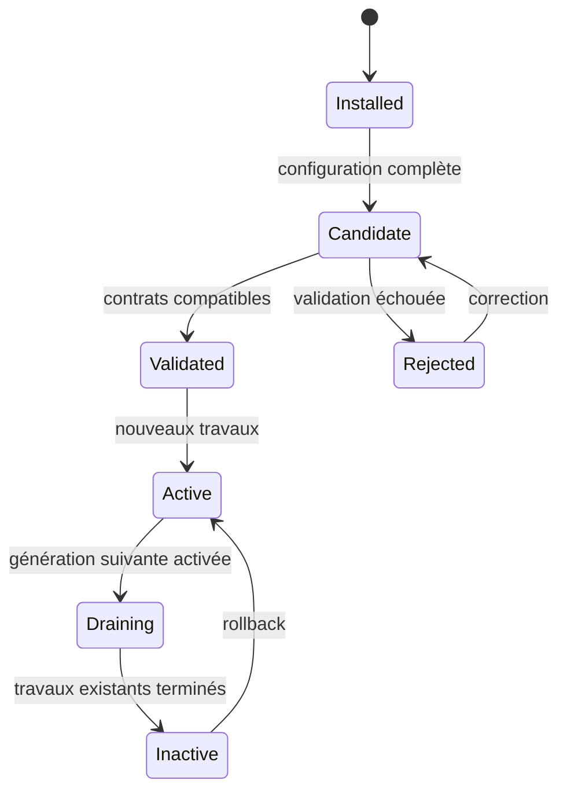
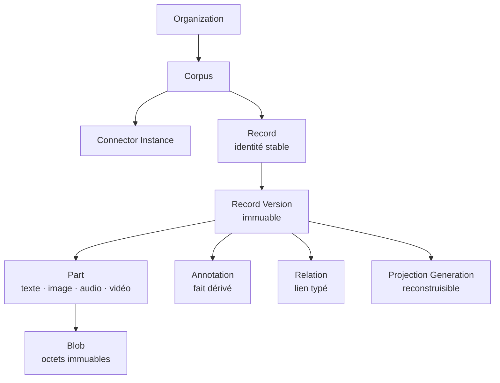
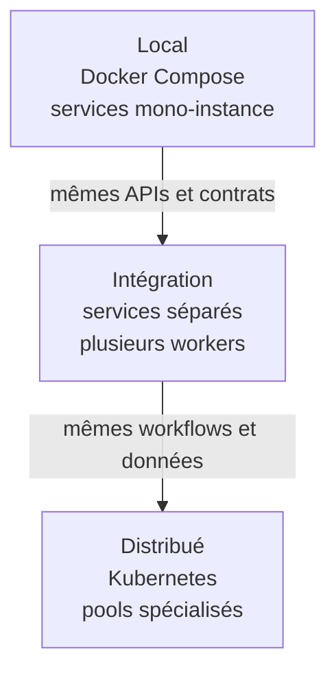

# Quivr V2 — vue d’ensemble du projet et de l’architecture

Date: 2026-09-03 (last revised 2026-09-28)

Status: historical design record, frozen on 2026-09-29. Current behaviour is defined by the code, the contracts and the living documentation.

## En une phrase

Quivr V2 est un backend open source et extensible qui transforme des flux de texte, d’images, d’audio et de vidéo en contenus recherchables et en alertes, sans imposer aux intégrateurs la complexité du traitement multimodal.

Le premier cas d’usage est la veille d’une organisation d’information. Quivr V2 reste toutefois générique : le vocabulaire, les formats et les règles propres à chaque organisation vivent dans ses plugins, tandis que le cœur fournit les invariants communs.



Cette vue sépare volontairement les contrats stables du cœur, les capacités apportées par les plugins et les briques de données. Les produits clients ne dépendent que de l’API Quivr V2 ; PostgreSQL et S3 portent la vérité durable, tandis que Weaviate reste une projection de recherche reconstruisible.

## La promesse

```text
Des contenus hétérogènes arrivent en continu
                         ↓
Quivr V2 les accepte, les comprend et les enrichit progressivement
                         ↓
Les utilisateurs les recherchent ou reçoivent une alerte pertinente
```

Trois choix rendent cette promesse réaliste :

1. un contenu devient utile avant que tous les traitements lourds soient terminés ;
2. les données sources sont durables, les index de recherche sont reconstruisibles ;
3. les comportements spécifiques sont ajoutés par des plugins externes, sans fork du moteur.

## Vue d’ensemble



Le démonstrateur d’un client ne dépend jamais directement de Temporal, PostgreSQL, S3 ou Weaviate. Il ne connaît que les contrats Quivr V2. Cela laisse au produit la liberté d’optimiser ou de remplacer une brique interne plus tard.

## Ce que possède chaque couche

| Couche | Rôle | Exemple |
| --- | --- | --- |
| API Quivr | Point d’entrée stable du produit | ingérer, rechercher, suivre une opération |
| Temporal | Exécuter sans perdre le travail | retry d’une transcription après panne |
| PostgreSQL | Porter la vérité transactionnelle | identité, versions, droits, policies |
| S3-compatible | Conserver les objets lourds | vidéo source, manifest, transcription |
| Weaviate | Servir la recherche rapide | BM25, vecteurs, filtres, hybride |
| Plugins | Apporter formats et comportements | NewsML-G2, OCR, modèle d’embedding, webhook |

La règle importante est simple : **PostgreSQL et S3 permettent de reconstruire Weaviate**. L’index de recherche accélère l’accès mais n’est jamais l’unique copie d’une information métier.

## Comment fonctionne une ingestion



Le chemin principal rend le contenu utile progressivement. Les plugins se branchent sur des points d’extension explicites sans devenir propriétaires de l’orchestration ou du stockage. La boucle de correction et de retrait emprunte la même chaîne durable.



Le reçu signifie « le système a durablement accepté le travail », pas « Temporal a déjà démarré » ni « tous les modèles ont terminé ». La même requête peut être répétée après une coupure réseau : la clé d’idempotence empêche la création d’un doublon logique.

### Disponibilité progressive

```text
Receipt       pending ──► created | duplicate | withdrawal_applied | conflict
Version       materialized ──► retrieval-ready
Record        sans version courante ──► version courante
Enrichments   OCR · transcript · captions · embeddings (indépendants)
```

Ces lignes sont volontairement indépendantes. Une dépêche texte peut devenir recherchable presque immédiatement. Une vidéo apparaît d’abord avec ses métadonnées, puis avec sa transcription, ses plans et ses embeddings. Une panne d’enrichissement optionnel ne retire pas ce qui est déjà utile, tandis qu’un enrichissement tardif peut déclencher une veille sans dupliquer un Match existant.

## Comment fonctionne le retrieval



Le mode `hybrid` combine lexical et sémantique par défaut. Un contenu dont l’embedding n’est pas encore prêt reste trouvable lexicalement. Les plugins peuvent réécrire, récupérer ou reranker, mais les droits sont contrôlés par le cœur avant le retour final.

Trois profils offrent un choix lisible : `fast` pour la latence, `balanced` pour le défaut produit et `deep` pour une recherche plus coûteuse. Ils partagent exactement la même API.

## De la recherche à la veille

La veille est du retrieval continu. Quivr V2 n’intègre donc pas un concept de veille figé : il fournit quatre primitives génériques que chaque produit peut présenter à sa manière.



Le Match et la Delivery sont séparés. Une destination indisponible peut être retentée sans réévaluer la recherche et sans créer une seconde alerte logique. Une correction ou un retrait reste traçable par rapport au match précédent.

## Le système de plugins

Un plugin est un package OCI versionné qui expose une ou plusieurs contributions : connecteur, normalizer, validator, enricher, projector, query rewriter, retriever, reranker, subscription ou delivery.

```text
plugin-news/
├── quivr-plugin.yaml       identité, compatibilité, capabilities
├── schemas/                contrats d’entrée, sortie et configuration
├── src/                    worker Python ou TypeScript
├── tests/                  contract tests et fixtures
└── Dockerfile              artefact exécutable hors du cœur
```

L’auteur du plugin utilise le SDK Quivr, pas les APIs internes de Temporal ou Weaviate. L’installateur choisit les plugins auxquels il fait confiance. Le processus séparé protège surtout la disponibilité du moteur contre un crash ou une consommation excessive ; le MVP ne prétend pas exécuter du code hostile dans une sandbox parfaite.

### Mettre à jour sans arrêter la plateforme



Chaque workflow conserve le plan et les digests exacts qui lui ont été attribués. Une nouvelle génération reçoit les nouveaux travaux ; l’ancienne finit les siens. L’activation s’applique par défaut `from-now`. Un backfill historique est une opération explicite, bornée et moins prioritaire.

## Le modèle de données en un coup d’œil



Les versions sont immuables : une correction crée une nouvelle version, un retrait crée un tombstone. Les annotations portent leur producteur, modèle, paramètres, inputs et génération. C’est ce qui permet de recalculer uniquement les dérivés concernés ou de comparer deux modèles.

## Rétention et stockage froid

```text
hot ──► warm ──► cold ──► restoring ──► warm
 │        │        │
 └────────┴────────┴──► purge candidate ─► grace period ─► purged
```

Une policy décide séparément :

- combien de temps un contenu reste dans la projection active ;
- combien de temps ses artefacts restent chauds ;
- quand ses blobs passent en stockage froid ;
- quand une purge physique est autorisée.

Désindexer ne veut donc pas dire supprimer. Un Legal Hold bloque la destruction. Le garbage collector commence par un dry-run, marque les candidats, attend un délai de grâce puis vérifie de nouveau les références avant suppression.

## Monter en charge sans complexifier trop tôt



Les files logiques protègent le temps réel :

```text
priorité haute   retrait / realtime ingestion / interactive search
priorité normale delivery / enrichissement
priorité basse   backfill / rebuild / maintenance
```

Le MVP ne démarre ni avec Kafka ni avec NATS. Temporal couvre l’orchestration durable et les retries. NATS reste une option future si un vrai besoin de diffusion indépendante apparaît. PostgreSQL n’est pas shardé tant qu’une mesure ne le justifie pas.

## Pourquoi cette stack

| Choix | Pourquoi maintenant | Porte de sortie |
| --- | --- | --- |
| Go | Cœur cohérent, typé, efficace et simple à distribuer sur Linux amd64/arm64 | OpenAPI, schémas SQL, événements et contrats plugins restent indépendants du langage |
| Temporal | Workflows durables, retries et excellente séparation orchestration/activité | Le domaine reste dans Quivr, pas dans l’historique Temporal |
| PostgreSQL | Modèle fiable et familier pour les invariants | Les payloads lourds et la recherche n’y résident pas |
| S3-compatible | Économique, durable et adapté au multimodal | Les états logiques restent indépendants du fournisseur |
| Weaviate | BM25 + dense + hybride + multimodal dans une seule projection OSS permissive | Projection encapsulée et reconstruisible ; Qdrant peut être évalué si les benchmarks échouent |
| OCI | Distribution standard des workers plugins | Une API distante peut aussi implémenter le contrat |

Les dépendances obligatoires restent sous licences permissives. Une technologie copyleft ou source-available peut inspirer le design, mais n’entre pas dans le socle requis.

## Ce que livre réellement le MVP

```text
1. Ingestion texte de bout en bout
2. Premier plugin externe et SDK Python
3. Saved Queries, Matches et deliveries
4. Image, audio et vidéo progressivement recherchables
5. SDK TypeScript et lifecycle des générations
6. Plugins de la première verticale connectés au démonstrateur par API
7. Benchmark multimodal et stabilisation v1
```

Le MVP ne livre pas une marketplace, un data lake, une plateforme Kafka, une sandbox hostile, un billing ou le scale maximal d’un grand corpus d’archives dès le premier jour. Il livre le chemin complet qui crée la valeur, avec les invariants nécessaires pour grossir sans réécriture.

## Frontière produit vertical / Quivr V2

| Quivr V2 | Produit vertical d’une organisation |
| --- | --- |
| Backend générique et open source | Démonstrateur et expérience utilisateur finale |
| APIs, SDKs et Plugin API | Intégration de ces APIs |
| Modèle canonique et retrieval | Choix éditoriaux et parcours de veille |
| Orchestration, stockage et lifecycle | Infrastructure finale selon le partage de responsabilités convenu |
| Support des plugins | Plugins et mappings privés propres à l’organisation |

Le test de cette frontière est simple : une autre organisation doit pouvoir installer Quivr V2 et ingérer ses propres contenus sans rencontrer une notion propre à un autre client dans le cœur.

## Pour aller plus loin

- [Scope détaillé du MVP](./quivr-v2-backend-mvp-scope.md)
- [Vocabulaire et modèle de domaine](../../../CONTEXT.md)
- Les notes de recherche et comparatifs techniques se trouvent dans [`research/`](../research/).
