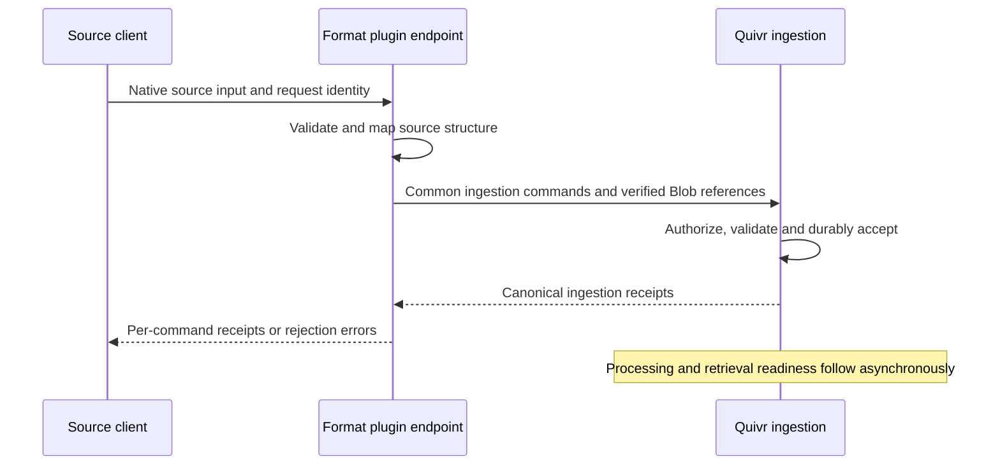

# Public ingestion contracts

Date: 2026-09-14 (last revised 2026-09-29)

Status: historical design record, frozen on 2026-09-29. Current behaviour is defined by the code, the contracts and the living documentation.

Status: assembled design with interview decisions accepted, tracked in [THE-543](https://linear.app/thevibecompany/issue/THE-543).
This document records the public ingestion contract and its evaluation defaults.
The OpenAPI and reproducible checks accompany it; this change implements no service.
The canonical data model and module boundaries remain authoritative. `/v0`
may evolve through documented breaking changes during evaluation.

## Accepted client behavior

- Simple text ingestion accepts a `text` field alongside source identity. Quivr
  constructs the Manifest and computes the checksum. This convenience must also
  accommodate structured source data; explicit Manifests remain available.
- Reading an Ingestion Receipt includes separate processing and availability
  summaries. Acceptance outcome, Version Availability, and currentness remain
  distinct; a Receipt does not acquire workflow lifecycle states.
- Batches are bounded and return acceptance results or errors per entry.
  Processing continues asynchronously. SDKs split larger imports into batches;
  retries preserve each entry's idempotency. Initial limits are specified below.
- Upload confirmation starts observable verification. The SDK waits for a
  verified Blob before submitting ingestion that references it.

## Format-specific plugin ingestion

A news-agency format plugin owns an HTTP endpoint accepting its native source format. It maps
that input to the common Quivr ingestion contract. This endpoint runs in the
plugin service; deployment routing may expose it under the same public domain.
Dynamic registration of plugin routes inside `quivr api` is not required.

The plugin preserves the original XML and structured source information. Its
format-specific mapping stays with the plugin. The core owns authorization,
identity and revision validation, idempotency, canonical persistence, and
processing. Plugins use those contracts rather than writing directly to storage
or indexes. An ingestion Receipt is returned only after core durable acceptance;
receiving the request in the plugin alone does not establish acceptance.



The diagram shows the responsibility boundary. A package can emit several
commands, following the source identities described below. Per-entry acceptance
remains independent; a package does not introduce a cross-Record transaction.

## News package mapping

A dispatch is a Record. Each photo with its own source identity is a separate
Record, connected to the dispatch through a Relation. Titles and paragraphs are
Parts of the dispatch; renditions belong to their photo rather than creating
independent photo Records.

This preserves independent correction and reuse of a photo across dispatches.
Withdrawing a dispatch does not automatically withdraw its shared photos.
Ordinary relation expansion resolves the target's current eligible version. The
source reference is preserved for historical interpretation; resolving a newer
photo does not mutate the dispatch's immutable source version. Source revision
mapping remains to be verified against actual source inputs.

A dispatch can become searchable before its separately linked photos are ready.
Unresolved references are retained, and may resolve when targets become available.
This does not relax verification of Blobs inside the dispatch's own Manifest.
Every expansion checks target authorization and withdrawal independently. A link
cannot grant access to its target or re-expose withdrawn content.

## Structured search and filter defaults

The format plugin supplies a default mapping of source fields to search and filter
roles. For example, the headline and body contribute text for retrieval, while
language, subjects, country, and dates supply filters. Corpus configuration can
adapt these defaults. Other structured source fields remain preserved even when
they are not indexed for search or filtering.

The plugin supplies the mapping; the core validates it and owns projection
construction. The HTTP contract below defines the mapping shape and its use of
the accepted Projection Generation lifecycle.

## News format source evidence

Inspected `QuivrHQ/multimodal-rag` at commit
`16731bb14620a886a5f99a84651e14438e8faab6`:

- [Document parser](https://github.com/QuivrHQ/multimodal-rag/blob/16731bb14620a886a5f99a84651e14438e8faab6/backend/multimodal_rag_api/src/multimodal_rag_api/api/services/document_processor.py)
  handles NewsML-G2 XML with agency-specific extensions, text/XHTML, editorial metadata,
  locations, subjects, and associated media with renditions.
- [Returned model](https://github.com/QuivrHQ/multimodal-rag/blob/16731bb14620a886a5f99a84651e14438e8faab6/backend/multimodal_rag_api/src/multimodal_rag_api/temporal_worker/models.py)
  does not preserve everything the article parser extracts. In particular, the
  richer article dictionary is discarded, and its subjects, urgency, signals,
  and linked media structure are absent from the returned article object.
- [Existing endpoint](https://github.com/QuivrHQ/multimodal-rag/blob/16731bb14620a886a5f99a84651e14438e8faab6/backend/multimodal_rag_api/src/multimodal_rag_api/api/controller/routes.py)
  accepts server file paths and returns Temporal workflow identifiers. This
  is evidence of the existing application, not the proposed V2 public contract.

This code is a concrete format example, not an authoritative or exhaustive
source schema. Its source revision handling and lossless mapping still need validation.

## HTTP contract

The [OpenAPI contract](../../../contracts/http/v0/openapi.yaml) defines the ingestion
shapes. Route spelling, header choice, limits, and schema syntax below are
evaluation defaults, adjustable through documented `/v0` changes.

Organization is derived from an API key in `Authorization: Bearer …`. Requests
name a Corpus, and the core checks the key's permitted actions and Corpus scope.
A plugin uses scoped credentials; it cannot authorize itself by setting a field.

Initial action permissions are `corpora:read/write`, `content:read/write`,
`blobs:read/write`, `changes:read`, `connectors:read/write`, `projections:rebuild`, and `operations:read/write`
(each slash pair denotes two separate permission names). Configuration rebuild requires both
`corpora:write` and `operations:write`. Resource-scoped actions additionally check
the allowed Corpus set. Blob access checks the Organization and the Blob action;
canonical references still cannot cross Organizations. Deployment configuration
provisions API keys initially; key-management endpoints are outside this slice.

### Text, source identity, and corrections

```json
{
  "idempotency_key": "import-42:item-7",
  "source": {
    "corpus_id": "corpus_news",
    "namespace": "example-feed",
    "record_key": "article-123"
  },
  "source_revision": "2",
  "content": {"kind": "text", "text": "Le texte de la dépêche…"},
  "extensions": {
    "example.editorial": {
      "schema_version": "1",
      "data": {"headline": "Titre", "subjects": [{"code": "science"}]}
    }
  }
}
```

This is an illustrative generic API input, not a native plugin endpoint schema.
Plugin extensions are namespaced JSON objects validated against their declared
schema. Unknown core fields are rejected.

**Plugin-owned namespaces (THE-684).** Besides the built-in namespaces, the
startup-pinned plugin owns the namespaces it declares under `extensions` in
its `quivr-plugin.yaml`. Each is the plugin id or starts with it followed by a
dot, and none may clash with a built-in namespace (otherwise API and worker
refuse to start: `foreign_namespace`, `namespace_conflict`). Only that plugin's
normalizer output writes them. Its extensions, top-level and on Parts, are
validated against the declared schema version before anything is recorded;
an undeclared namespace or schema version, or data invalid against the schema,
fails the invocation as `normalizer_invalid_output` and publishes nothing.
Valid top-level extensions are published on the Version beside the submitted
ones, and Part extensions stay in the published Manifest. The Version identity
still derives from the submitted input. A client submission (single, batch
entry or Connector-produced command) that writes a plugin-owned namespace,
top-level or on a Part, is rejected with 422 `extension_namespace_owned`, so
plugin output can be neither forged nor overwritten. Text and uploaded Blob inputs enter
the same command; a structured Manifest expresses Parts and Relations explicitly.
Source data is distinct from computed Derivations and Annotations.

POST `/v0/records` returns a Receipt after durable acceptance. Repeating the
same route-family/idempotency key and canonical request returns the same Receipt;
changing the request under that key returns `idempotency_conflict`. Ordinary
ingestion and entries in `/v0/records/batch` share the ingestion route family.

Correction uses the same command and source identity with a new revision/input
and request key. External revision and monotonic Source Position are optional;
the canonical Manifest digest and per-Record acceptance order provide their
respective fallbacks. A revision identifier is not inferred from a timestamp.
The existing current version remains visible until the correction is ready.
A correction back to an earlier Version's exact content resolves `created`
with a new Version that becomes current (ADR 0003); resubmitting the desired
Version's content under a new key resolves `duplicate`.

POST `/v0/records/withdrawals` accepts source identity and an idempotency key.
It can fence a not-yet-materialized Record. Withdrawal is terminal for that
identity, does not purge bytes, and does not cascade to shared media.

### Per-entry batch results

The initial bound is 100 commands and 10 MiB per batch. Each entry owns its request
key; its array index is only response correlation and never durable identity.
The envelope returns HTTP 200 after individual acceptance attempts, with a Receipt
or error for each entry. A malformed envelope is rejected as a whole before
processing. Entries are independently validated against `IngestCommand`: missing
fields and wrong JSON types are per-entry errors too. The OpenAPI envelope
therefore accepts raw entries; SDK helpers may still build typed commands.
If a transport failure leaves results unknown, replay the same entry keys.

Exceeding either envelope bound is HTTP 413 (`batch_too_large` for more than 100
entries, `request_too_large` above 10 MiB); a schema-invalid envelope is 422 and
malformed JSON 400. None of them creates a Receipt. Each entry's raw JSON is also
held to the 1 MiB single-request bound, reported as the entry error
`entry_too_large`, so the same entry bytes are never refused for size when
submitted alone. Entry errors use the same codes as single submission. The
request's 5 s deadline covers both the upload and every entry's acceptance;
clients on slow links should send smaller batches. When the client disconnects
or the deadline passes, entries not yet accepted stay unaccepted or report a
retryable error; replaying their keys completes them without duplicating
accepted entries.

### Receipt and availability

```json
{
  "receipt_id": "receipt_123",
  "source": {
    "corpus_id": "corpus_news",
    "namespace": "example-feed",
    "record_key": "article-123"
  },
  "state": "resolved",
  "outcome": "created",
  "record_id": "record_123",
  "version_id": "version_2",
  "availability": {
    "state": "building_baseline",
    "is_current": false,
    "searchable": false
  },
  "processing": {"state": "running", "phase": "baseline"},
  "diagnostics": []
}
```

`pending` has no outcome; `resolved` has exactly one of `created`, `duplicate`,
`withdrawal_applied`, or `conflict`. Linked availability is absent until a version
exists. Readiness alone does not imply currentness or authorized searchability.
Infrastructure retries appear in diagnostics, never as a failed Receipt outcome.

The separate `processing` read view distinguishes queued, running, retrying,
blocked, and currently idle work, with a materialization/baseline/enrichment phase
when relevant. It is derived from execution facts rather than another canonical
lifecycle. `idle` does not promise that no future enrichment will be scheduled.

A Version read carries `diagnostics` when there is something to explain: the reason
of a quarantine first, then an external normalizer failure an optional route fell back
from, or a recorded `normalizer_conflict`. A normalization diagnostic also names the
`plugin`, the `contribution` and the `invocation_id`. The codes are documented on the
`Diagnostic` schema of `contracts/http/v0/openapi.yaml`:

| Code | Outcome |
| --- | --- |
| `plugin_unavailable` | Receipt stays `pending` and retries; never quarantines |
| `normalizer_failed` | Terminal plugin error; quarantined |
| `normalizer_invalid_output` | Output refused before any commit; quarantined |
| `normalizer_timeout` | Timeouts exhausted the retry budget; quarantined |
| `normalizer_retries_exhausted` | Retryable errors exhausted the retry budget; quarantined |
| `input_unverified` | The input Blob is no longer the accepted one; quarantined |
| `normalizer_unrouted` | Route removed after acceptance, not `text/*`; quarantined |
| `normalization_superseded` | A newer revision was accepted first; not invoked, quarantined |
| `normalizer_conflict` | Divergent output for one idempotency key; the first output is kept |

On an `optional` route, the plugin failures above publish the Version through the
built-in text path instead of quarantining it. A quarantined Version publishes only its
submitted input Blob Part and is announced by `record.quarantined`.

Divergent normalizer output is recorded rather than quarantined. Detecting it can
happen after the first output was already published and became searchable, when a
quarantine is no longer possible without rewriting canonical state. A diagnostic read
from the durable normalization record is always observable and never overwrites
anything.

### Upload and operation boundaries

Create an upload with expected checksum, size, and media type; receive an upload
URL and required headers. Confirm, then poll the upload until `verified` supplies
a Blob ID, or a terminal verification error occurs. A Blob ID is organization
scoped; possession of its ID does not grant access. A storage URL is a temporary
transfer capability, not canonical Blob identity.

An Operation is an administrative execution. Its read shape exposes semantic
state, optional approximate progress, bounded errors, and counters. Technical
retries keep its ID; an intentional rerun after terminal completion gets a new
linked Operation. No ordinary ingestion is wrapped in an Operation. This draft
defines the Operation read shape, not every administrative command body.

### Errors and replay

Errors contain a stable `code`, readable `message`, and `retryable` flag, plus an
optional field path. Proposed HTTP mapping: 400 malformed input, 401 invalid key,
403 action outside scope, 404 unavailable resource, 409 identity/idempotency
conflict, 413 request too large, 422 invalid schema or unverified Blob, 429 rate
limit, and 503 temporary admission failure. Rejected inputs have no new Receipt.
Resource lookup uses 404 for absent or unauthorized targets to avoid disclosing
their existence. Retryable rejection does not prove prior attempts were unaccepted;
clients retain request keys until their outcomes are known.

### Corpus and relation reads

Create or select a Corpus explicitly. Its effective retrieval configuration
resolves a plugin profile plus overrides by logical field name. Initial field
types are string, number, boolean, datetime, and string arrays; roles are text
search and filtering. Changes to indexed mappings create a new Projection
Generation through an administrative Operation; active configuration changes
only at validated cutover. This is not a new physical index per Corpus. The
implemented behavior, including how mapped fields reach the projection, is
described in [the search contracts](./quivr-v2-search-contracts.md#retrieval-configuration-the-660).

Version reads return the immutable source Manifest and a separate `relations`
view. An available target supplies current Record/Version IDs; an unavailable
target exposes no newly resolved IDs or distinction between missing, unready,
withdrawn, and inaccessible. Original source references remain source data.

### Change feed and resynchronization

Polling and SSE share the committed journal, filtered to a requested Corpus.
Events carry public resource references and serve as invalidations: clients read
current authorized state rather than applying old content over newer content.
Each visible canonical mutation in the synchronized resource family must emit
an invalidation. Exact monitoring event payloads belong to THE-547.

Without a cursor, polling returns no historical events and the current committed
cursor: start now. SSE initially emits a checkpoint with that cursor. Poll pages
always supply `next_cursor` and `has_more`, including when no visible events were
found. A cursor binds Organization, Corpus filter, and authorization scope.

For SSE, `id` carries the resume cursor; `data.event_id` is deduplication identity.
`Last-Event-ID` takes precedence on reconnect. `change` frames carry ChangeEvent
JSON; `checkpoint` frames carry `{"cursor":"…"}` and advance only over safely
scanned positions. `stream_error` carries Error JSON and does not advance the ID.
Before streaming begins, expiry is HTTP 410 `cursor_expired`; after headers, send
`stream_error` and close. Scope/filter changes require explicit resynchronization.
Retention is configured by `change_retention` (Go duration, default `168h`).
A cursor expires in two cases:

- the first journal position after it is older than that window, so a
  caught-up cursor on a quiet Organization stays valid;
- it stands before the Organization's pruned watermark, whatever the reader's
  retention.

A cursor at or after the watermark reads every retained event. A cursor is
therefore refused with 410 rather than resumed over a gap. A 410 can come
slightly early, while the pruner has not yet deleted the aged events.

The worker physically prunes the journal (THE-697). Every `change_prune.interval`
(default `1m`), it deletes, per Organization, the contiguous prefix of events
older than retention. Each pass runs at most 10 transactions of 1000 positions.
The prune never takes the writers' journal lock. It never passes the committed
head or the evaluation dispatch checkpoint (before dispatch starts, the earliest
Subscription activation boundary), so monitoring never loses a trigger event.
It deletes only journal events, never Records, Versions, Matches, Deliveries or
notices. Progress is recorded per Organization (`change_journal_prunes`) and
counted on the worker `/metrics` (`quivr_change_events_pruned_total`,
`quivr_change_prune_failures_total`).

The prune uses the same `change_retention` as the API, so API and worker must
share that setting. `change_prune.retention` may only lengthen it. A shorter
value is refused at worker startup unless `allow_short_retention` is set
together with a non-empty `change_prune.organizations`. That combination is a
test-isolation setting; an empty list means all Organizations.

Because events are deleted, an emission probe can no longer find an earlier
`event_id` once it is pruned. If the same mutation commits again more than one
retention window later, its `event_id` is published again. Consumers
deduplicate by `event_id`.

Each poll scans at most 1000 journal positions; `has_more` stays true until the
committed head is reached.

`resync_url` is the Corpus's Record catalog route relative to the API base,
`/v0/records?corpus_id=<corpus>`. It accompanies `cursor_expired` (HTTP 410
or SSE `stream_error`) and `cursor_scope_changed` (HTTP 409) from both the
change feed and catalog pages; the client restarts the procedure below from it.

Use an authenticated streaming HTTP client in SDKs. Native browser EventSource
does not expose an arbitrary Authorization-header option; API keys must not be
placed in URLs. See the [SSE standard](https://html.spec.whatwg.org/multipage/server-sent-events.html).

The accepted initial resynchronization restores a **current convergent view**,
not a transactional historical snapshot:

1. Capture a start-now Change Cursor before scanning.
2. Read all pages of `GET /v0/records?corpus_id=…` (authorized Records in stable
   Record ID order, including withdrawal state) into a fresh local view,
   following `next_page_cursor` until it is absent. Resolve needed current
   versions separately.
3. Consume changes after the captured cursor. Treat each as an invalidation:
   reread current state with `GET /v0/records/{record_id}`; remove a Record that
   rereads as 404 (absent or inaccessible) from the view.
   Every mutation affecting a Record's catalog state emits an invalidation whose
   resource is that Record ID, even when additional Receipt/Version events exist.
   Never overwrite current state with an older event's payload.
4. Once caught up, continue polling or SSE from `next_cursor`. Deduplicate event
   IDs, and serialize/coalesce refreshes per Record so stale concurrent reads
   cannot overwrite newer local results.

There is no long database transaction across HTTP pages. New Records missed by
keyset traversal and mutations during the scan are covered by the journal.
Expiration or authorization-scope change during scan/catch-up discards the partial
view and restarts this procedure. For the initial slice, this procedure covers
the content catalog; additional resource snapshots accompany their own features.
Page cursors are opaque, never expire, and are distinct from Change Cursors,
Corpus page cursors and Connector page cursors: each kind is signed in its own
domain (`record-page`, `corpus-page`, `connector-page`, `change-cursor`), so
presenting one kind in place of another, or a tampered cursor, is 422
`invalid_cursor`. Corpus and Connector page cursors issued before their signing
domain existed are also 422 `invalid_cursor`; clients restart `/v0/corpora` or
`/v0/connectors` pagination from the first page. A page cursor presented with another Corpus
filter or authorization scope is 409 `cursor_scope_changed` with `resync_url`.

| Situation | Response | Client action |
| --- | --- | --- |
| Change Cursor aged out of retention | 410 `cursor_expired` + `resync_url` | discard view, restart at step 1 |
| Change or page cursor from another Corpus/scope | 409 `cursor_scope_changed` + `resync_url` | discard view, restart at step 1 |
| Malformed, tampered or wrong-kind cursor | 422 `invalid_cursor` | client defect; do not retry unchanged |
| Reread of an invalidated Record is 404 | — | remove the Record from the view |

The acceptance suite runs this procedure as a minimal reference client
(`tests/acceptance/catalog_test.go`) while ingestion, correction and withdrawal
continue, including a Record inserted behind the traversal position and a
Change Cursor that expires mid-procedure.

A convergent current view was explicitly accepted for evaluation; the API does
not promise an exact point-in-time historical snapshot.

### Pull acquisition: Connector Instances

THE-667 (Spec 9/9) adds pull acquisition; THE-668 ships the generic model with a
deterministic `fixture` kind. THE-669 ships `rss` (RSS/Atom feeds, see
[the operator guide](../../connectors/rss.md)), THE-670 ships `m365_mail` and THE-671
ships `x_list` (X list polling, see [the operator guide](../../connectors/x.md)).

- **Resource.** `POST /v0/connectors` creates a Connector Instance bound to one
  authorized Corpus and one Source Namespace, with a kind, a `config` validated
  by that kind's JSON Schema, an optional `schedule.interval_seconds`, an optional
  `health_policy`, and an optional Deposited Credential. Same key and request
  replays the instance; a different request is 409 `idempotency_conflict`. Only
  one **enabled** instance may own a Corpus + Source Namespace (409
  `source_namespace_in_use`); disabling releases it, so a replacement instance
  keeps the same Record identities. `GET /v0/connectors[?corpus_id=]`,
  `GET /v0/connectors/{id}`, `POST /v0/connectors/{id}/disable` (idempotent,
  absorbing), `PUT /v0/connectors/{id}/credential` (replace to rotate) and
  `PUT /v0/connectors/{id}/schedule` (set the interval; a no-op when unchanged)
  complete the surface. `GET /v0/connector-kinds` publishes the enabled kinds with
  their config and credential JSON Schemas, whether credential deposits are
  available and the interval floor, so clients render forms without knowing the
  kinds. Connector `422`s carry `field`, a JSON Pointer into the request. `connectors:read/write` are Corpus-scoped; another
  Organization's or an unauthorized Corpus's instance is 404.
- **Deposited Credentials.** The secret is validated by the kind's credential
  schema, encrypted with AES-256-GCM under the deployment `credential_key`
  (optional, 32+ bytes when set, in `QUIVR_CONFIG`; Railway passes
  `QUIVR_CREDENTIAL_KEY` when set) and bound to its Organization and instance. Each row
  records a key identifier for future key rotation. Responses expose only
  `version`, `deposited_at` and `expires_at`; idempotent replay compares an HMAC
  of the request, never the plaintext. Secrets are decrypted only inside the
  acquisition activity and never enter Temporal payloads or logs. Without a
  `credential_key` the core starts, logs `credential deposits disabled` once
  per process, and refuses any create carrying a credential and every rotation
  with `503 credentials_unavailable` (not retryable) before digesting or storing
  it. Secret-free requests are still digested under a key derived from
  `cursor_key`, so adding, changing or removing `credential_key` changes the
  digest key: a create retried across that change is `409
  idempotency_conflict` rather than a replay. A sealed credential that cannot be
  opened (key absent or changed) fails runs with `access_error`
  (`credential_unreadable`).
- **Schedule.** The instance row is the schedule. The worker leases due
  instances and starts one short Temporal workflow per run, identified by
  instance and run sequence, so at most one acquisition per instance is in
  flight. The interval defaults per kind (fixture/RSS 5 min, mail 1 min, X
  2 min) and is refused below `connector_min_interval` (default `30s`; only the
  local verification stack lowers it). The first run starts at creation.
- **Acquisition path.** A connector fetches pages of new or changed items since
  its Acquisition Checkpoint. Each item is submitted through the same ingestion
  command path as `POST /v0/records` (or withdrawal) in the instance's Corpus and
  Source Namespace, with provenance `producer` = the instance ID and
  `producer_version` = `<kind>/v1`. `source_revision` is the item revision or a content hash; the
  idempotency key derives from instance, Record Key and revision. The checkpoint
  is committed only after the page's commands were durably accepted, so a crash
  re-fetches items that replay the same Receipts. Connector keys use the reserved
  `connector:` prefix, which the public ingestion and withdrawal routes refuse
  with 422 `reserved_idempotency_key`.
- **Attachments.** An item may carry binary attachments. The acquirer first
  checks whether the item's revision-bearing idempotency key already has a
  Receipt; if so it downloads nothing. Otherwise it streams each attachment
  (≤ 25 MB) into a verified same-Organization Blob, with the same identity as a
  client upload of those bytes, and appends it as a Blob Part before
  submitting. A run stores at most 200 MB of attachments; the rest continues on
  the next run.
- **Connector Health.** Health is committed at each run end, credential
  replacement and disable, with `evaluated_at` showing its age. Precedence is
  `disabled` > `access_error` (the source refused access; only a later
  successful poll clears it, not a transient failure)
  > `credential_expiring` (within `credential_warning_seconds`, default 14 days)
  > `silent` (no new item for `silent_after_seconds`, default 24 h) > `active`.
  A "new item" is one whose acceptance reserved a new Record Version; a replayed
  Receipt (an unchanged item fetched again) is not source activity. A run the
  connector declines as not yet due (for example an RSS `ttl`) polls nothing and
  records neither a success nor an error.
  Transient or source failures appear only as `last_error{code,at}`; an item the
  ingestion path rejects is reported as `item_rejected` without stalling the
  source. A failure may carry a retry delay (e.g. a rate-limit reset): the next
  run then waits for the longer of the interval and that delay. A run that
  completed but must report a condition (e.g. `daily_read_cap_reached`) records
  it as `last_error` without degrading health.
- **Usage and diagnostics.** Kinds that read billable or rate-limited source
  resources report them per page; `health.usage` shows the current UTC day's
  `items_read` and `previous_day_items_read`, committed with the checkpoint.
  `health.diagnostics` is a kind-defined object from the latest page, documented
  on the kind's guide (for `x_list`, deletion recheck coverage). Both are absent
  for kinds that do not report them.
- **Events.** `connector.created`, `connector.disabled`,
  `connector.credential_replaced`, `connector.schedule_changed` and `connector.health_changed`
  (`resource.kind=connector`) are committed with their mutation and visible
  through the Corpus change feed.
- **Known limitations.** Public ingestion into a connector-owned Source Namespace
  is not blocked yet. Re-enable and reconfiguration are later work. Superseded
  credential versions stay encrypted until a retention operation exists. A run
  killed mid-activity is retried after its heartbeat timeout (30 s); a live run
  is bounded to 5 minutes.

### Administrative cancellation

Cancellation asks remaining work to stop; it does not undo committed effects.
If the Operation is terminal, return its existing state. A completion racing
with cancellation may win. No unsafe partial projection becomes active; restoring
cold content still preserves its prior state if canceled before activation.
Intentional rerun is allowed only after terminal completion and revalidates
current authorization and eligibility, using a new linked Operation ID.

### Selected generators and validation

The contract uses [OpenAPI 3.1](https://spec.openapis.org/oas/v3.1.0.html) with JSON
Schema constraints. Generated transport structs do not replace request schema
validation or canonical cross-resource checks.

Select [oapi-codegen v2.8.0](https://github.com/oapi-codegen/oapi-codegen/tree/v2.8.0)
for Go types and net/http strict server bindings, and OpenAPI Generator v7.25.0
for [Python](https://openapi-generator.tech/docs/generators/python/) and
[TypeScript fetch](https://openapi-generator.tech/docs/generators/typescript-fetch/)
clients. Ten representative payloads round-trip without data loss in all three
languages. Go bindings and TypeScript outputs compile; the OpenAPI, examples and
seventeen boundary cases validate. The [verification guide](../../../contracts/http/v0/README.md)
records pinned versions, commands, the generator limitation found and its schema
fix. These are transport checks, not running-service or end-to-end verification.

Small handwritten SDK layers will handle per-entry batching, persistent request
keys, polling, authenticated SSE and resynchronization. They follow this contract
and do not create a second public schema source of truth.

## Implementation handoff

- THE-543 resolves the initial ingestion, Receipt and Operation surface. Actual
  endpoint implementation and SDK convenience layers follow implementation tickets.
- Verify the news source revision mapping against real inputs in the plugin work;
  the core does not infer external revisions from publication timestamps. The
  plugin owns its native endpoint schema and produces the common commands.
- Detailed monitoring resources and event payloads belong to THE-547; their
  integration and the runtime acceptance harness remain THE-548/THE-550.
- The first schema supports Record-target Relations needed by the news package flow;
  Part-target relation syntax can be added with the feature that needs it.
