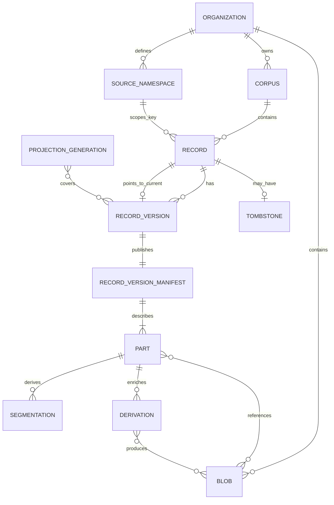
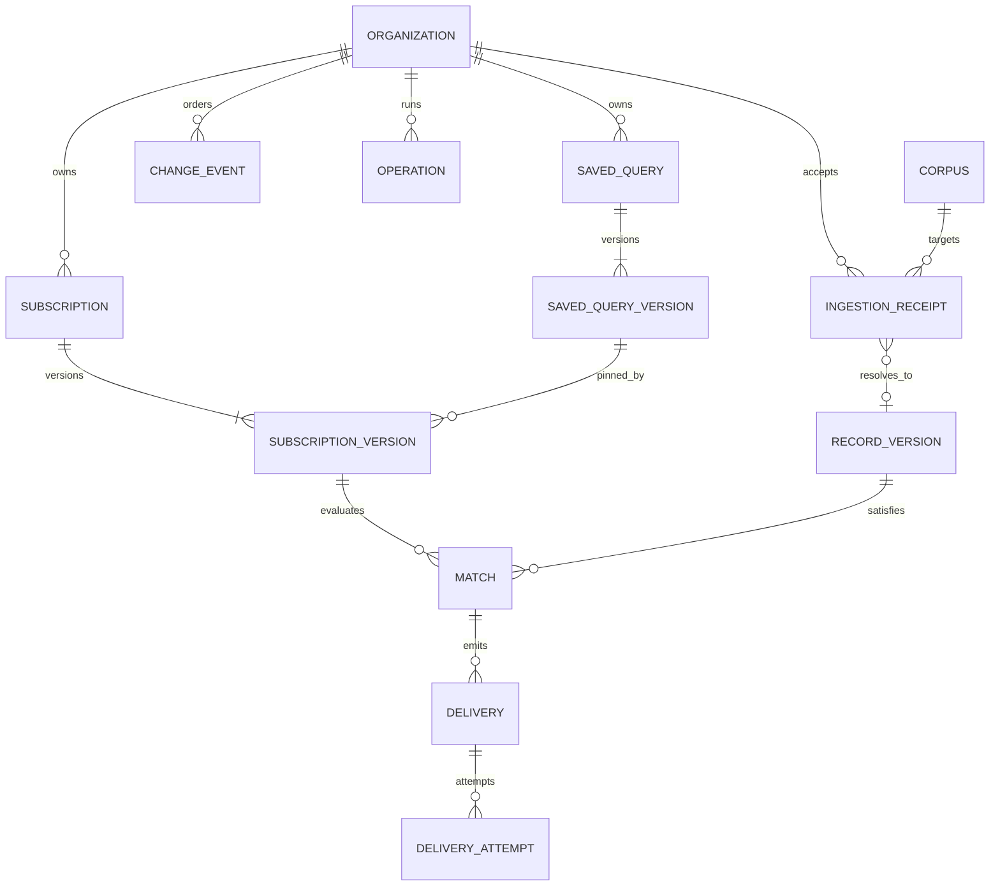
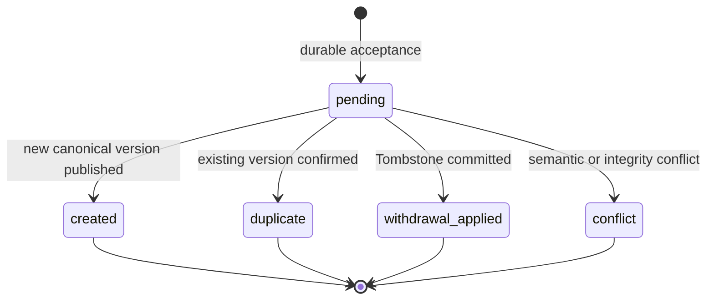
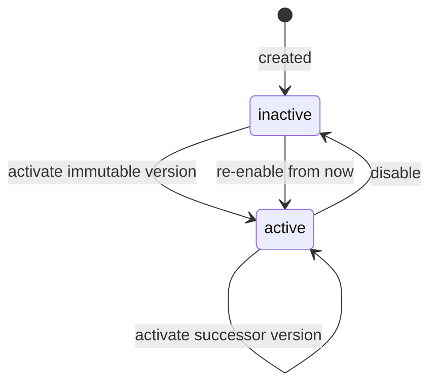
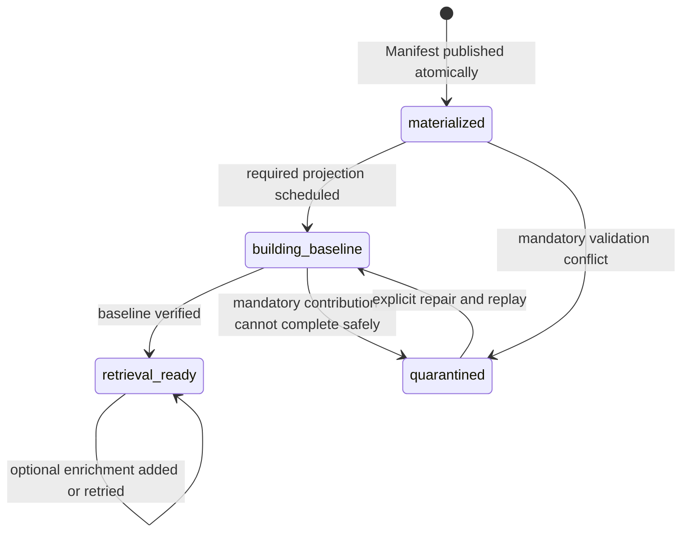
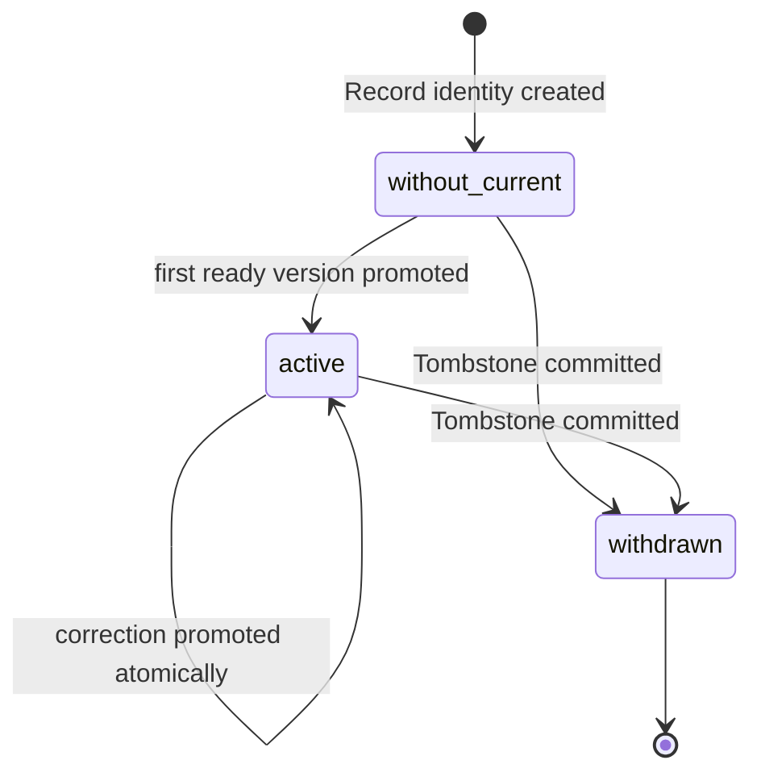
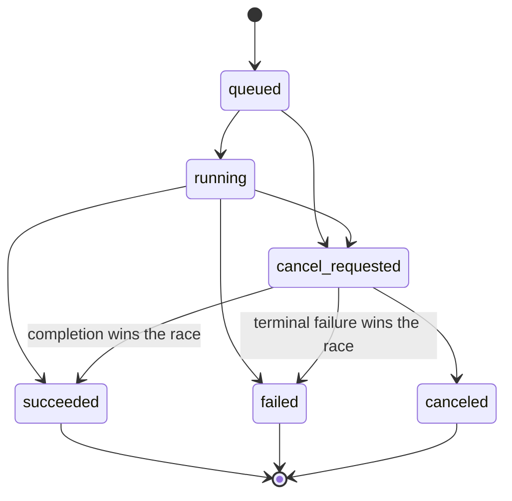
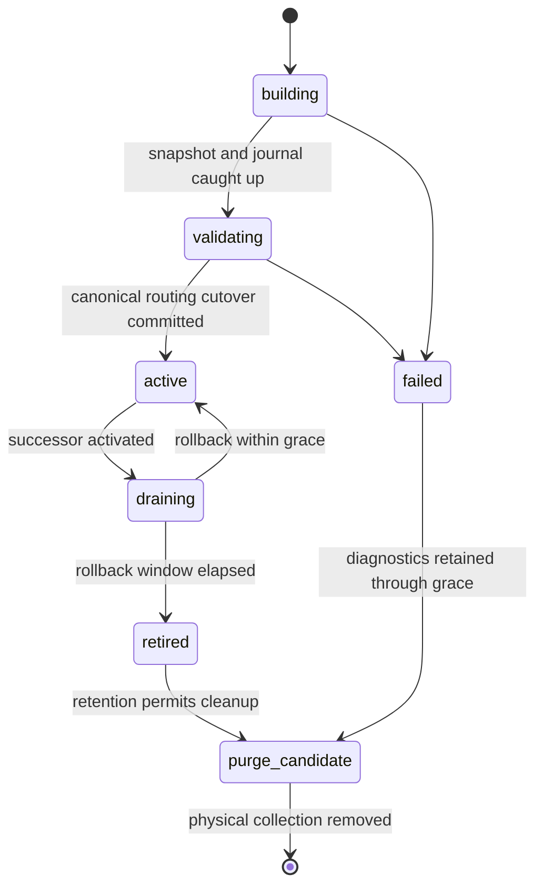
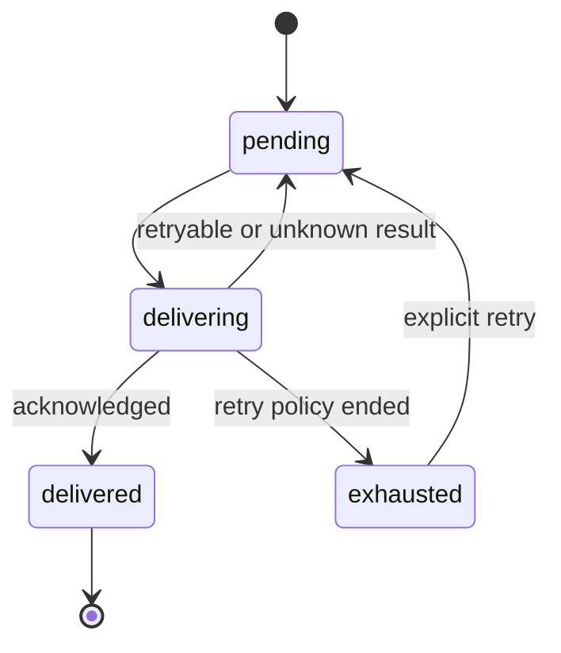
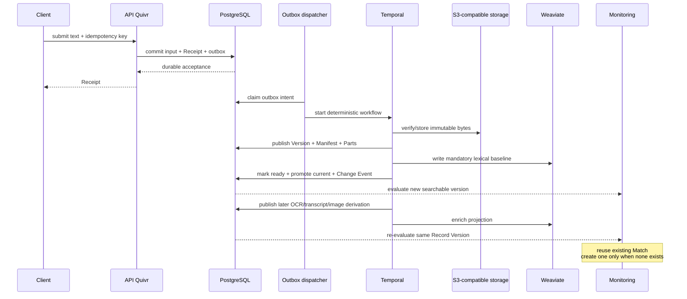

# Quivr V2 — Canonical data model and lifecycle invariants

> Decision record for [THE-546](https://linear.app/thevibecompany/issue/THE-546/define-canonical-data-invariants-and-lifecycle-state-machines)
>
> Scope: technical foundation and first text-monitoring vertical slice
>
> Status: accepted foundation, 4 September 2026
>
> Routing clarification, 14 September 2026: the accepted
> [runtime spike](https://github.com/The-Vibe-Company/quivr-v2/blob/4196f51/prototype/runtime-spike/evidence/report.md)
> establishes PostgreSQL as the physical-generation query router; the Weaviate
> alias is operational metadata.

This document defines the durable identities, ownership boundaries, and lifecycle rules that the Quivr V2 foundation must preserve. It is deliberately conceptual: table names and Go package layouts may change, but these invariants must remain observable through the public contracts.

The design follows two existing decisions:

- [PostgreSQL-led durable consistency](https://github.com/The-Vibe-Company/quivr-v2/blob/9d0783de7ffc56f06d27b9e9b785997791a37807/research/durable-consistency-model.md): PostgreSQL commits canonical facts, S3-compatible storage owns immutable bytes, Temporal executes retryable work, and Weaviate remains rebuildable.
- [Weaviate projection generations](https://github.com/The-Vibe-Company/quivr-v2/blob/e8980d086403b86c8dce47763979185791320409/research/weaviate-projection-design.md): one deterministic object per segment, canonical hydration, and generation-based rebuild/cutover.

## Decision summary

1. `Organization` is the ownership and isolation root. Every tenant-bound reference is provably contained by one Organization.
2. A `Record` belongs to exactly one `Corpus`; its external identity is unique within Organization, Corpus, and `Source Namespace`.
3. A source revision creates an immutable `Record Version`. Optional enrichment changes neither that version nor its Manifest.
4. A Record Version becomes canonical only when its verified Manifest, Parts, and Blob references can be published atomically. Incomplete work remains staging data.
5. An `Ingestion Receipt` proves durable acceptance; it does not duplicate workflow or search-availability state.
6. Availability is progressive. The mandatory retrieval baseline makes a version eligible to become current; optional text, image, audio, and video derivations may arrive later.
7. A correction replaces the current pointer only after its baseline is ready. A `Tombstone` withdraws the Record immediately and is absorbing in the MVP.
8. Re-evaluation after enrichment converges on one `Match`. A source correction may create a new, linked Match and alert.
9. `Projection Generations` are immutable rebuild units. PostgreSQL selects the active physical Weaviate collection; an alias is operational metadata.
10. PostgreSQL constraints protect local truth, application rules protect semantic transitions, and reconcilers repair cross-system drift. Reconciliation is never the only barrier against withdrawn or unauthorized content.

## Canonical authority

| Concern | Authority | Consequence |
| --- | --- | --- |
| Identity, ownership, lifecycle, currentness | PostgreSQL | No other component may promote or withdraw a Record. |
| Immutable bytes | S3-compatible storage | PostgreSQL references bytes only after checksum and size verification. |
| Long-running execution and retry | Temporal | Workflow history is operational evidence, not canonical product state. |
| Search candidates | Weaviate | Every candidate is hydrated and re-authorized against PostgreSQL. |
| Public changes | PostgreSQL Change Events | Events commit atomically with the facts they describe. |
| External notification outcome | Destination plus Delivery Attempt history | Quivr guarantees a stable logical Delivery and at-least-once attempts, not an external transaction. |

## Conceptual model

### Content and provenance



`PART` may form a hierarchy, but every Part has at most one parent, and that parent must belong to the same Manifest. Search segments are children of a `Segmentation`; they are not new Record Versions.

### Acceptance, monitoring, and delivery



The two diagrams are connected by `Organization`, `Record Version`, and `Change Event`. A normal ingestion is followed through its Receipt and linked version; it is not modeled as a long-running administrative Operation.

## Identity and ownership invariants

### Organization and Corpus

- Every Corpus belongs to exactly one Organization.
- Every Record, source namespace, receipt, query, subscription, match, delivery, event, operation, blob, and projection checkpoint is attributable to exactly one Organization.
- A reference that crosses Organizations is invalid, even when opaque IDs happen to exist in both.
- Blob deduplication never crosses an Organization boundary.
- Database relationships for tenant-bound aggregates use Organization-compatible keys or equivalent constraints; authorization code is not the sole protection against cross-tenant references.

### Record and Record Key

- A Record belongs to exactly one Corpus for its entire lifetime.
- Its source identity is unique on:

  ```text
  (organization, corpus, source_namespace, record_key)
  ```

- Record Key is a value object inside that identity, not an independently mutable resource.
- `Source Namespace` survives replacement or reconfiguration of a connector. Connector identity is therefore not part of the Record Key.
- A Record maintains two distinct notions:
  - the highest accepted mutation order, used to fence stale work;
  - the current Record Version, used for retrieval and monitoring.
- A Record may exist before it has a current version, for example while its first accepted submission is being processed.
- Corpus transfer is not a mutation of a Record. If required later, it creates a distinct Record in the target Corpus with explicit lineage.

### Source ordering and duplicate revisions

- A source may supply a monotonic `Source Position`. When present, it orders revisions within its Source Namespace.
- Without a Source Position, Quivr assigns a durable per-Record acceptance order.
- The same source revision and same canonical Manifest digest converge on one Record Version.
- The same source revision with different canonical content is a conflict and is quarantined; it is never an overwrite.
- When a stable external revision identifier exists, it selects the version slot and the Manifest digest verifies it. Without one, the canonical Manifest digest supplies version identity.
- Without a revision, a newer submission whose bytes equal an earlier, no-longer-desired Version is a revert. It mints a new Record Version with identical content, which becomes current; the earlier Version is never re-pointed (ADR 0003).
- Distinct external revision identifiers preserve distinct source history even when their canonical bytes happen to agree.
- An older revision arriving late may be retained as immutable history, but it cannot replace a newer desired or current revision.
- A newer accepted revision fences any older in-flight cutover. The older work may finish safely, but compare-and-set promotion fails.

### Record Version, Manifest, and Part

- A Record Version is born only when one verified `Record Version Manifest` is published with it in the same PostgreSQL transaction.
- Before that transaction, payloads and intermediate results are staging artifacts owned by the accepted command, not a partial Record Version.
- A Record Version and its Manifest are immutable after publication.
- A source correction creates a new Record Version linked to its predecessor. A normalization, segmentation, embedding, OCR, caption, or transcription does not.
- Every Part belongs to exactly one Manifest and therefore exactly one Record Version.
- A Part key is unique within its Manifest.
- A Part has at most one parent; parent and child belong to the same Manifest; cycles are forbidden.
- A Manifest references only verified Blobs from the same Organization.
- Publication is all-or-nothing: readers can observe neither half a Manifest nor dangling Part ownership.

### Blob, Segmentation, and Derivation

- A Blob is immutable and identified inside one Organization by verified content identity, including checksum and size.
- One Blob may be referenced by several Parts or Derivations in that Organization. Its bytes carry no business ownership by themselves.
- A Segmentation is a versioned Derivation of an exact normalized input. Several segmentations may coexist.
- A Derivation identity includes its immutable inputs, capability version, producer or plugin digest, model, parameters, and output role.
- Repeating the same derivation identity converges on the same result. Different output bytes for that identity are an integrity conflict.
- A configuration, model, or producer change creates a new Derivation rather than mutating the old one.
- The `Pipeline Plan` marks each contribution as mandatory for the retrieval baseline or optional enrichment. A plugin may add requirements but cannot weaken core integrity and access rules.

### Receipt and Operation

- The acceptance transaction creates one immutable Receipt for:

  ```text
  (organization, route_family, idempotency_key)
  ```

- Reusing that key with the same canonical request hash returns the same Receipt. Reusing it with another request is a conflict.
- A Receipt begins `pending` and resolves exactly once as `created`, `duplicate`, `withdrawal_applied`, or `conflict`.
- Availability belongs to the linked Record Version. Workflow dispatch, retries, and search readiness are not Receipt lifecycle states.
- A read model may show linked processing and availability beside a Receipt without copying those states into the Receipt aggregate.
- Inputs rejected before durable acceptance produce a synchronous structured error and no Receipt.
- An Operation represents an explicit administrative command such as rebuild, backfill, cold-data restoration, or purge. Routine ingestion is not an Operation.
- Technical retries and process restarts keep the same Operation identity. An intentional rerun of terminal work creates a new linked Operation.

### Saved Query, Subscription, Match, and Delivery

- Saved Queries and Subscriptions belong to exactly one Organization.
- A Saved Query has stable identity and immutable versions. Each version fixes the query expression, Corpus scope, retrieval profile, and temporal policy.
- Every Corpus in a Saved Query Version belongs to the same Organization.
- A Subscription has stable identity and immutable versions. A Subscription Version pins one Saved Query Version plus its evaluation and delivery policy.
- Only the active Subscription Version is evaluated. Activating a new immutable version does not rewrite earlier Matches; disabling a Subscription stops new evaluations without deleting its history.
- Disabling a Subscription also blocks admission of new Delivery Attempts, including retries of pending notifications. Already admitted/in-flight attempts may finish. This admission rule was resolved in THE-547.
- Activation starts from now by default. Evaluating an earlier time range is an explicit Backfill with its own scope and priority.
- A Match is unique on:

  ```text
  (subscription_version, record_version)
  ```

- Re-evaluating a Record Version after optional enrichment converges on the same Match. If it did not match earlier and a later image analysis or video transcription makes it match, the Match and Delivery may be created then.
- An enrichment never creates a duplicate logical alert for an existing Match.
- A source correction is a new Record Version and may create a new Match linked to the previous Match. The Subscription policy decides whether a source-declared or semantically material correction warrants a new Delivery.
- The initial policy treats a source-declared correction that still matches as material; specialized plugins may classify significance without changing core identity rules.
- A Delivery is unique for one Match, destination, and logical event kind. Delivery Attempts are append-only and may repeat with the same stable public event ID.
- Exactly-once delivery to an external system is not promised. Receivers can deduplicate attempts by event ID.
- A Match remains immutable history after correction or withdrawal. A separate correction or withdrawal event can produce a linked Delivery; it never edits the original fact.

### Change Event and Change Cursor

- A Change Event is inserted in the same PostgreSQL transaction as the canonical transition it describes.
- `event_id` is globally unique. `(organization, position)` is unique and totally ordered within one Organization.
- Positions are allocated behind a row-locked Organization stream head, not from commit-unsafe timestamps or exposed database sequences.
- Polling and SSE read the same committed event journal.
- Consumption is at-least-once. Clients deduplicate on event ID.
- A Change Cursor is opaque, Organization-scoped, and valid only within the public event-retention window. An expired cursor returns `cursor_expired` and requires explicit snapshot resynchronization; Quivr never skips silently.
- Public Change Events and the internal projection-rebuild journal are distinct contracts, even if an implementation can share storage primitives.

### Tombstone and physical deletion

- At most one Tombstone exists for a Record.
- Tombstone creation and Record withdrawal commit atomically with their Change Event.
- Withdrawal is terminal in the MVP. A later ordinary ingestion cannot reactivate the Record; reintroduction requires a new Record Key.
- From the Tombstone commit onward, canonical search hydration and Match creation reject the Record even if stale Weaviate objects or plugin work still exist.
- Projection cleanup is eventual and cannot be the confidentiality or correctness barrier.
- An external Delivery Attempt already in flight cannot be recalled transactionally. Withdrawal blocks new attempts and can emit a separate withdrawal Delivery.
- A Tombstone does not physically delete history or bytes.
- Physical deletion requires no canonical reference, no active work, no Legal Hold, retention eligibility, and an elapsed recovery grace period. The item first becomes a `Purge Candidate`.

### Projection Generation lifecycle

- A Projection Generation pins schema, derivations, vector spaces, and exact engine/client compatibility metadata.
- A Generation is a whole rebuild unit, not an in-place schema migration.
- For the initial text projection, at most one Generation is `active` globally for the projection family. Per-Organization generations remain a measured scale escape hatch, not an MVP default.
- Reads resolve the active physical Generation in PostgreSQL, then query that collection. Writers always name physical Generations.
- Building starts from a canonical snapshot at high-water mark H, then consumes the durable projection journal from H+1 until caught up.
- PostgreSQL owns active-generation routing, cutover intent, and checkpoints. The Weaviate alias can mirror the active collection for operations, but alias drift cannot override canonical query routing.
- The old Generation remains updated while `draining`, allowing rollback during a bounded grace period.
- Once a Generation is active, its manifest is immutable. A changed schema or vector space requires another Generation.

## Lifecycle state machines

### Ingestion Receipt



Transient infrastructure failures do not resolve the Receipt as failed. They remain retryable and observable through linked processing diagnostics. A non-retryable integrity or revision collision resolves as `conflict` and may link to a Quarantine entry.

### Subscription



Only the selected immutable Subscription Version receives new evaluations. Historical Matches keep pointing to the version that created them. A historical window is processed through an explicit Backfill rather than being silently replayed on activation.

### Record Version availability



`retrieval_ready` is not sufficient by itself to return the version in normal search. The derived searchability predicate is:

```text
version availability is retrieval_ready
AND record.current_version_id equals this version
AND record is not withdrawn
AND active projection coverage is valid
AND the caller remains authorized
```

Optional enrichment failure is visible and retryable but does not move a ready version backward. A version superseded while building may become retrieval-ready historical data, but cannot win the current-pointer compare-and-set.

### Record currentness and withdrawal



Accepting a correction does not remove the current version. The old version remains searchable until the successor is retrieval-ready and wins the atomic cutover. Tombstone is the only immediate exception.

### Operation



Activities may retry or workers may restart while the Operation remains `running`. There is no pause/resume state in the MVP.

A cancellation request stops remaining work without rolling back committed
effects. Completion may win a race with cancellation; a request against a terminal
Operation returns that terminal state. Safe activation constraints still apply,
including preserving the prior state when cold restoration is canceled before
activation. These public cancellation semantics were resolved in THE-543.

### Projection Generation



The database prevents two Generations of one projection family from being canonically active. Query routing reads this canonical state. If an operational alias is maintained, reconciliation repairs it from PostgreSQL after an ambiguous result or crash; alias movement does not select what clients query.

### Logical Delivery



Every transition to `delivering` appends a Delivery Attempt. A lost response may therefore cause the destination to observe the same event more than once, but it never creates another logical Delivery.

## Atomic PostgreSQL transitions

The foundation needs a small number of explicit transaction boundaries rather than a distributed transaction.

### 1. Durable acceptance

One transaction commits:

- idempotency key and request digest;
- replayable command/input reference;
- pending Receipt;
- initial Change Event when publicly relevant;
- transactional-outbox intent to start Temporal work.

An HTTP `202 Accepted` means this commit exists. It does not mean that Temporal has already acknowledged `StartWorkflow`.

### 2. Canonical version publication

After all referenced bytes have been verified, one transaction commits:

- Record identity if this is its first accepted revision;
- immutable Record Version and predecessor lineage;
- exactly one Manifest;
- all Parts and Blob references;
- initial Version Availability;
- Derivation identities already required for materialization;
- Receipt resolution to `created`, or a link to the existing version for `duplicate`.

No transaction references a Blob before the object exists and passes checksum/size verification.

### 3. Searchable correction cutover

After every mandatory baseline object has succeeded in the active Projection Generation, one compare-and-set transaction:

- verifies the candidate still owns the latest accepted mutation order;
- verifies the Record has no Tombstone;
- records baseline coverage as ready;
- promotes `current_version_id`;
- marks the previous current version historical;
- appends the searchable or correction Change Event.

A Weaviate write may precede this commit, but canonical hydration hides it. The reverse ordering is forbidden because it would claim searchability before the projection exists.

### 4. Withdrawal

One high-priority transaction:

- inserts the unique Tombstone;
- marks the Record withdrawn and advances its mutation fence;
- appends the withdrawal Change Event;
- enqueues projection cleanup and any configured withdrawal notification.

Search and Match code reject the Record immediately from canonical state; external cleanup recovers forward.

### 5. Match and Delivery creation

One transaction:

- locks or compare-and-sets against the same current Record head;
- verifies currentness, authorization, absence of Tombstone, and pinned Subscription Version;
- inserts the unique Match or returns the existing one;
- links a correction Match when applicable;
- creates the unique logical Delivery and outbox intent;
- appends a Match Change Event when public.

Delivery Attempts happen later and never recreate the Match.

## Where each invariant is enforced

| Invariant | Transactional database protection | Application rule | Eventual repair |
| --- | --- | --- | --- |
| Same-Organization ownership | Composite foreign keys or equivalent constrained references | Authorization and scope compilation | Audit scan for imported legacy data only |
| Record Key uniqueness | Unique Organization/Corpus/Namespace/Key tuple | Normalize key and compare canonical identity | None required for correctness |
| Request idempotency | Unique route-scoped idempotency key | Compare stored and incoming request digests | Outbox watchdog resumes accepted work |
| Version convergence | Unique version identity per Record | Compare source revision and Manifest digest; reject divergent bytes | None required for canonical truth |
| Atomic Manifest | One Version-to-Manifest relation, Part and reference constraints in one transaction | Validate structure, parent scope, acyclicity, schemas, and Blob verification | Sweep unreferenced staging bytes after grace |
| Derivation convergence | Unique deterministic derivation identity | Compare output checksum on conflict | Retry missing outputs; quarantine divergence |
| Current correction | Row lock or compare-and-set on Record mutation order | Choose desired revision using Source Position or acceptance order | Remove stale projected objects |
| Tombstone wins | Unique Tombstone plus atomic withdrawn state | Gate every search hydration and Match commit | Delete stale projection objects and cancel obsolete work |
| Change order | Unique Organization/position allocated under stream-head lock | Encode and validate opaque cursor | Monitor consumer lag; explicit resync after expiry |
| One logical Match | Unique Subscription Version/Record Version | Re-evaluate progressive enrichment against pinned policy | Replay Change Events safely |
| One logical Delivery | Unique Match/destination/event kind | Stable event ID and retry policy | Retry or park attempts; receiver deduplicates |
| One active projection | Unique active Generation per projection family | Validate coverage and atomically select canonical query routing | Reconcile operational alias from PostgreSQL |
| Projection completeness | Coverage/checkpoint rows and compare-and-set cutover | Inspect every object result; canonical hydration | Repair missing/stray objects or rebuild generation |
| Physical purge safety | Protected/candidate state committed before deletion | Resolve references, active work, retention, grace, and Legal Hold | Recheck after object deletion and report drift |

The database should reject violations it can know locally. It should not embed plugin semantics or pretend to transact with S3, Temporal, Weaviate, or a webhook destination.

## End-to-end scenarios

### New article, then multimodal enrichment



For the first text slice, normalized text and its lexical projection form the mandatory baseline. Embeddings and later multimodal derivations may follow. Other Record types can define a different baseline through their validated Pipeline Plan.

### Correction

1. Version V1 remains current and searchable.
2. The correction is accepted with a higher mutation order and becomes V2 only after atomic Manifest publication.
3. V2 receives its mandatory projection while V1 stays current.
4. V2 wins a compare-and-set cutover only if no newer revision or Tombstone has appeared.
5. The correction Change Event re-evaluates Subscriptions.
6. A material correction can create Match M2 linked to the earlier M1; optional enrichment of V1 or V2 cannot duplicate their Matches.

### Withdrawal racing slow work

1. Tombstone and withdrawn state commit synchronously.
2. Every subsequent search hydration and Match transaction rejects the Record.
3. An already-running plugin or Weaviate write may finish, but its promotion compare-and-set fails.
4. Cleanup and reconciliation delete stale projection objects later.

This permits harmless external leftovers but never makes them canonically visible.

## Public contract consequences

- `GET /v0/ingestion-receipts/{id}` exposes acceptance outcome and links to the Record/Version plus a separate availability view. It must not imply that Receipt state and Version Availability are the same state machine.
- `GET /v0/records/{id}` identifies the current version and withdrawal state; historical versions remain separately addressable when authorized.
- Search results name Record, Record Version, Part/segment, Projection Generation, derivations, and availability of optional modalities.
- Change Events distinguish at least new searchable version, correction, enrichment available, Match, Delivery outcome, and withdrawal.
- A late enrichment can produce a first alert. It cannot produce a duplicate alert for an existing Match.
- A correction alert is linked to its predecessor and labeled as a correction rather than presented as an unrelated new Record.
- Public APIs expose semantic states and stable IDs, never Temporal workflow status, S3 keys, Weaviate collection names, or database positions.

This supersedes the earlier shorthand in THE-532 that described `accepted`, `materialized`, and `searchable` as successive Receipt states. Clients may observe all three milestones through one response, but acceptance, version availability, and currentness remain separate canonical concerns. THE-543 must reflect this distinction in the OpenAPI contract.

## Deliberately deferred implementation detail

This decision does not freeze:

- SQL table names, UUID format, indexes beyond the conceptual uniqueness rules, or Go ORM/query tooling;
- exact JSON schemas for Manifests, Parts, annotations, and plugin outputs;
- an overall `enriched` terminal state—optional contributions remain independently observable;
- hostile-plugin isolation, a plugin marketplace, quotas, billing, Kafka, NATS, or CDC;
- per-Organization Weaviate generations before the large-tenant benchmark proves the need;
- physical retention implementation beyond the accepted purge-safety invariant.

## Evidence still required from prototypes

The model is settled, but four cross-system behaviors need executable proof:

1. crash injection at acceptance, S3 publication, version publication, Weaviate write, and current-pointer cutover;
2. correction and Tombstone races against a paused projector;
3. Weaviate readiness, partial-batch recovery, alias cutover, and rollback on the pinned server/client pair;
4. ordered Change Cursor behavior and contention under representative concurrent ingestion.

Those experiments validate adapters and recovery protocols. They must not reopen the canonical identities unless they reveal an actual contradiction.
