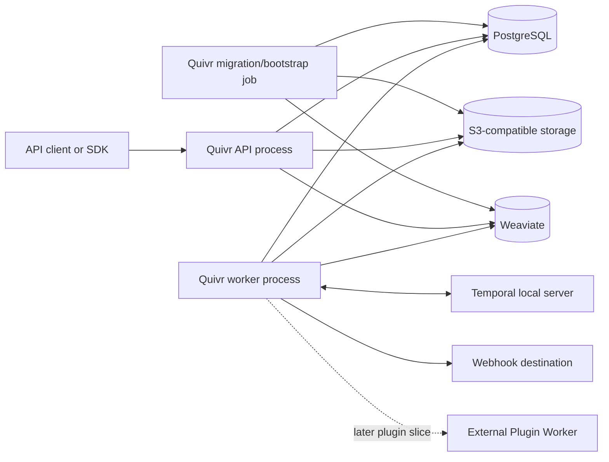
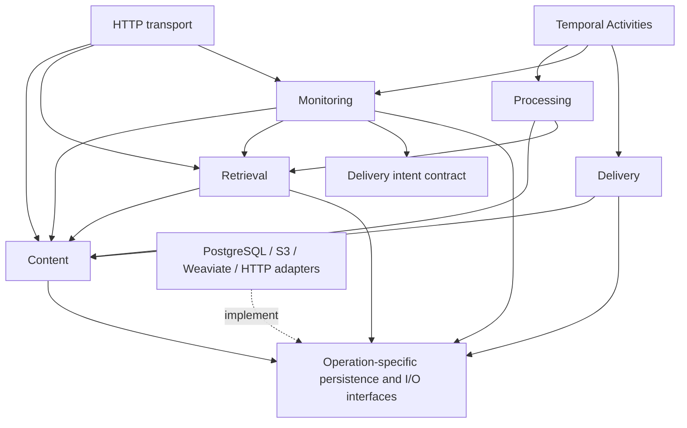

# Quivr V2 — Module ownership and repository design

Decision ticket: [Choose module boundaries and repository topology](https://linear.app/thevibecompany/issue/THE-542).

Status: the interview choices, including Monitoring's atomic Match/Delivery
operation, were accepted by Stan on 2026-09-14. The assembled blueprint below is
proposed for final review. No production implementation is included.

## Accepted direction

### Responsibility-based modules

| Module | Responsibility |
| --- | --- |
| Content | Durable acceptance, Record Versions, Manifests, availability, and withdrawal |
| Processing | Execution of normalization and enrichment steps |
| Retrieval | Search projections, candidate retrieval, and authorized result hydration |
| Monitoring | Saved Queries, Subscriptions, and Match creation |
| Delivery | Notification transport, signatures, and Delivery Attempts |

These are module responsibilities, not five independent deployable services.
Keep a small interface around meaningful behavior so callers do not coordinate
individual persistence steps. Match creation and creation of its logical Delivery
remain one transaction; network delivery follows separately. Monitoring owns
this combined operation. Delivery owns subsequent sending and retries. This
ownership was accepted after clarifying that the existing atomicity guarantee
does not require a distributed transaction or another deployable service.

### One core artifact, separately operated processes

One versioned Go binary and container image provides API, worker, and migration
commands (`quivr api`, `quivr worker`, `quivr migrate`). Processes can be scaled
and operated separately. The prototype demonstrates that multiple worker image
versions can coexist with pinned executions. That capability does not impose
cross-version schema compatibility on the current evaluation phase.

### Evaluation migrations: direct and potentially breaking

Migrations run through the dedicated migration command and may be applied while
the evaluation stack is running. Stan explicitly accepts that they may break
active requests or workflows during this phase. Zero-downtime guarantees,
expand/contract sequencing, and compatibility with every active worker version
are not requirements or gates for this foundation.

Keep versioned migrations and an identifiable migration/bootstrap entry point so
stricter deployment behavior can be added later. For now, use direct migrations
and record their effects and any required restart or recovery in the iteration.
Automatic compatibility analysis, drain-gated migration controllers, and a
production rollout policy are deferred until a concrete integration needs them.

This supersedes the round-2 recommendation to preserve compatibility with every
active worker generation. The reason is scope: Quivr is being evaluated, and
production-grade rollout guarantees would delay the questions being tested.
The canonical transaction invariants still describe normal engine behavior;
this decision concerns behavior across schema changes.

### Shared processing interface

Built-in processing and external plugin execution satisfy a common processing
interface. Built-in implementations can be called locally; a remote adapter
can call an external Plugin Worker without changing the processing caller's
contract. Keep input/result validation and canonical persistence under engine
ownership.

Only build the interface and local implementations required by the first slice.
The full external plugin platform remains separate work. The common interface
does not require routing built-in calls through the network or serializing
in-memory calls solely to imitate transport.

### Shared repository, independent package releases

The public repository contains the core, public contracts, Python/TypeScript
SDKs, and public reference plugins. Published packages have independent versions.
Related contract, SDK, and compatibility-test changes can be reviewed together.
Customer-specific private plugins remain in separate repositories.

This defines where future SDK/plugin work belongs; it does not add the full
plugin platform or both SDK implementations to the first text slice.

### Explicit public contracts

OpenAPI and JSON Schema are authoritative for public HTTP and plugin contracts.
Generate applicable transport types from those contracts and translate them into
internal domain inputs. Go domain structures are not the source of truth for
external contracts. Generated files must be reproducible from the checked-in
source contracts.

The rationale is visible, language-neutral compatibility review for clients and
plugin authors. This accepts the cost of explicit translation at the interface.
Generator choice and exact schemas remain later decisions.

## Constraints inherited from accepted evidence

- PostgreSQL owns canonical facts; S3-compatible storage owns immutable bytes;
  Temporal runs durable executions; Weaviate holds rebuildable projections.
- Preserve the five atomic transitions in the
  [canonical data model](quivr-v2-canonical-data-model.md#atomic-postgresql-transitions):
  acceptance, publication, searchable promotion, withdrawal, and Match/Delivery
  creation. Module separation must preserve their atomicity.
- External Plugin Workers use language-neutral contracts. Internal Go interfaces
  and Temporal/Weaviate types are not public plugin contracts.
- The [runtime experiment](https://github.com/The-Vibe-Company/quivr-v2/blob/4196f51/prototype/runtime-spike/evidence/worker-rollout.md)
  demonstrated pinned worker coexistence and exposed concurrent projection
  bootstrap. Assign an explicit initialization owner while keeping the evaluation
  migration policy above separate from future production guarantees.
- PostgreSQL selects the active physical search collection. The alias-routing
  shorthand in the canonical model is corrected alongside this blueprint using
  the accepted runtime evidence.
- The disposable prototype promotes `current_version_id` during materialization.
  The accepted canonical model requires promotion only after the mandatory
  retrieval baseline is ready. Preserve that model in the production design.

## Proposed blueprint

The following makes the accepted choices concrete. File names and illustrative
operation names are internal design proposals, not frozen public contracts.

### Module interfaces and ownership

| Module | Illustrative operations | Implementation responsibility |
| --- | --- | --- |
| Content | Accept, PublishVersion, PromoteSearchableVersion, Withdraw, ReadAuthorized | Canonical identities, Blob publication, access scope, currentness and lifecycle transitions |
| Processing | ProcessAcceptedInput | Resolve the bounded processing plan, invoke a local or remote contribution, validate its result and request canonical publication |
| Retrieval | IndexVersion, Search | Resolve the physical Projection Generation, publish/query Weaviate objects, then hydrate through Content |
| Monitoring | SaveQuery, ConfigureSubscription, EvaluateVersion, CommitMatch | Evaluate a pinned Saved Query/Subscription Version and atomically record the Match and logical Delivery |
| Delivery | DeliverPending | Admit an attempt, call the destination, record its outcome and arrange a retry if needed |

The HTTP transport and Temporal Activities call these interfaces. They do not
reimplement the canonical rules or directly update module tables. Workflow code
contains orchestration and references to durable IDs; Activities perform I/O and
call modules. A workflow never becomes the source of truth for a Record's state.

Content and the database implementation own authorization checks on canonical
records. The HTTP transport resolves an API key into an Organization/Corpus scope
and passes that scope inward. Retrieval applies the scope when requesting
candidates and Content rechecks it when hydrating. An internally generated
candidate or a plugin result is not authorization to expose content.

### Transactions and cross-module operations

One PostgreSQL database serves the core. Cross-module atomicity uses that database
within the same process, not HTTP calls or a distributed commit protocol.

| Transition | Owning operation | Commit includes |
| --- | --- | --- |
| Durable acceptance | Content.Accept | Idempotency, replayable input, Receipt, public event when relevant, workflow-start outbox intent |
| Canonical publication | Content.PublishVersion | Verified Blob references, Version, Manifest, Parts, initial availability and Receipt resolution |
| Searchable promotion | Content.PromoteSearchableVersion | Baseline coverage, current-version CAS, mutation/withdrawal checks and public event |
| Withdrawal | Content.Withdraw | Tombstone, current-state fence, public event and cleanup/withdrawal-notification intents |
| Match + logical Delivery | Monitoring.CommitMatch | Currentness/access/Subscription Version checks, unique Match, unique Delivery, outbox intent and public event |

Monitoring.CommitMatch rechecks its inputs inside the transaction, including the
active Subscription Version and the current Record head. A prior search result
does not replace this check. All Record-sensitive commits use the same locking
or compare-and-set convention. The PostgreSQL implementation shares the small
helpers for Record guards and organization-ordered Change Events so these rules
are not copied into independent module adapters.

Monitoring owns the combined Match/Delivery creation use case. Delivery owns the
logical Delivery's subsequent transport state and append-only Delivery Attempts.
The combined PostgreSQL operation may insert both rows; this is an explicit
cross-module transaction, not permission for arbitrary cross-module writes.

Each new Delivery Attempt, including a retry, checks eligibility against canonical
state at admission. A disabled Subscription blocks new attempts, including retries
of pending notifications, as resolved in THE-547. A committed withdrawal blocks new content notifications; an
already admitted/in-flight attempt cannot be recalled transactionally. A failed
or interrupted attempt is retried through admission again. Withdrawal notices
are distinguished by event kind, because they can legitimately follow a Tombstone.
Content records the withdrawal-notification intent in its own transaction; the
worker can subsequently arrange the corresponding notification. Exact event and
delivery policies remain with the thin-monitoring contract decision.

Shared outbox and Change Event storage are internal transaction mechanisms. A
module commits its facts and intents together; a worker dispatcher later executes
the intent. Public change polling/SSE reads the committed journal. No separate
event broker or general event-bus framework is required for this slice.

### Dependency direction

The proposed Go import direction is:

```text
cmd/quivr → internal/app (configuration and dependency construction)
                  ├── HTTP transport → module interfaces
                  ├── Temporal workflows/Activities → module interfaces
                  └── concrete PostgreSQL/S3/Weaviate/HTTP adapters

Processing → Content, Retrieval
Retrieval  → Content
Monitoring → Content, Retrieval, Delivery's intent types
Delivery   → Content
Content    → small shared identity/scope/value types only
```

These arrows describe module relationships, not storage implementation details.
Infrastructure adapters implement narrow interfaces declared by the modules that
consume them; their concrete construction stays in `internal/app`. PostgreSQL
provides operation-specific atomic methods, not one generic CRUD repository per
table. Its shared transaction helpers remain private. SQL, `pgx.Tx`, Temporal
contexts and Weaviate objects stay out of module-facing contracts.

Only genuinely shared value types belong in `internal/types`; keep behavior in
its owning module. Module tests use the same interfaces as their callers, with
real infrastructure where the guarantee is transactional. Do not create alternate
database backends or an elaborate mocking layer merely to satisfy an abstraction.

### Repository and contract layout

```text
cmd/quivr/main.go                 CLI dispatch
internal/app/                    configuration, wiring and process lifecycle
internal/types/                  shared IDs, scope and value types
internal/content/
internal/processing/              common processing interface + local baseline
internal/retrieval/
internal/monitoring/
internal/delivery/
internal/transport/http/          generated bindings + handwritten translation
internal/orchestration/temporal/  workflow code, Activities and outbox dispatcher
internal/adapters/postgres/       atomic operations, shared guards and event helpers
internal/adapters/s3/
internal/adapters/weaviate/
internal/adapters/pluginhttp/     introduced when the external-plugin slice needs it
internal/plugins/                 plugin manifest validation, `quivr plugin` CLI, local dev host, init template
contracts/http/v0/openapi.yaml    authoritative HTTP contract
contracts/shared/                shared JSON Schemas (Manifest) used by HTTP and plugin contracts
contracts/plugins/               authoritative plugin JSON Schemas, added as needed
contracts/internal/              durable workflow/event payload schemas as needed
migrations/                      ordered PostgreSQL migrations: legacy 0xx_, then <UTC YYYYMMDDTHHMMZ>_<slug>.sql
sdks/python/                     Python Plugin SDK (quivr_plugin), installed from the repository
sdks/typescript/                 added with the SDK slice
plugins/                         public reference plugins as their slices arrive
tests/acceptance/                 public HTTP black-box scenarios
tests/plugin-contract/            added with the plugin contract runner
deploy/compose/compose.yaml       local reference topology
docs/                            decisions and explanations
CONTEXT.md                       domain glossary
```

Start with one Go module at the repository root. Create folders when they contain
real behavior rather than empty scaffolding. The existing throwaway prototype
stays on its evidence branch. Go's `cmd`/`internal` layout refines the illustrative
`src/` entry in the domain-layout document; it does not introduce multiple domain
contexts or change the role of CONTEXT.md.

Generated HTTP bindings live beside their transport, and generated SDK code lives
inside its SDK package. Label generated output and regenerate it from one pinned
tool invocation; CI checks regeneration produces no unexplained diff. Handwritten
SDK ergonomics and domain logic remain outside generated files. Choosing the
specific generator and final route schemas belongs to the public-contract ticket.

Core, public HTTP contract, plugin contracts and SDK packages can carry distinct
versions. Record each package's supported contract versions in its release
metadata. During evaluation `/v0` can break with an explicit contract change and
regenerated clients; this proposal does not add a historical compatibility matrix
as a release gate. Internal workflow payload versions describe durable formats,
not an additional public SDK or a promise that every old format must keep working.

### Processes, configuration and startup

The same image exposes three commands:

- `quivr api`: HTTP ingestion/reads/search/monitoring administration/change feed.
- `quivr worker`: Temporal polling and Activities, outbox dispatch, processing,
  index publication, minimal monitoring and delivery work.
- `quivr migrate`: numbered database migrations and idempotent initial storage/
  projection bootstrap. It is the single initialization entry point.

The local Compose stack runs migration/bootstrap as a one-shot job before starting
the API and worker. Those long-lived processes check readiness but do not each
race to create tables, collections or aliases. Subsequent evaluation migrations
can run against a live stack with the accepted possibility of failure/restart.
A simple exclusive initializer is sufficient; no production migration controller
is included. It provisions an initial projection, not the full rebuild/backfill
administration surface from later slices.

Use one typed configuration loader at the process entry point. Environment values
provide database, Temporal, S3 and search endpoints, credentials, and worker
identity; construct validated dependencies there rather than reading environment
variables inside domain code. Provide an `.env.example` with local defaults.
The client-facing HTTP shapes expose Quivr IDs and states, not these endpoints.

Proposed developer command: `make dev` starts the Compose dependencies, one-shot
initializer, API and worker. Its exact health checks and test invocation belong
to the local operational-baseline ticket. Use the selected PostgreSQL, Temporal
local server, SeaweedFS and Weaviate profiles. A fake webhook receiver is a test
fixture. An external plugin process is added when its slice requires one.

### Container view (C4 level 2)



API, worker and initializer use the same versioned artifact. All application data
is owned by the core; the client and plugin never directly access these stores.
Temporal and external storage requests are outside canonical PostgreSQL commits.

### Module view (C4 level 3)



The diagram shows logical use; the application entry point injects adapters.
Monitoring's atomic commit spans Match and logical Delivery rows in PostgreSQL.
It does not synchronously call a separate notification process.

### Checks against accepted evidence

| Scenario | Why the proposed ownership preserves it |
| --- | --- |
| Temporal is unavailable after HTTP acceptance | Content already committed the command and outbox; worker dispatch can resume |
| Worker fails after Blob upload | Content publishes only verified Blob references; immutable publication can converge on retry |
| Indexing of a correction is delayed | Retrieval reports coverage, then Content alone promotes the current version after its checks |
| Withdrawal races indexing or monitoring | Content's Record guard also gates promotion and Monitoring.CommitMatch |
| Webhook fails after Match creation | Delivery retries the durable intent; Monitoring does not recreate the Match |
| Multiple workers start together | One initializer owns schema/bootstrap; workers perform application work |
| Schema migration breaks an old worker during evaluation | Failure/restart is accepted and recorded; no unsupported compatibility guarantee is implied |

This is a design review, not new executable evidence. The runtime and rollout
results remain the bounded prototype evidence linked above. The API black-box
harness and later Plugin Contract Runner stay the two correctness seams; detailed
harness design, public schemas and monitoring event policies remain their existing
decision tickets.

## Final review

The interview's architectural choices are accepted. Review the assembled ownership,
repository and process proposal as a whole before resolving THE-542. On acceptance,
record the resolution and pointer on the map, then continue with the public
ingestion/receipt/operation contracts. No production code or new deployment gate
is needed to resolve this design ticket.
